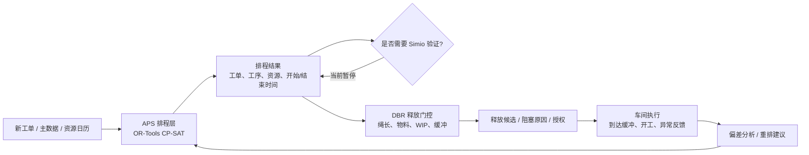

# APS 如何使用 OR-Tools CP-SAT

算法假设与可调参数业务说明

版本：2026-06-20  
适用范围：SDBR / DDOM / DBR 计划员排程工作台  
相关能力：`BE-SOLVER-009`、`BE-SOLVER-010`、`BE-SOLVER-011`、`BE-SOLVER-012`、`BE-SOLVER-014`、`BE-REL-012`、`UI-ADMIN-002`

## 1. 这份文档解决什么问题

这份文档面向业务人员、生产计划员、调度主管和供应链管理人员，说明：

1. APS 为什么可以使用 CP-SAT 做高级排程。
2. 当前系统把哪些业务问题交给 CP-SAT 计算。
3. 当前 CP-SAT 模型有哪些算法假设。
4. 哪些参数可以调，调了会影响什么。
5. 哪些事情当前没有纳入 CP-SAT，仍由释放门控、人工判断、ERP/MES 或后续规则负责。

一句话概括：CP-SAT 是当前系统的“排程求解器”，负责在给定资源、工艺、工单、日历和目标策略下，生成一个满足约束的计划；但它不是完整 ERP、MES、MRP 或仿真系统。

## 2. APS、CP-SAT 和 DBR 的分工

当前系统不是传统意义上让所有设备 100% 满载的 APS，而是服务于 DDOM / DBR 的需求驱动排程与执行系统。

业务上可以理解为三层：

| 层级 | 主要职责 | 当前实现 |
| --- | --- | --- |
| APS 排程层 | 决定工单和工序在什么时间、用什么资源加工 | OR-Tools CP-SAT |
| DBR 释放门控层 | 判断排好的工单是否应该释放到车间 | 绳长、物料、WIP、缓冲状态 |
| 执行与反馈层 | 记录现场到达、开工、异常、偏差和重排需求 | 执行事件、缓冲看板、异常中心 |

也就是说，CP-SAT 负责“先把可执行计划排出来”，释放门控负责“现在是否应该把某个工单放出去”。

## 3. 为什么选择 CP-SAT

OR-Tools CP-SAT 适合当前 APS 场景，原因不是“它一定比所有求解器都强”，而是它适合当前这类离散排程问题：

1. 工序开始时间、结束时间天然是离散时间点。
2. 设备同一时间不能加工两个任务，适合用“不重叠”约束表达。
3. 工序有先后顺序，适合用优先约束表达。
4. 一个工序可以在主资源或备用资源之间选择，适合用“可选区间”表达。
5. 换型、时间窗、固定工单、冻结区等现场规则，通常是离散逻辑。
6. CP-SAT 对“能不能排得出来”和“在有限时间内找一个好方案”这类问题很实用。

当前项目中，Gurobi 保留历史结果读取能力，但新排程任务已暂停；OR-Tools CP-SAT 是唯一活动求解器。

## 4. CP-SAT 在 APS 中到底算什么

业务人员可以把 CP-SAT 理解成一个“会遵守规则的排程器”。

它接收：

| 输入对象 | 业务含义 |
| --- | --- |
| 工单 | 要生产什么、数量、交期、优先级 |
| 工艺路线 | 每个产品要经过哪些工序，工序顺序是什么 |
| 资源 | 哪些设备/工作中心可加工，哪些是约束资源 |
| 资源日历 | 哪些时间可生产，哪些时间维护或不可用 |
| 备用资源 | 主资源忙时是否允许换到备用资源 |
| 换型矩阵 | 某资源从一种产品族切到另一种产品族要多久 |
| 目标策略 | 更重视交期、流动速度、瓶颈保护，还是综合平衡 |
| 锁定/冻结 | 哪些已排工单或冻结窗口内工序不能随便改 |

它输出：

| 输出对象 | 业务含义 |
| --- | --- |
| 工序计划 | 每道工序在哪台资源上、什么时候开始、什么时候结束 |
| 工单计划 | 每张工单的计划开工、计划完工、交期表现 |
| 资源负荷 | 每个资源未来一段时间的负载和产能对比 |
| 甘特数据 | 供计划员查看和人工复核的排程条带 |
| 求解诊断 | 为什么用了某些能力、是否超时、是否不可行 |

## 5. 当前 CP-SAT 模型的业务表达

### 5.1 有限产能

对约束资源，系统采用有限产能排程。

业务含义：

同一台约束设备在同一时间只能做它物理上能做的工作，系统不会排出“同时加工两个任务但设备只有一台”的计划。

当前表达：

- 单台有限资源：同一时间不允许重叠。
- 多并行资源：用 `CapacityUnits` 表示同质并行能力，例如 2 台相同设备可同时加工 2 个任务。

### 5.2 非约束资源无限产能语义

对非约束资源，当前保持 DBR 思想中的“非约束资源应保留冲刺能力”。

业务含义：

非瓶颈资源不是系统节拍来源，不强制把所有非约束资源都排得非常满。它们的长期超载会在负荷图中暴露，供计划员判断是否需要重新定义瓶颈。

### 5.3 工序先后关系

如果工艺路线是：

切割 -> 焊接 -> 装配

那么 CP-SAT 会保证：

焊接不能早于切割完成；装配不能早于焊接完成。

如果定义了最小间隔，也会一起遵守。

### 5.4 主资源与备用资源

一个工序可以定义主资源和备用资源。

业务含义：

系统优先使用主资源，但在目标策略允许时，可以选择备用资源以改善交期或流动速度。

当前模型会对使用备用资源设置惩罚，避免系统无理由地乱换资源。

### 5.5 顺序相关换型

如果同一台约束资源从产品族 A 切到产品族 B 需要 30 分钟，从 B 切回 A 需要 10 分钟，系统可以表达这种不对称换型时间。

当前支持范围：

- 支持单台有限资源上的顺序相关换型。
- 支持不对称换型。
- 同族或未定义矩阵时，换型时间默认为 0。

当前不支持：

- 多台并行资源上的机台级换型追踪。

原因是多机台场景需要明确“上一件产品在哪一台具体机台上加工”，这属于更细粒度的资源建模，需要业务规则确认。

### 5.6 资源效率

资源可以设置效率百分比。

业务含义：

如果标准工时是 100 分钟：

- 效率 100%，按 100 分钟排。
- 效率 50%，按约 200 分钟排。
- 效率 125%，按约 80 分钟排。

当前系统用向上取整方式修正工序时长，避免出现小数分钟。

### 5.7 固定时间窗

工序可以设置：

- 最早开始时间 `EarliestStartAt`
- 最晚完成时间 `LatestEndAt`

业务含义：

某些工序只能在指定窗口内加工，例如客户指定窗口、特殊班次、外协窗口、温控窗口等。

当前这些时间窗是硬约束：不满足则可能导致不可行。

### 5.8 锁定与冻结

已发布或已人工确认的部分计划可以被锁定。

当前模型支持：

- 固定某工序的开始时间。
- 固定某工序使用的资源。
- 重排时保留冻结窗口内的工序。
- 记录重排相对源计划的变化摘要。

业务含义：

不是每次重排都把全厂计划推翻重来。锁定和冻结用于降低计划波动。

## 6. 当前算法假设

以下假设是当前通用排程基线。它们已经记录在 `docs/backend-specification.md` 中，但这里用业务语言解释。

| 假设 | 业务解释 | 风险或边界 |
| --- | --- | --- |
| 时间按整数分钟计算 | 排程不会使用秒级或小数分钟 | 对秒级节拍行业需扩展 |
| 并行资源是同质资源池 | 2 台相同设备被视为一个容量为 2 的资源池 | 不追踪具体机台编号 |
| 约束资源有限产能 | 瓶颈设备不能同一时间超载 | 约束定义错误会影响全局计划 |
| 非约束资源保持无限产能语义 | 非瓶颈资源不作为全局节拍限制 | 长期超载需由负荷图发现 |
| 工序当前不跨能力桶连续加工 | 一个工序需落在可用窗口内 | 长工序跨班次规则后续定义 |
| 资源效率修正工时 | 效率影响实际排程时长 | 效率必须来自可靠主数据 |
| 时间缓冲不是完整 DBR 数学硬约束 | 缓冲主要影响保护交期和释放门控 | 不应误解为所有缓冲都进了求解器 |
| 物料、在途、WIP 不作为 CP-SAT 硬约束 | 这些由释放门控判断 | 排好了不等于马上能释放 |
| 单机支持换型，多机台换型待定 | 当前能处理单台约束资源换型 | 多机台需业务规则 |
| 轻量 MRP 不在当前求解器内 | CP-SAT 不直接做物料硬约束 | 物料齐套由轻量 MRP、运行状态和释放判断 |

## 7. 可调参数总览

当前可调参数分为三类：

1. 直接影响 CP-SAT 排程结果的参数。
2. 影响释放门控或计划解释的参数。
3. 当前只是台账或说明，还没有直接进入求解器的参数。

### 7.1 直接影响 CP-SAT 的参数

| 参数 | 业务含义 | 调大通常意味着 | 调小通常意味着 |
| --- | --- | --- | --- |
| `TimeLimitSeconds` | 求解器最多计算多久 | 有更多时间找更好解 | 更快返回，但可能只得到可行解 |
| `ObjectiveStrategyID` | 使用哪种目标策略 | 不同策略权衡不同 | 同左 |
| `TardinessWeight` | 迟交惩罚权重 | 更重视按期交付 | 更可能牺牲交期换取流动或资源偏好 |
| `MakespanWeight` | 总完工跨度权重 | 更重视整体尽快做完 | 可能更关注个别交期 |
| `AlternateResourcePenaltyWeight` | 使用备用资源惩罚 | 更少使用备用资源 | 更愿意为了交期/流动使用备用资源 |
| `CapacityUnits` | 资源并行数量 | 允许更多任务并行 | 资源更容易成为瓶颈 |
| `EfficiencyPercent` | 资源效率 | 工序持续时间变短 | 工序持续时间变长 |
| `SetupTransitions` | 换型时间矩阵 | 更真实反映切换损失 | 换型影响减弱 |
| `EarliestStartAt / LatestEndAt` | 工序硬时间窗 | 限制更严格 | 限制更宽松 |
| 锁定/冻结 | 哪些计划不能改 | 计划更稳定 | 重排自由度更大 |

### 7.2 影响释放门控或计划解释的参数

| 参数 | 所属层 | 业务含义 |
| --- | --- | --- |
| `TimeBufferMinutes` | 排程/DBR 解释 | 用于保护交期和缓冲语义 |
| `RopeBufferMinutes` | 释放策略 | 决定建议释放时间的提前量 |
| 红黄绿缓冲比例 | 释放策略 | 定义缓冲渗透区域 |
| `MaxWipCount` | 释放策略 | 控制 WIP 上限 |
| `MaterialLookaheadMinutes` | 释放策略 | 物料可用性检查窗口 |
| 稳定性阈值 | 释放策略 | 抑制频繁释放/重排导致的波动 |

这些参数不完全等同于 CP-SAT 硬约束。它们更多用于 DBR 释放管理、缓冲状态解释和计划稳定性治理。

### 7.3 当前不应当承诺的参数

以下内容目前没有进入通用 CP-SAT 模型：

| 内容 | 当前状态 | 原因 |
| --- | --- | --- |
| 轻量 MRP | 已实现第一版 | 按工单需求、库存、已分配和在途窗口判断可用/短缺 |
| 完整 BOM / 多级 MRP | 未实现 | 需定义 BOM 展开、替代料、批次/效期和 ERP 账务边界 |
| 替代料 | 未实现 | 需定义替代优先级、可用批次、质量限制 |
| 合批 / 拆批 | 未实现 | 需定义合批粒度、容量、混批限制 |
| 多机台换型 | 未实现 | 需建模具体机台历史状态 |
| 班组人数 | 未实现 | 需定义人机绑定关系 |
| Simio 反馈闭环 | 暂停 | 仿真接口尚未接入 |
| 真实 ERP/MES 回写 | 契约阶段 | 当前只定义接口，不连接真实系统 |

## 8. 目标策略怎么理解

当前系统内置策略包括：

| 策略 | 业务倾向 |
| --- | --- |
| `v1_delivery_flow_bottleneck` | 第一版默认策略：交期优先，流动时间第二，瓶颈/备用资源保护第三 |
| `balanced` | 综合平衡交期、总完工时间和备用资源使用 |
| `delivery_first` | 更重视交期 |
| `flow_first` | 更重视整体流动速度和尽快完成 |
| `bottleneck_protect` | 更重视保护瓶颈和减少不必要的备用资源变化 |

也可以通过后台创建自定义策略，设置：

- `TardinessWeight`
- `MakespanWeight`
- `AlternateResourcePenaltyWeight`

### 示例 1：交期优先

如果客户交期压力很大，可提高 `TardinessWeight`。

业务效果：

系统会更努力减少迟交，即使可能导致更多换用备用资源或整体完工跨度略变长。

适用场景：

- 大客户订单。
- 罚款或违约风险高。
- 本周必须交付的订单。

### 示例 2：流动优先

如果目标是减少整体在制时间，可提高 `MakespanWeight`。

业务效果：

系统会倾向让整体任务更快结束，但个别订单交期优先级可能下降。

适用场景：

- 清理积压。
- 降低 WIP。
- 周末前尽量收尾。

### 示例 3：少用备用资源

如果备用资源质量风险、换线成本或管理成本高，可提高 `AlternateResourcePenaltyWeight`。

业务效果：

系统会更倾向使用主资源，只有收益明显时才使用备用资源。

适用场景：

- 备用设备稳定性差。
- 外协资源成本高。
- 某些资源有认证限制。

## 9. “可行解”和“最优解”的区别

CP-SAT 返回的结果可能是：

| 状态 | 业务解释 |
| --- | --- |
| `Optimal` | 在给定时间内证明这是当前模型下最优方案 |
| `Feasible` | 找到了满足约束的方案，但未证明最优 |
| `Infeasible` | 在当前约束下无解 |
| `TimeLimit` | 达到时间限制，可能没有找到方案或未证明最优 |
| `Error` | 输入或模型存在错误 |

业务上不要把 `Feasible` 理解为“差计划”。在真实 APS 场景中，分钟级响应往往比长时间追求数学最优更重要。

## 10. 不可行时业务上应先看什么

如果 CP-SAT 返回不可行，通常不是“算法坏了”，而是约束组合产生冲突。

优先检查：

1. 是否所有工序都有可用资源。
2. 约束资源产能是否过低。
3. 工序时间窗是否过窄。
4. 固定工单是否互相抢占同一资源。
5. 换型时间是否过大。
6. 日历是否把可用时间扣光。
7. 交期或保护交期是否过于紧张。
8. 主数据是否缺少路线、资源或日历。

## 11. CP-SAT 与释放门控可能出现偏差吗

会出现偏差，而且这是有意分层。

例子：

CP-SAT 认为某工单可以排在明天上午加工，但释放门控发现：

- 物料还没到。
- WIP 已超限。
- 还没到绳长释放时间。
- 缓冲状态显示过早释放会增加现场拥堵。

这时系统会保留排程结果，但释放门控会阻止工单下达，并给出结构化原因。

为了避免波动放大，当前系统采用：

1. Planning Run 冻结策略版本。
2. 释放评估冻结运行状态快照。
3. 阻塞原因结构化输出。
4. 稳定性阈值抑制频繁重排。
5. 计划发布生命周期避免未审核计划直接下发。

## 12. 计划员如何使用这些能力

建议操作顺序：

1. 检查数据就绪：主数据版本、运行状态快照、资源和路线是否有效。
2. 选择或创建排程策略：内置策略或自定义权重策略。
3. 创建 Planning Run：当前默认使用 OR-Tools CP-SAT。
4. 查看排程结果：KPI、甘特、负荷、工单计划、诊断。
5. 查看释放门控：哪些工单可释放，哪些被物料/WIP/绳长阻塞。
6. 审核计划发布治理：草案、复核、批准、发布。
7. 根据执行偏差决定是否重排。

## 13. 管理员如何治理参数

推荐原则：

1. 不要频繁改权重。每次策略变化都应有业务理由。
2. 自定义策略必须通过测试案例验证。
3. 一次只调整一类参数，避免无法判断效果来源。
4. 策略发布前应记录目标：保交期、降 WIP、保护瓶颈，还是减少备用资源。
5. 对比至少两个方案：当前策略 vs 候选策略。
6. 用真实案例确认，而不是只看目标函数数值。

## 14. 验收时应该看哪些结果

业务验收不应只问“求解器有没有成功”，还应看：

| 验收项 | 应检查的问题 |
| --- | --- |
| 交期 | 关键订单是否按期或迟期减少 |
| 瓶颈 | 约束资源是否连续、有序、不过载 |
| WIP | 释放门控是否避免过早下达 |
| 物料 | 物料短缺是否被阻塞，而不是直接放行 |
| 备用资源 | 是否有不合理的资源切换 |
| 换型 | 排序是否减少明显不必要的换型 |
| 稳定性 | 重排后是否大面积扰动已确认计划 |
| 可解释性 | 每个阻塞或失败是否有结构化原因 |

## 15. 当前系统中可查看的接口

以下接口主要服务于后台、UI 和验收：

| 接口 | 用途 |
| --- | --- |
| `GET /planner/workbench/admin/cp-sat/assumptions` | 查看 CP-SAT 假设、可调参数、延后规则 |
| `POST /planner/workbench/admin/scheduling-strategies` | 创建自定义目标策略 |
| `GET /planner/workbench/admin/scheduling-strategies` | 查看策略台账 |
| `POST /planner/workbench/planning-runs` | 创建 Planning Run 并冻结策略 |
| `POST /planner/workbench/planning-runs/{run_id}/execute` | 执行排程 |
| `GET /planner/workbench/schedule-results/{run_id}/workbench` | 查看排程结果 |
| `GET /planner/workbench/release-management/runs/{run_id}/workbench` | 查看释放门控结果 |

## 16. 当前阶段的结论

当前 APS 使用 CP-SAT 的边界可以概括为：

1. CP-SAT 是当前唯一活动排程引擎。
2. 它负责有限产能、工序顺序、备用资源、换型、效率、时间窗、锁定冻结和目标权重优化。
3. 自定义目标权重已经可以实际驱动 CP-SAT。
4. 物料、WIP、绳长和缓冲释放仍由释放门控负责。
5. 完整 BOM/多级 MRP、合批拆批、多机台换型、Simio 反馈和真实 ERP/MES 连接仍需后续业务规则。
6. 调参必须通过案例验收，而不是只凭目标函数或单次结果判断。

从业务角度，最重要的不是“CP-SAT 算出了一个数学最优计划”，而是“系统能持续生成可解释、可发布、可门控、可追溯、可稳定执行的计划”。
