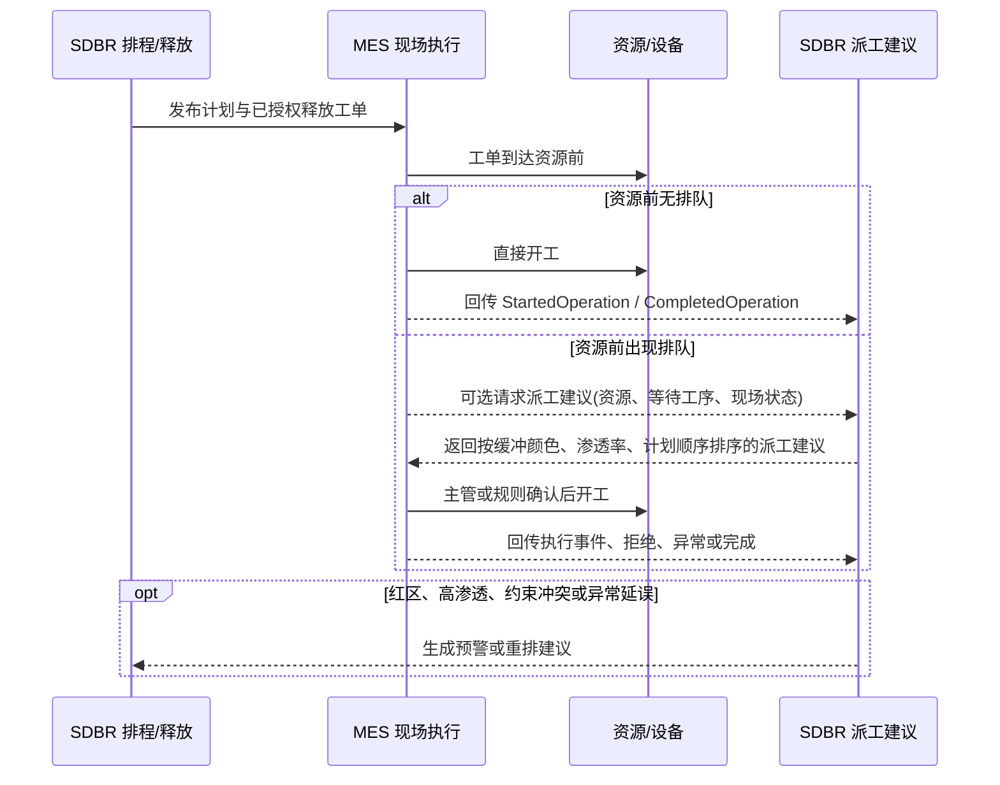

# SDBR / DDOM 后台能力规格与完成度台账

| 属性 | 内容 |
| --- | --- |
| 文档版本 | 2.81 |
| 日期 | 2026-07-12 |
| 文档状态 | 待用户审阅后成为后台开发基线 |
| 适用范围 | 完整产品蓝图，包括计划后台、求解器、集成、执行反馈、分析与运维能力 |
| UI 规格 | `docs/ui-specification.md` |
| 后台检查点 | `docs/backend-readiness-2026-06-19.md` |
| 产品参考 | 项目需求、Intuiflow 视频截图及 `interface/interface.md` |

## 1. 文档效力

本文件是后台需求、设计、开发、测试、审计和交接的能力台账。后续后台变更必须引用一个或多个 `BE-*` 规格编号。若新需求无法映射到现有编号，应先修改本文件，再修改代码。

本文件记录两类事实：

1. **目标能力**：完整产品最终需要具备什么。
2. **当前证据**：仓库中已经实现并验证了什么。

“目标存在”不表示“当前已经实现”；“存在接口骨架”也不表示“集成已经可用”。详细能力表是状态判断的唯一依据。

## 2. 状态与证据规则

### 2.1 状态定义

| 标识 | 中文状态 | 使用条件 |
| --- | --- | --- |
| `[VERIFIED]` | 已验证 | 实现存在，且自动化测试或明确运行检查已通过 |
| `[IMPLEMENTED]` | 已实现待验证 | 实现存在，但缺少当前可重复的验收证据 |
| `[PARTIAL]` | 部分实现 | 已有可用基础，但尚未满足完整产品要求 |
| `[NOT-STARTED]` | 未开始 | 尚无可用实现，或仅有需求描述 |
| `[PAUSED]` | 已暂停 | 产品路径保留，但依据项目决定暂不实施 |
| `[EXTERNAL]` | 外部系统边界 | 能力由 ERP、MES、SCADA、身份平台等外部系统负责；本系统只负责契约和集成 |

### 2.2 证据等级

| 标识 | 证据 |
| --- | --- |
| `C` | 代码实现或领域对象 |
| `A` | FastAPI 接口或进程入口 |
| `T` | 自动化测试 |
| `R` | 可重复运行、性能、恢复或人工验收记录 |
| `D` | 只有设计文档或接口占位，不构成实现完成证据 |

### 2.3 状态变更规则

1. `[VERIFIED]` 至少需要 `C/A + T/R` 两类证据。
2. `[PARTIAL]` 必须同时写清“已有能力”和“剩余缺口”。
3. `[PAUSED]` 恢复开发时先改为 `[NOT-STARTED]` 或 `[PARTIAL]`。
4. `[EXTERNAL]` 不得标记为本系统已完成；对应连接器应使用独立 `BE-INT-*` 条目跟踪。
5. 每次状态变更必须更新第 18 节变更记录，并给出测试或运行证据。
6. 测试失败时，不得继续保留受影响条目的 `[VERIFIED]` 状态。

## 3. 产品边界与总体流程

本产品定位为 **DDOM（Demand Driven Operating Model，需求驱动运营执行模型）** 的计划、排程、释放、执行反馈与仿真验证系统。

DDS&OP / Adaptive S&OP 不属于本系统的日常运行范围。本系统只接受 DDS&OP 下发的 Operating Model Configuration，并向 DDS&OP 输出其需要的偏差分析与运行表现数据。DDS&OP 负责模型治理和战术/战略决策，例如解耦点、控制点、主设置、缓冲参数、能力范围、季节性/促销/新品/停机等配置规则；DDOM 负责按照已生效配置每天运行、排程、释放、执行和反馈。

```text
ERP / 主数据源 / DDS&OP 配置
  -> 主数据版本 + 运行状态快照
  -> Planning Run
  -> OR-Tools CP-SAT（当前活动求解器）
  -> 可选 Simio 验证
  -> 计划输出 / 方案比较 / 人工确认
  -> 绳长 + 物料 + WIP + 缓冲释放门控
  -> MES 执行
  -> 执行事件、偏差与异常
  -> 稳定性判断 / 重排请求 / BI 与流程挖掘
```

系统边界原则：

- ERP 负责订单、BOM、库存、采购在途和基础主数据的权威来源。
- DDS&OP 负责 DDOM 模型配置和治理，包括解耦点、控制点、Buffer Profile、主设置、调整因子、能力范围和重大调整建议；本系统不实现 DDS&OP 工作流、会议/审批、场景治理或模型重构决策。
- 本系统负责 DDOM 日常运营执行：消费已生效配置，生成供应/制造建议，完成控制点有限排程、释放门控、缓冲执行、MES 派工建议、偏差与异常反馈。
- 本系统需要补齐 DDOM 内部的 DDMRP 运行能力，但 **不做 DDMRP 参数配置**；DDMRP 参数、Buffer Profile、调整因子和解耦/控制点设置来自 DDS&OP 或外部主设置。
- 本系统负责冻结排程输入、有限产能排程、DBR 缓冲与释放决策。
- MES/SCADA 负责现场报工、设备状态和实际产量采集。
- 本系统接收执行事件并形成偏差、预警和重排建议，不替代完整 MES。
- Gurobi 与 OR-Tools 位于同一求解器抽象层；当前只允许 OR-Tools CP-SAT 执行新计划，Gurobi 保留历史结果读取路径但暂停新执行。
- Simio 是可选验证步骤；不验证时求解结果直接进入计划输出，验证时可接受、拒绝或调整计划。

DDAE / DDS&OP 配置契约原则：

- 本系统持续维护为 DDOM / S-DBR 执行系统，只负责 MRP/物料可行性、有限能力排程、释放管理、缓冲执行、MES 派工建议、执行反馈和偏差采集。
- DDAE 下发的已批准主设置必须按“接收、校验、冻结、执行、反馈”处理；本系统页面不得重新计算或治理这些主参数。
- Planning Run 必须冻结使用的 `OperatingModelConfigurationID`，用于追溯本次排程使用的 DDS&OP / DDAE 配置版本。
- 时间缓冲、控制点、DDMRP 参数、资源角色等若来自 DDAE，只能按接口契约消费，不能在 SDBR 中私自扩展字段或改变含义。
- 向 DDAE 输出反馈时，必须带配置版本、运行版本、时间戳、数据来源、异常原因和可追溯 ID，并遵循 `D:\Documents\DDAE_INTERFACE_CONTRACT`。
- ERP/MES mock 接口可继续作为 SDBR 第一版产品闭环；DDAE 连接必须单独纳入 Contract Agent 管控。
- 若执行侧发现契约不足，只提交契约变更请求，不先在 SDBR 里做隐式字段或页面侧参数变通。

DDOM 与 DDS&OP 分工：

| 范围 | 本系统职责 | 不属于本系统第一版职责 |
| --- | --- | --- |
| DDOM 日常运行 | 实际需求驱动供应/制造建议、控制点有限排程、释放门控、缓冲颜色/渗透率、执行优先级、异常与偏差反馈 | 设计 DDOM 应该如何配置 |
| DDMRP 运行能力 | 消费已冻结的 DDMRP/DDOM 参数，执行轻量 MRP、库存/物料可用判断、缓冲状态与同步预警 | DDMRP 参数配置、Buffer Profile 治理、调整因子审批 |
| DDS&OP 协同 | 接收配置；输出交付表现、库存表现、缓冲表现、产能冲突、执行异常和流动表现 | DDS&OP 会议流程、战术协调、情景评估、模型重构建议审批 |

## 4. 主数据与运行状态

| ID | 能力要求 | 状态 | 当前证据 | 缺口与完成条件 |
| --- | --- | --- | --- | --- |
| `BE-DATA-001` | 导入资源及日能力 | `[VERIFIED]` | `C` `sdbr/resource_import.py`; `A` `/resources/import`; `T` `tests/test_resource_import.py` | 已满足当前模型 |
| `BE-DATA-002` | 导入主/备用工艺路线和备用资源 | `[VERIFIED]` | `C` `sdbr/routing_import.py`; `A` `/routings/import`; `T` `tests/test_routing_import.py` | 已满足当前模型 |
| `BE-DATA-003` | 导入排程工单 | `[VERIFIED]` | `C` `sdbr/order_import.py`; `A` `/orders/import`; `T` `tests/test_order_import.py` | 后续由 ERP 连接器自动同步 |
| `BE-DATA-004` | 导入库存缓冲 | `[VERIFIED]` | `C` `sdbr/inventory_import.py`; `A` `/inventory-buffers/import`; `T` `tests/test_inventory_import.py` | 已满足当前模型 |
| `BE-DATA-005` | 导入已分配库存、在途数量与可用时间 | `[VERIFIED]` | `C` `sdbr/material_state.py`; `A` `/material-availability/import`; `T` `tests/test_material_state.py` | 物料批次、替代料和保质期尚属高级能力 |
| `BE-DATA-006` | 导入当前 WIP 与 WIP 上限 | `[VERIFIED]` | `C` `sdbr/material_state.py`; `A` `/wip-limits/import`; `T` `tests/test_material_state.py` | 已满足释放门控基础需求 |
| `BE-DATA-007` | 校验资源、约束、路线、工序、缓冲和物料需求 | `[VERIFIED]` | `C` `sdbr/master_data_validation.py`; `A` `/master-data/validate`; `T` `tests/test_master_data_validation.py` | 后续增加面向 UI 的问题分类与修复建议 |
| `BE-DATA-008` | 创建不可变、可追溯的 Master Data Version | `[VERIFIED]` | `A` `/master-data/versions`; `T` `tests/test_api.py`, `tests/test_backend_readiness.py` | 已满足当前审计需求 |
| `BE-DATA-009` | 创建运行状态快照并判断新鲜度 | `[VERIFIED]` | `C` `sdbr/operational_state.py`; `A` `/operational-state/snapshots`; `T` `tests/test_operational_state.py` | 后续增加资源实时状态字段 |
| `BE-DATA-010` | 柔性日历、班次、节假日和维护扣减 | `[PARTIAL]` | `C` `sdbr/calendar_import.py`, `sdbr/base_calendar.py`, `sdbr/calendar_overrides.py`, `sdbr/calendar_preview.py`, `sdbr/scheduling_solver.py`; `A` 主数据版本比较/发布/回滚、`/planner/workbench/admin/base-calendars`、`/planner/workbench/admin/resource-calendar-assignments`、`/planner/workbench/admin/calendar-overrides`、`/planner/workbench/calendar/preview`; `UI` 管理后台基础日历与临时覆盖配置入口，`UI-CALENDAR-001` 已定义独立日历页面；`T` `tests/test_calendar_import.py`, `tests/test_scheduling_solver.py`, `tests/test_api.py` | 已支持资源级日历、版本化日历输入、基础日历模板、多班次、节假日、资源日历分配、维护扣减、加班/临时覆盖、日历预览事项要素检查、受控主数据发布，以及基础日历和临时覆盖冻结到 Planning Run 并按“维护 > 节假日 > 临时覆盖 > 加班 > 基础班次”驱动 CP-SAT 能力桶；审批流、企业节假日自动同步、完整日历编辑器和节假日强制加班例外规则仍待后续确认 |
| `BE-DATA-011` | 丰富资源属性 | `[PARTIAL]` | `C` `Resource` 已有约束标识、能力、日历、资源数量、效率、类型、缓冲标识、负责人和分类；`T` `tests/test_api.py` | 班组人数、固定偏移和更细换型属性仍需独立业务规则 |
| `BE-DATA-012` | BOM、多级物料需求和替代料模型 | `[PARTIAL]` | `C` `sdbr/light_mrp.py`; `A` `/planner/workbench/light-mrp/evaluate`; `T` `tests/test_material_state.py`, `tests/test_api.py` | 第一版已确认由本系统执行轻量 MRP：按工单物料需求、库存缓冲、已分配库存、在途数量和物料检查窗口输出可用/在途覆盖/短缺/缺库存记录结论；完整 BOM 展开、多级 MRP、替代料、批次/效期分配和 ERP 库存账务仍未实现 |
| `BE-DATA-013` | 主数据版本差异、发布和回滚 | `[VERIFIED]` | `C/A` `/master-data/version-comparison`、`/master-data/versions/{id}/publish|retire|rollback`; `T` `tests/test_api.py` | 已满足后台治理闭环；真实 ERP 主数据发布回写由 `BE-INT-*` 跟踪 |
| `BE-DATA-014` | 版本化测试数据集、场景包与测试库重建 | `[VERIFIED]` | `C` `sdbr/test_data.py`, `sdbr/test_case_acceptance.py`; `D` `docs/cp-sat-business-case-acceptance.md`; `A` `/planner/workbench/test-data/cases`, `/planner/workbench/test-data/acceptance`, `/planner/workbench/test-data/acceptance/{case_id}/decision`, `/planner/workbench/test-data/acceptance/{case_id}/reset`, `/planner/workbench/test-data/acceptance/reset`; CLI `sdbr-reset-test-data --list-cases`; `T` `tests/test_test_data.py`, `tests/test_business_closure.py` | 已提供基准工厂、物料短缺、WIP 超限、CP-SAT 有限产能/备用资源/日历覆盖/效率/换型/不可行诊断案例、DDMRP 净流展示案例、测试库重建、单案例/全案例复位、自动验收包、预期/实际差异、排程结果可打开性状态和人工确认/驳回记录；当前场景可驱动 Planning Run 执行、计划输出、释放门控、发布治理、DDMRP 运行状态与 CP-SAT 业务行为验收 |

## 4.1 DDMRP 运行能力

本能力组属于 DDOM 日常运行，不属于 DDS&OP 模型治理。本系统消费外部已经配置并冻结的 DDMRP/DDOM 参数，计算净流位置、库存缓冲状态和补货建议；不提供 Buffer Profile、调整因子、解耦点设计或 DDMRP 参数审批界面。DDMRP 运行原则见 `docs/ddom-ddmrp-runtime-principles.md`。

| ID | 能力要求 | 状态 | 当前证据 | 缺口与完成条件 |
| --- | --- | --- | --- | --- |
| `BE-DDMRP-001` | 消费解耦点运行快照 | `[VERIFIED]` | `D` `docs/ddom-ddmrp-runtime-principles.md`; `C` `sdbr/ddmrp.py`; `A` `/planner/workbench/ddmrp/decoupling-points/import`; `T` `tests/test_ddmrp.py`, `tests/test_api.py` | 解耦点含 Item/Location、Buffer Profile、DLT、MOQ、倍量和状态；本系统只消费外部配置，不维护参数治理 |
| `BE-DDMRP-002` | 消费库存缓冲红黄绿区快照 | `[VERIFIED]` | `D` `docs/ddom-ddmrp-runtime-principles.md`; `C` `InventoryBufferPolicy` 复用库存缓冲输入；`A` `/planner/workbench/inventory-buffers/import`, `/planner/workbench/ddmrp/net-flow/evaluate`; `T` `tests/test_ddmrp.py`, `tests/test_api.py` | 缓冲区数量来自外部已配置结果；不计算 Buffer Profile 参数 |
| `BE-DDMRP-003` | 计算 Net Flow Position | `[VERIFIED]` | `C` `evaluate_ddmrp_net_flow`; `A` `/planner/workbench/ddmrp/net-flow/evaluate`; `T` `tests/test_ddmrp.py`, `tests/test_api.py` | 第一版公式为在手 + DLT 窗口内有效在途 - 逾期/今日/合格尖峰需求 |
| `BE-DDMRP-004` | 区分计划缓冲状态与在手执行状态 | `[VERIFIED]` | `C` `PlanningStatus`、`ExecutionStatus`; `T` `tests/test_ddmrp.py`, `tests/test_api.py` | 计划状态基于净流位置，执行状态基于在手库存，二者不得混用 |
| `BE-DDMRP-005` | 生成补货建议 | `[VERIFIED]` | `D` `docs/ddom-ddmrp-runtime-principles.md`; `C` `SuggestedReplenishmentQty`; `A` `/planner/workbench/ddmrp/net-flow/evaluate`; `T` `tests/test_ddmrp.py`, `tests/test_api.py` | 当净流处于红区或黄区时触发补货建议，建议量补到绿区顶部，并按 MOQ/订单倍量修正；净流高于黄区时不补货 |
| `BE-DDMRP-006` | DDMRP 运行 read model | `[VERIFIED]` | `A` `/planner/workbench/ddmrp/status`; `UI` `UI-DDMRP-001`、`UI-DDMRP-002`; `T` `tests/test_api.py` | 数据就绪页只读显示健康摘要；物料计划工作台只读显示解耦点、缓冲颜色、缓冲百分比、净流位置、在手/在途/合格需求、补货建议和详情；不提供参数编辑 |

## 4.2 S-DBR P1 市场控制运行能力

本能力组属于 DDOM / S-DBR 执行层，不属于 DDS&OP 参数治理。第一轮实现目标是把 CCR planned load、MTO safe-date、MTA replenishment load 和 unified buffer priority 做成内部运行 read model；它消费冻结 Planning Run 配置、排程结果、现有 DDMRP 运行结果和执行状态，不新增 DDAE 主参数协议，也不重算 DDAE 已批准的时间缓冲、控制点、资源角色或 DDMRP 参数。

| ID | 能力要求 | 状态 | 当前证据 | 缺口与完成条件 |
| --- | --- | --- | --- | --- |
| `BE-SDBR-001` | CCR planned load read model | `[PARTIAL]` | `C` `sdbr/sdbr_market_control.py`; `A` `/planner/workbench/schedule-results/runs/{run_id}/workbench`; `T` `tests/test_sdbr_market_control.py`, `tests/test_api.py` | 组合 MTO 订单负荷和 MTA 补货负荷，显示约束/候选约束资源的计划负荷与保护产能状态；first implementation does not require a new DDAE protocol，后续若 DDAE 要结构化消费该指标，再走 Contract Agent 变更 |
| `BE-SDBR-002` | MTO safe-date execution signal | `[PARTIAL]` | `C` `build_mto_safe_date_summary`; `T` `tests/test_sdbr_market_control.py` | 基于 CCR planned load 和冻结时间缓冲策略生成执行层安全承诺信号；不在 SDBR 内治理或重算时间缓冲主参数 |
| `BE-SDBR-003` | MTA replenishment load bridge | `[PARTIAL]` | `C` `build_mta_replenishment_load`; `T` `tests/test_sdbr_market_control.py` | 将 MTA replenishment load 可执行映射纳入 CCR 负荷可见性；缺少执行工单映射的补货建议必须输出 issue，不得隐式写入产能 |
| `BE-SDBR-004` | Unified MTO/MTA buffer priority | `[PARTIAL]` | `C` `build_unified_buffer_priority`; `A` 释放管理和派工建议 read model; `T` `tests/test_sdbr_market_control.py`, `tests/test_dispatch_priority.py` | 用 shared red/yellow/green priority scale 统一 MTO time-buffer 与 MTA stock-buffer 的运行优先级；release authorization、物料/WIP 门控和 MES 到达仍是硬门槛 |
| `BE-SDBR-005` | Native execution-level what-if | `[PARTIAL]` | `C` `sdbr/sdbr_what_if.py`; `A` `/planner/workbench/schedule-results/runs/{run_id}/what-if/workspace`, `/planner/workbench/schedule-results/runs/{run_id}/what-if/evaluate`; `T` `tests/test_sdbr_what_if.py`, `tests/test_api.py` | Evaluates execution-level shocks including MTO expedite/order insertion, downtime, supply delay, and MTA red-zone replenishment pressure against frozen CCR load, buffer status, and release assumptions. Does not mutate schedule, does not run CP-SAT, does not add DDAE protocol fields, and does not claim formal customer promise. |
| `BE-SDBR-006` | Shared demand commitment identity | `[PARTIAL]` | `C` `sdbr/planning_commitments.py`; `T` `tests/test_planning_commitments.py` | MTO、MTA、DependentDemand 和外部正式订单使用统一需求身份、版本、幂等键和来源分类；creation、registration、confirmation、replay、freeze 和 predecessor guard 必须共用 canonical normalizer，校验允许的 source type、finite positive quantity、timezone-aware required time、非空 identity/UOM/demand class/TraceID，并从业务内容派生 `BusinessKey`、`LogicalDemandKey`、`DemandCommitmentID` 和 UTC content fingerprint；候选派生值不一致返回结构化 conflict，持久化不一致或同一 canonical business key 存在多个 ledger row 返回 migration required；相同业务键不得产生两个活动承诺 |
| `BE-SDBR-007` | Atomic planning reservation batch | `[PARTIAL]` | `C` `sdbr/planning_reservations.py`; `T` `tests/test_planning_reservations.py` | 计划员确认产生的候选、CCR 容量预留和物料计划分配全部成功或全部失败；幂等重放必须比较持久化 payload fingerprint/result，并验证 result 指向的 demand、batch、capacity、material 身份及不可变业务内容仍完整，仅允许已记录的 lifecycle/version/权威接管字段变化；缺失或不可验证 ledger 返回结构化迁移/冲突；同一 `DemandCommitmentID` 终身只允许原确认的精确幂等重放，调整必须使用 Phase 0 之外的新需求版本/替代流程；Phase 0 不提供独立确认 UI |
| `BE-SDBR-008` | Shared CCR capacity reservation ledger | `[PARTIAL]` | `C` `sdbr/planning_reservations.py`, `sdbr/planning_reservation_view.py`; `T` `tests/test_planning_reservations.py`, `tests/test_planning_reservation_view.py`, `tests/test_sdbr_market_control.py` | MTO/MTA 使用同一负荷台账；每条容量预留必须有位于 reservation window 内的 timezone-aware `LatestAllowedCompletionAt`；仅当冻结容量行与 Completed 排程中的订单、工序、资源、合法窗口、严格 collection/object 类型、时间戳差值、声明分钟完全对应且排程结束不晚于该 deadline 时才转正式工序占用，任一 malformed evidence 返回结构化 409，否则保持有效/异常保护且不得低计 Planned Load |
| `BE-SDBR-009` | Shared material planning allocation ledger | `[PARTIAL]` | `C` `sdbr/planning_reservations.py`, `sdbr/planning_reservation_view.py`; `T` `tests/test_planning_reservations.py`, `tests/test_planning_reservation_view.py`, `tests/test_planning_run_reservation_bridge.py` | 计划分配防止其他需求重复使用供应，但不得把同一需求再次扣减净流；冻结后仅接受带正式外部分配引用和权威快照的单调权威接管，Planning Run 不得回退或覆盖 `Externalized`/`AuthorityTransferred` 状态与来源；ERP/WMS 权威实现仍不属于 Phase 0 |
| `BE-SDBR-010` | Automatic MTO order commitment evaluation and planner decision | `[PARTIAL]` | `C` `sdbr/ccr_shadow_scheduler.py`, `sdbr/order_commitment_evaluation.py`, `sdbr/order_commitment_view.py`, `sdbr/api.py`, `sdbr/state_store.py`; `A` `/planner/workbench/order-commitments/intake`, `/{evaluation_id}/reevaluate`, `/{evaluation_id}/decision`, `/workbench`, `/{evaluation_id}`; `T` `tests/test_ccr_shadow_scheduler.py`, `tests/test_order_commitment_evaluation.py`, `tests/test_order_commitment_view.py`, `tests/test_order_commitment_api.py`, `tests/test_planning_run_reservation_bridge.py`, `tests/test_state_store.py` | Intake performs recommendation-only CCR shadow assessment using formal bucket semantics and exact active reservations. Current operational evidence is server-selected with a fixed 60-minute maximum age; stale/future evidence cannot be feasible. Identity freezes schedule/config/release/snapshot/relevant-ledger evidence. Only a planner decision may create shared Phase 0 rows, ending at `AcceptedPendingFormalSchedule`; no Planning Run or external-authority mutation is automatic. Approved CCR threshold intake, external formal-order authority, explicit later Planning Run, and ERP/MES authority remain outside this implementation. |

## 5. Planning Run 生命周期与任务执行

| ID | 能力要求 | 状态 | 当前证据 | 缺口与完成条件 |
| --- | --- | --- | --- | --- |
| `BE-RUN-001` | Planning Run 固定引用主数据版本和运行快照 | `[VERIFIED]` | `A` `/planning-runs`; `T` `tests/test_api.py`, `tests/test_backend_readiness.py`, `tests/test_business_closure.py` | 已满足 |
| `BE-RUN-002` | 创建、入队、领取、运行、完成、失败和取消生命周期 | `[VERIFIED]` | `C/A` `sdbr/api.py`; `T` `tests/test_api.py`, `tests/test_business_closure.py` | 已满足当前状态机 |
| `BE-RUN-003` | 独立 Worker 领取并执行任务 | `[VERIFIED]` | `C` `sdbr/planning_worker.py`; CLI `sdbr-planning-worker`; `T` `tests/test_planning_worker.py`, `tests/test_business_closure.py` | 生产环境服务安装脚本尚未提供 |
| `BE-RUN-004` | Worker 租约、续租、过期回收与令牌保护 | `[VERIFIED]` | `C/A` claim/renew/execute; `T` `tests/test_api.py`, `tests/test_backend_readiness.py` | claim readiness、lease/claim expiry、recovery、renewal 和 finalization fencing 只使用注入的 server-owned UTC clock；client `ClaimedAt`、`RenewedAt`、`StartedAt`、`CompletedAt` 仅作 audit metadata，不取得 ownership authority；deterministic clock、blocked-solver heartbeat、expiry、recovery 和 stale-owner tests 已满足当前部署模型 |
| `BE-RUN-005` | 重试、延迟重试、死信和人工恢复 | `[VERIFIED]` | `A` enqueue/recover; `T` `tests/test_api.py` | 已满足 |
| `BE-RUN-006` | 队列指标、分页查询和运行审计 | `[VERIFIED]` | `A` `/planning-runs`, `/metrics`, `/audit-events`; `T` `tests/test_api.py` | 后续提供 UI 聚合接口 |
| `BE-RUN-007` | 乐观并发和跨实例冲突检测 | `[VERIFIED]` | `C` `sdbr/state_store.py`; `A` `If-Match`; `T/R` `tests/test_backend_readiness.py` | 多节点生产部署应迁移至支持行级事务的数据库 |
| `BE-RUN-008` | 运行幂等键与重复请求去重 | `[PARTIAL]` | `C` 状态机和版本冲突可阻止部分重复写入 | 增加显式 idempotency key、请求摘要和重复响应语义 |
| `BE-RUN-009` | 计划确认、发布和撤销发布生命周期 | `[VERIFIED]` | `C` `sdbr/plan_publication.py`; `A` `/planning-runs/{run_id}/publication/*`; `T` `tests/test_business_closure.py` | 已实现 Draft/Reviewed/Approved/Published/Superseded/PublicationRevoked 状态、权限、审计和非法跳转保护 |
| `BE-RUN-010` | Planning Run 冻结 Operating Model Configuration | `[PARTIAL]` | `C/A` `sdbr/ddsop_contracts.py`, `/planner/workbench/ddsop/config-inbound`, `/planner/workbench/planning-runs`; `T` `tests/test_ddsop_contracts.py`; `R` `D:\Documents\DDAE_INTERFACE_CONTRACT\reviews\SDBR-open-gates-report.md` | 已支持按 `D:\Documents\DDAE_INTERFACE_CONTRACT\contracts\ddsop-config-inbound-v1` 接收、校验、ACK 并保存 DDAE Operating Model Configuration；引用可用配置创建 Planning Run 时深度解析所选 `MasterDataVersionID` 下 ProductID、PrimaryRoutingID、ResourceID、ItemID、LocationID 等 required references，无法解析时拒绝创建并返回 `REFERENCE_NOT_FOUND`；成功时冻结 `OperatingModelConfigurationID`、`OperatingModelFingerprint`、`SchedulingConfigurationID`、`DDMRPConfigurationID` 和完整配置快照；旧 Planning Run 兼容路径仍允许不带配置，但标记为 `LegacyNonDdsopConfigInboundV1`，不作为 DDSOP-CONFIG-INBOUND-V1 合规路径；重排强制继承/替换 Operating Model Configuration 的策略仍需后续补齐 |
| `BE-RUN-011` | Planning Run freezes and converts planning reservations | `[PARTIAL]` | `C` `sdbr/planning_run_reservation_bridge.py`, `sdbr/api.py`, `sdbr/state_store.py`; `T` `tests/test_planning_run_reservation_bridge.py`, `tests/test_api.py`, `tests/test_state_store.py` | Planning Run 以当前格式标记显式冻结 demand/batch/capacity/material identity、record version、content fingerprint 和 lifecycle，并在转态时 compare-and-set；相同 record version 必须精确匹配 status、`PlanningRunID`、`LastTransitionAt`、`EventType` 的字段存在性和值，仅显式允许的 version-advanced failure recovery/material authority handoff 可变化；只允许同时缺失 top-level selection 与 frozen graph 的真实历史 run 绕过，当前空图仍必须验证全部 metadata/orphan/selected-ID equality；direct/worker 必须在求解前用短事务持久化唯一 per-run execution version/token 和 bounded expiry，direct expiry 从 store boundary 内 server UTC 起算 solver time limit 加 60 秒内部 finalization safety grace，worker execution expiry 跟随由 server UTC 起算的可续租 lease，均属于 SDBR 内部执行安全而非 DDAE 业务参数；claim readiness、lease/claim expiry、recovery、renewal 和 finalization validity 只由同一注入的 server-owned UTC clock 决定，client execution timestamps 仅作 audit metadata，`monotonic()` 仅保护 solver elapsed duration；求解期间不得持有 store write lock，heartbeat 必须可提交并同时延长 worker execution fence；lease recovery 必须使旧 claim 失效，direct observed finalization error 必须补偿为可恢复 Failed；finalization 在短事务内重新加载并合并同 ownership heartbeat，以 execution/lease CAS 原子发布 graph、run schedule/publication state 与 audit；GET body 与 `X-Workbench-Revision` 必须在同一 state lock 捕获，successful store-managed write response 必须使用对应 `StateStoreSaveOutcome.revision`，claim/interactive claim/renewal/finalization controlled rejection 必须携带并响应 mutation 在 store boundary 内读取的 authoritative revision，不得在 middleware ambient reread；所有持久化字段及 metadata 使用完整 store rollback/state root，相关 readers 只看到完整 pre/post state；SQLite commit 后 backup 失败不得恢复旧内存或报告事务失败；能力状态保持 `[PARTIAL]` |

## 6. 求解器接口与排程模型

| ID | 能力要求 | 状态 | 当前证据 | 缺口与完成条件 |
| --- | --- | --- | --- | --- |
| `BE-SOLVER-001` | 统一求解器协议、可用性、输入、结果和诊断 | `[VERIFIED]` | `C` `SchedulingSolver`, `SchedulingProblem`, `SchedulingResult`; `T` `tests/test_scheduling_solver.py` | 已满足扩展基础 |
| `BE-SOLVER-002` | Gurobi 实际建模和求解 | `[PAUSED]` | `C` `GurobiEngine`, `_solve_fixed_resource_gurobi`; `T/R` 既有 Gurobi 小模型测试 | 保留历史结果读取和兼容代码；禁止创建或执行新的 Gurobi 计划，许可证不再作为当前产品运行条件 |
| `BE-SOLVER-003` | 约束资源有限产能 | `[VERIFIED]` | `C` 容量桶和有限资源约束; `T` `tests/test_scheduling_solver.py` | 已满足当前粒度 |
| `BE-SOLVER-004` | 非约束资源按无限产能并保留冲刺能力 | `[VERIFIED]` | `C` `enforce_finite_capacity_on_constraints_only`; `T` `tests/test_scheduling_solver.py` | 后续使冲刺能力比例可配置 |
| `BE-SOLVER-005` | 工序优先关系和最小间隔 | `[VERIFIED]` | `C` `PrecedenceConstraint`; `T` `tests/test_scheduling_solver.py` | 已满足基础路线 |
| `BE-SOLVER-006` | 备用资源选择和惩罚权重 | `[VERIFIED]` | `C` assignment binary variables and objective; `T` `tests/test_scheduling_solver.py` | 已满足当前模型 |
| `BE-SOLVER-007` | 交期、保护交期、最早释放和优先级输入 | `[PARTIAL]` | `C` `SchedulingOrderInput` 已包含字段，目标包含迟期和完工期；`T` `tests/test_api.py` 策略绳长驱动 Planning Run 建议释放时间 | 统一定义保护交期与时间缓冲的目标函数、硬约束和软惩罚语义 |
| `BE-SOLVER-008` | 求解时间限制和结构化诊断 | `[VERIFIED]` | `C` `solver_time_limit_seconds`, `SolverDiagnostic`; `T` `tests/test_scheduling_solver.py` | 后续增加 MIP gap、节点数和中断原因 |
| `BE-SOLVER-009` | OR-Tools CP-SAT 活动求解器 | `[VERIFIED]` | `C` `sdbr/cp_sat_solver.py`, `OrToolsEngine`; `T` `tests/test_scheduling_solver.py`, `tests/test_api.py`, `tests/test_business_closure.py`; `R` 三组持久化测试场景与六组 `TST-CP-*` 业务案例 | 已实现有限产能、优先关系、备用资源、能力桶、保护交期目标、时间限制和结构化诊断，并成为唯一活动求解器 |
| `BE-SOLVER-010` | 顺序相关换型与产品族切换 | `[PARTIAL]` | `C` `SetupTransition`、CP-SAT 单机有限资源换型顺序约束；`T` `tests/test_scheduling_solver.py`, `tests/test_business_closure.py` | 已实现单机有限资源换型矩阵和非对称换型排序，并通过 `TST-CP-SETUP-SEQUENCE` 业务案例验证换型间隔；多并行资源换型、清洗规则和机台级族切换仍未实现 |
| `BE-SOLVER-011` | 资源数量、效率、班组人数和固定偏移约束 | `[PARTIAL]` | `C` `capacity_units`、`efficiency_percent`、工序时间窗、临时日历覆盖能力桶；`T` `tests/test_scheduling_solver.py`, `tests/test_api.py`, `tests/test_business_closure.py` | 已实现资源并行数量、效率修正、工序 earliest/latest 时间窗和 Active 日历覆盖驱动 CP-SAT，并通过 `TST-CP-CALENDAR-OVERTIME`、`TST-CP-RESOURCE-EFFICIENCY` 和 `TST-CP-INFEASIBLE-WINDOW` 验证；班组人数和固定偏移仍需独立业务规则 |
| `BE-SOLVER-012` | 工单锁定、冻结区和人工固定安排 | `[PARTIAL]` | `C` `FixedOperationAssignment`、CP-SAT 固定开始/固定资源硬约束、显式 `SourceRunID`、重排来源追踪和工序差异摘要；`T` `tests/test_scheduling_solver.py`、`tests/test_api.py` | 已完成工序级固定开始/资源、锁定工单、冻结窗口、Planning Run 显式源计划选择和重排差异输出；锁定范围细分到工序/资源/订单的交互策略仍需 UI/业务规则确认 |
| `BE-SOLVER-013` | 批次、合批、拆批和订单分组 | `[NOT-STARTED]` | `D` `administration_view.py` 已暴露批次字段和策略分组占位 | 暂不硬编码；需先定义合批粒度、拆批条件、批量容量和订单混批限制 |
| `BE-SOLVER-014` | 多目标策略和配置化权重 | `[PARTIAL]` | `C` `strategy_id`、`ObjectiveStrategyID`、内置策略权重、版本化策略台账、自定义权重驱动 CP-SAT；`A` `/planner/workbench/admin/scheduling-strategies`, `/planner/workbench/admin/cp-sat/assumptions`; `T` `tests/test_scheduling_solver.py`, `tests/test_api.py`, `tests/test_business_closure.py` | 第一版默认策略为 `v1_delivery_flow_bottleneck`：交期优先、流动时间第二、瓶颈/备用资源保护第三；已实现内置策略、自定义策略权重持久化、自定义策略驱动 CP-SAT、算法假设/可调参数说明接口，并在 `TST-CP-*` 业务案例中输出可解释断言；策略仿真解释和 UI 调参仍需后续完成 |
| `BE-SOLVER-015` | 大规模性能基线与许可证容量治理 | `[NOT-STARTED]` | `D` 已记录 `CORES=256` 议题 | 与 OR-Tools/Simio 阶段共同建立规模矩阵、硬件/许可检查和降级策略 |

### 6.1 当前 CP-SAT 建模假设

以下假设是当前通用排程基线，用户已于 2026-06-20 认可。它们不代表所有工厂的最终业务规则；未来面向具体业务时，应通过案例逐项确认并定制，不在当前阶段提前硬编码。

1. 排程时间采用整数分钟精度。
2. 并行资源按同质容量池建模，不区分池内具体机台。
3. 工序必须完整落在一个能力桶内，当前不跨班次连续加工。
4. 约束资源采用有限产能；非约束资源默认采用无限产能并保留冲刺能力语义。
5. 资源效率通过 `ceil(标准工时 * 100 / 效率百分比)` 修正工序时长。
6. 时间缓冲当前主要通过保护交期参与迟期目标，不等同于完整 DBR 数学模型。
7. 物料齐套、在途、轻量 MRP、WIP 和绳长释放继续由释放门控/物料评估层判断，不作为当前 CP-SAT 硬约束。
8. 第一版默认优化偏好为交期优先、流动时间第二、瓶颈/备用资源保护第三；策略权重仍需按具体业务验证。
9. 单机有限资源支持顺序相关换型；多并行资源的机台级换型等待具体业务规则。
10. 完整 BOM 展开、多级 MRP、替代料、批次、合批、拆批、班组人数及 Simio 反馈不属于当前通用模型。

### 6.2 当前可调参数边界

当前阶段允许配置并可追溯的 CP-SAT 参数如下。未列入的参数不得在 UI 或 API 中暗示为已支持。

| 参数类别 | API 字段/对象 | 当前作用 | 边界 |
| --- | --- | --- | --- |
| 求解器选择 | `SolverBackendID` | 新任务只允许 `ortools` | Gurobi 暂停，Simio 不参与求解 |
| 求解时间限制 | `TimeLimitSeconds` / `solver_time_limit_seconds` | 传入 CP-SAT `max_time_in_seconds` | 不保证最优，只保证状态结构化 |
| 目标策略 | `ObjectiveStrategyID` | 选择内置策略或后台自定义策略 | 自定义策略需先在策略台账创建 |
| 目标权重 | `/admin/scheduling-strategies` 的 `TardinessWeight`、`MakespanWeight`、`AlternateResourcePenaltyWeight` | 直接形成 CP-SAT 加权目标 | 权重解释需通过业务案例校准 |
| 时间缓冲 | `TimeBufferMinutes`、释放策略时间缓冲比例 | 当前用于保护交期/释放门控语义 | 不作为完整 DBR 数学硬约束 |
| 资源效率/并行数 | `EfficiencyPercent`、`CapacityUnits` | 修正工时和并行容量 | 多机台顺序换型仍未支持 |
| 工序时间窗 | `EarliestStartAt`、`LatestEndAt` | CP-SAT 硬约束 | 业务含义由上游或人工配置给出 |
| 换型矩阵 | `SetupTransitions` | 单机有限资源顺序换型硬约束 | 多并行资源换型后续建模 |
| 释放策略 | `/dbr/release-policies` | 冻结并驱动建议释放时间、释放门控、缓冲颜色、WIP 采用上限、物料检查窗口和稳定性动作 | 不反向作为 CP-SAT 物料/WIP 硬约束；批次/MRP 仍待业务规则 |

## 7. DBR 缓冲、释放与稳定性

| ID | 能力要求 | 状态 | 当前证据 | 缺口与完成条件 |
| --- | --- | --- | --- | --- |
| `BE-REL-001` | 计算绳长和建议释放时间 | `[VERIFIED]` | `C` `calculate_suggested_release_date`, `release_candidates.py`; `T` `tests/test_planner_workbench.py`, `tests/test_release_candidates.py` | 已满足基础 DBR |
| `BE-REL-002` | 物料可用性和在途到达门控 | `[VERIFIED]` | `C` `release_candidates.py`; `T` `tests/test_release_candidates.py` | 高级替代料和批次分配未纳入 |
| `BE-REL-003` | WIP 上限门控 | `[VERIFIED]` | `C` `WipLimit`; `T` `tests/test_release_candidates.py` | 已满足基础需求 |
| `BE-REL-004` | 合并绳长、物料、WIP 和库存风险形成候选 | `[VERIFIED]` | `C/A` release candidate endpoints; `T` `tests/test_api.py`, `tests/test_release_candidates.py`, `tests/test_business_closure.py` | 已满足；测试数据验证释放门控消费 Completed Planning Run 的冻结排程结果 |
| `BE-REL-005` | 授权、派发包和结构化阻塞原因 | `[VERIFIED]` | `C` `release_authorization.py`; `A` release authorization endpoints; `T` `tests/test_release_authorization.py`, `tests/test_business_closure.py` | 已满足当前接口边界；物料短缺与 WIP 超限输出结构化阻塞原因 |
| `BE-REL-006` | 决策包、执行追踪和偏差分析 | `[VERIFIED]` | `C` `release_decision_package.py`, `shop_floor_execution.py`; `A` package trace/variance endpoints; `T` `tests/test_api.py` | 已满足基础闭环 |
| `BE-REL-007` | 稳定性策略抑制频繁放行/重排波动 | `[VERIFIED]` | `C` `release_stability.py`, `release_policy.py`; `T` `tests/test_release_stability.py`, `tests/test_api.py` | 已由版本化释放策略驱动释放管理稳定性动作；后续按业务案例校准阈值 |
| `BE-REL-008` | 偏差触发重排请求并支持人工决策 | `[VERIFIED]` | `C` `replanning.py`; `A` replan endpoints; `T` `tests/test_replanning.py`, `tests/test_api.py` | 已满足 |
| `BE-REL-009` | 时间缓冲红黄绿计算 | `[VERIFIED]` | `C` `planner_view.py`, `work_order_release_view.py`; `T` `tests/test_planner_view.py`, `tests/test_api.py` | Planning Run 释放管理已按冻结释放策略比例计算红黄绿；Buffer Board 更复杂优先级仍由 BE-REL-011 跟踪 |
| `BE-REL-010` | 两阶段五区域 Buffer Board 聚合 | `[VERIFIED]` | `C` `sdbr/buffer_execution_view.py`; `A` Buffer Board workbench/detail endpoints; `T` `tests/test_api.py` | 已按 Planning Run 聚合授权、冻结计划和执行事件；更复杂的优先级由 BE-REL-011 承担 |
| `BE-REL-011` | 配置化执行优先级矩阵 | `[PARTIAL]` | `C` `sdbr/dispatch_priority.py`; `A` `/planner/workbench/dispatch-priority/runs/{run_id}/workbench`, `/planner/workbench/mes/dispatch-suggestions/runs/{run_id}`; `T` `tests/test_dispatch_priority.py`, `tests/test_api.py` | 第一版 MES 派工优先级已按“已授权释放、红黄绿、渗透率、约束资源计划开始、客户交期”输出资源/工作中心 + 工序级队列和 Mock 派工建议包；MTS、Min-Max、MTO 独立策略及 Stockout/Critical/OTOG 等权重仍后续配置化 |
| `BE-REL-012` | 版本化 DBR 与释放策略中心 | `[VERIFIED]` | `C/A` `/dbr/release-policies` 列表/创建/查询、Planning Run 冻结 `ReleasePolicyVersionID` 和策略快照、释放推荐/门控/授权证据消费策略、管理后台配置摘要；`T` `tests/test_api.py` | 已实现绳长、缓冲比例、策略 WIP 上限、物料检查窗口和稳定性阈值驱动当前释放算法；后续只做业务校准、编辑 UI 和审批流程 |

## 8. 计划输出、负载与方案比较

| ID | 能力要求 | 状态 | 当前证据 | 缺口与完成条件 |
| --- | --- | --- | --- | --- |
| `BE-OUT-001` | 输出工序级和工单级计划 | `[VERIFIED]` | `C` `sdbr/schedule_output.py`; `A` scheduled work-order/order endpoints; `T` `tests/test_schedule_output.py`, `tests/test_business_closure.py` | 已满足基础结果输出 |
| `BE-OUT-002` | 资源甘特数据 | `[PARTIAL]` | `C` `sdbr/gantt_view.py`, `sdbr/schedule_result_view.py`; `T` `tests/test_gantt_view.py`, `tests/test_business_closure.py`, `tests/test_api.py` | 已由测试 Planning Run 验证甘特 read model，并按冻结释放策略绳长展示时间缓冲长度；前端排程结果页补充 `资源占用图` 与 `工单流程图` 双视图，支持按资源确认维护/不可用窗口、按工单确认工序流转；更完整计划/实际对比仍待 MES 执行数据 |
| `BE-OUT-003` | 系统级负载图 | `[PARTIAL]` | `C` `LoadGraphRow`, `planner_view.py`, `schedule_result_view.py`, `sdbr_flow_control.py`; `T` `tests/test_planner_view.py`, `tests/test_business_closure.py`, `tests/test_api.py` | 已由测试 Planning Run 验证负载 read model，并输出 S-DBR 计划负荷、安全日期、释放纪律、稳定性建议和保护产能监控摘要；跨资源排名、可配置时间范围、负责人/类型/分类筛选和 DDAE 阈值配置仍后续完善 |
| `BE-OUT-004` | 单资源逐日负载图 | `[PARTIAL]` | `C` 已有日能力、需求和超载单元格 | 增加 Available/Released/Unreleased/Completed/Remaining 分层 |
| `BE-OUT-005` | 非约束资源瓶颈候选识别 | `[VERIFIED]` | `C` `build_bottleneck_candidates`, `sdbr_flow_control.py`; `T` `tests/test_planner_view.py`, `tests/test_api.py` | 非约束资源继续作为保护产能监控和候选约束预警，不自动变更主数据或变成 CP-SAT 硬约束；后续阈值配置化 |
| `BE-OUT-006` | 产能缓冲和库存缓冲看板 | `[VERIFIED]` | `C` `build_capacity_buffer_board`, `build_inventory_buffer_board`; `T` `tests/test_planner_view.py` | UI 聚合仍需完善 |
| `BE-OUT-007` | 排程方案比较与推荐 | `[VERIFIED]` | `C` `sdbr/scenario_comparison.py`; `A` `/scenarios/compare`; `T` `tests/test_api.py` | 后续支持持久化方案集和人工选择理由 |
| `BE-OUT-008` | 已排程工单统一查询与批量命令 | `[VERIFIED]` | `C` `sdbr/work_order_release_view.py`; `A` Planning Run work-order workbench/commands；`T` `tests/test_api.py`, `tests/test_business_closure.py` | 已提供统一工单 read model，以及锁定/解锁/优先级审计命令；本阶段补输出治理上下文；释放强制进入 BE-UI-004 |
| `BE-OUT-009` | 工单详情聚合 | `[VERIFIED]` | `C/A` 已组合工序、交期、路线、释放、计划、生产/销售、备注、UDF 和审计上下文；`T` `tests/test_api.py` | 已满足当前计划员详情审计需求；本阶段补 OutputContext、ReleaseContext 和 AuditContext；更深 ERP/MES 字段由集成阶段补充 |
| `BE-OUT-010` | 计划发布文件/API 契约 | `[VERIFIED]` | `C` `sdbr/plan_publication.py`; `A` `/planning-runs/{run_id}/publication`; `T` `tests/test_business_closure.py` | 已定义内部版本化计划发布包、状态查询、发布、撤销、替代和审计；本阶段补内部输出治理包和稳定读取契约；真实 ERP/MES 回写仍由 `BE-INT-*` 跟踪 |

## 9. 执行反馈与异常

| ID | 能力要求 | 状态 | 当前证据 | 缺口与完成条件 |
| --- | --- | --- | --- | --- |
| `BE-EXEC-001` | 接收现场执行事件 | `[VERIFIED]` | `C` `shop_floor_execution.py`; `A` `/shop-floor/execution/event`; `T` `tests/test_shop_floor_execution.py` | 当前是集成契约，不是完整 MES 终端 |
| `BE-EXEC-002` | 到达缓冲、开始、完成和状态汇总 | `[VERIFIED]` | `C/A` execution status endpoints; `T` `tests/test_shop_floor_execution.py`, `tests/test_api.py` | 已满足基础反馈 |
| `BE-EXEC-003` | 迟到事件强制异常原因码 | `[VERIFIED]` | `C` `validate_execution_event`, default exception catalog; `T` `tests/test_shop_floor_execution.py` | 原因码目录和必填区域需配置化 |
| `BE-EXEC-004` | 按数量、百分比、工时和最后一批报工 | `[PARTIAL]` | `C/A` Buffer Board 事务支持 Quantity、CompletionPercent、Hours 并记录 Actor/原因码；`T` `tests/test_api.py` | 最后一批语义、MES 对账和幂等接入契约仍未实现；完整报工优先由 MES 承担 |
| `BE-EXEC-005` | 计划与实际偏差、授权预警 | `[VERIFIED]` | `C` variance/stability/alerts builders; `A` authorized alerts; `T` `tests/test_shop_floor_execution.py` | 已满足基础闭环 |
| `BE-EXEC-006` | 完整操作员终端、扫码和设备采集 | `[EXTERNAL]` | MES/SCADA 责任 | 本系统只维护事件契约、幂等和确认回执 |

## 10. ERP、MES 与外部集成

| ID | 能力要求 | 状态 | 当前证据 | 缺口与完成条件 |
| --- | --- | --- | --- | --- |
| `BE-INT-001` | ERP 入站连接器 | `[PARTIAL]` | `C` `sdbr/integration_contracts.py`; `A` `/planner/workbench/integrations/contracts`, `/planner/workbench/integrations/mock-api/status`, `/planner/workbench/integrations/messages`; `T` `tests/test_integration_contracts.py` | 第一版采用 Mock API 作为活动适配器；已定义 ERP 入站契约、字段校验、幂等键、确认、死信和重放测试桩；未来通过可替换 Adapter 接入直连 ERP 或 UNS Topic；真实 ERP 增量同步、映射适配、重试调度和对账仍未实现 |
| `BE-INT-002` | ERP 出站计划与释放回写 | `[PARTIAL]` | `C` `sdbr/integration_contracts.py`; `A` `/planner/workbench/integrations/contracts`, `/planner/workbench/integrations/mock-api/status`, `/planner/workbench/integrations/messages`; `T` `tests/test_integration_contracts.py` | 第一版采用 Mock API，不真实回写 ERP；已定义确认计划、建议释放、实际释放和异常状态的出站契约及确认/重放边界；未来通过可替换 Adapter 接入直连 ERP 或 UNS Topic；真实 ERP 回写连接器、投递队列和回执对账仍未实现 |
| `BE-INT-003` | ERP 业务所有权 | `[EXTERNAL]` | ERP 是权威来源 | 本系统不替代 ERP 主数据、采购和库存账务 |
| `BE-INT-004` | MES 入站执行事件连接器 | `[PARTIAL]` | `C/A` 通用执行事件接口、`sdbr/integration_contracts.py` MES 入站契约和消息测试桩；`T` `tests/test_integration_contracts.py`, `tests/test_shop_floor_execution.py` | 第一版采用 Mock API 接收测试/验收事件；已补幂等键、来源系统、字段校验、死信、重放契约，以及 DispatchAccepted、StartedOperation、CompletedOperation、DispatchRejected、ExceptionReported 第一版回执类型；真实 MES 适配、重放执行和对账仍未实现 |
| `BE-INT-005` | MES 出站派工与释放接口 | `[PARTIAL]` | `C/A` dispatch package、`sdbr/dispatch_priority.py`、`sdbr/integration_contracts.py` MES 出站契约；`A` `/planner/workbench/dispatch-priority/runs/{run_id}/workbench`, `/planner/workbench/mes/dispatch-suggestions/runs/{run_id}`, `/planner/workbench/mes/dispatch-suggestions/runs/{run_id}/issue`, `/planner/workbench/integrations/mock-api/status`; `T` `tests/test_integration_contracts.py`, `tests/test_release_authorization.py`, `tests/test_dispatch_priority.py`, `tests/test_api.py` | 第一版只生成 MES 派工建议，不真实下发 MES；已定义版本化派工/释放消息、资源/工作中心 + 工序级派工队列、Mock issue 台账、确认回执、撤销和重发边界；真实 MES 投递、确认回执和重发队列仍未实现 |
| `BE-INT-006` | MES/SCADA 业务所有权 | `[EXTERNAL]` | MES/SCADA 负责现场采集和控制 | 本系统消费状态，不直接控制设备 |
| `BE-INT-007` | 通用集成监控 | `[PARTIAL]` | `C/A` 集成消息台账、死信查询和重放请求接口；`T` `tests/test_integration_contracts.py` | 已提供契约层错误队列和人工重放占位；连接状态、延迟、最后成功时间、自动重试和外部系统健康检查仍未实现 |
| `BE-INT-008` | DDAE / DDS&OP 配置输入与 DDOM 偏差反馈接口 | `[PARTIAL]` | `C/A` `sdbr/ddsop_contracts.py`, `sdbr/ddsop_delivery.py`, `sdbr/public_demo_golden_loop.py`, `sdbr/adventureworks_product_demo_profile.py`, `/planner/workbench/ddsop/config-inbound`, `/planner/workbench/ddsop/configurations`, `/planner/workbench/ddsop/feedback/planning-runs/{run_id}`, `/planner/workbench/ddsop/feedback/variance-analysis/{run_id}`, `/planner/workbench/ddsop/feedback/runs/{run_id}/deliver`, `/planner/workbench/ddsop/feedback/delivery-ledger`, `/planner/workbench/public-demo/golden-loop`, `/planner/workbench/public-demo/golden-loop/run`, `/planner/workbench/public-demo/adventureworks-product-demo-profile`; `T` `tests/test_ddsop_contracts.py`, `tests/test_adventureworks_product_demo_profile.py`; `R` `D:\Documents\DDAE_INTERFACE_CONTRACT\reviews\SDBR-implementation-report.md`, `D:\Documents\DDAE_INTERFACE_CONTRACT\reviews\SDBR-open-gates-report.md`, `D:\Documents\DDAE_INTERFACE_CONTRACT\reviews\SDBR-golden-loop-report.md`, `D:\Documents\DDAE_INTERFACE_CONTRACT\reviews\SDBR-public-demo-golden-loop-page-demo-implementation-report.md`, `D:\Documents\DDAE_INTERFACE_CONTRACT\reviews\SDBR-adventureworks-product-demo-v1-scoped-implementation-report.md` | 已以契约库 `ddsop-config-inbound-v1` 和 `ddsop-feedback-outbound-v1` 为唯一事实源，实现配置入站 ACK、Approved/Active 可用性校验、配置台账摘要、PlanningRunFeedback 与 VarianceAnalysisFeedback payload 生成并通过契约 schema；按 Contract Agent 裁定实现 fixture 级 `SDBR push to DDAE inbound endpoint with ACK`：SDBR 可将两条 feedback POST 到 DDAE inbound endpoint、校验返回 ACK schema，并记录 SDBR delivery ledger / ACK record；新增 PUBLIC-DEMO-GOLDEN-DATA-V1 页面级文件 handoff demo和 `ADVENTUREWORKS_PRODUCT_DEMO_V1` ProductDemoMode 读模型：读取 frozen package、DDAE handoff payload、profile manifest 与 DemoAuthority extension，显示 schema/status/fingerprint/crosswalk/reviewed candidate mapping、source-class/evidence、PanelPolicy、DemoAuthority 行数和边界校验；若契约可用则生成 demo fixture feedback 文件；不绕过契约、不把 Network candidates 当作 SDBR executable scheduling input、不声明生产物料可行性或正式 CP-SAT/OR-Tools production entry；不实现 DDS&OP 配置治理、Buffer Profile 治理或战略情景模拟；当前结论仅为 `Accepted for Contract Fixtures / ControlledPublicDemoImplementation, Not Business Production Data`，生产级 retry scheduler、dead-letter operator workflow、长期持久化与运维告警仍待后续 |

### 10.1 可替换集成架构原则

后续 ERP/MES 集成不得把 SDBR 核心业务绑定到某一种外部技术路线。SDBR 核心只处理统一业务消息（Canonical Message），外部系统接入必须通过可替换 Adapter 完成。

目标架构：

```text
SDBR Core Planning / Release / Dispatch
  -> Integration Port
  -> Adapter
     -> Direct ERP/MES API 或数据库/文件
     -> UNS MQTT Topic
     -> Mock/Test Adapter
```

Canonical Message 必须包含：

- `MessageID`
- `MessageType`
- `SchemaVersion`
- `SourceSystem`
- `BusinessID`
- `Revision`
- `OccurredAt`
- `IdempotencyKey`
- `Payload`

第一版消息类型至少覆盖：

- ERP 入站：`WorkOrderImported`、`RoutingImported`、`ResourceImported`、`MaterialRequirementImported`、`InventorySnapshotImported`
- ERP 出站：`SchedulePublished`、`ReleaseAuthorized`、`PlanningExceptionReported`
- MES 出站：`DispatchQueueIssued`、`ReleaseInstructionIssued`、`DispatchRevoked`
- MES 入站：`DispatchAccepted`、`StartedOperation`、`CompletedOperation`、`DispatchRejected`、`ExceptionReported`

Adapter 策略：

- `DirectAdapter`：用于未来直连 ERP/MES REST、数据库中间表、文件或消息队列。
- `UnsMqttAdapter`：用于未来接入 EMQX/UNS，Topic 由工厂、车间、产线、工作中心和事件类型组成。
- `MockAdapter`：用于测试数据、案例验收和离线演示。

UNS Topic 命名建议：

```text
SDBR/{Plant}/{Area}/{Line}/{WorkCenter}/Dispatch/QueueIssued
SDBR/{Plant}/{Area}/{Line}/{WorkCenter}/Dispatch/ReleaseAuthorized
SDBR/{Plant}/{Area}/{Line}/{WorkCenter}/Schedule/Published
source/erp/{Plant}/Orders/WorkOrderImported
source/erp/{Plant}/Materials/InventorySnapshot
source/mes/{Plant}/{Area}/{Line}/{WorkCenter}/Execution/StartedOperation
source/mes/{Plant}/{Area}/{Line}/{WorkCenter}/Execution/CompletedOperation
source/mes/{Plant}/{Area}/{Line}/{WorkCenter}/Execution/ExceptionReported
```

设计约束：

- SDBR 核心业务模块不得直接调用 ERP/MES/EMQX/Node-RED/IoTDB SDK。
- Direct 与 UNS 只允许出现在 Adapter 层。
- 消息台账、幂等、确认回执、死信、人工重放和审计必须在 Integration Port 层统一处理。
- Adapter 切换不得改变 Planning Run、释放门控、派工优先级和发布治理的核心业务代码。

### 10.2 MES 与 SDBR 的事件驱动执行协同原则

本系统不替代 MES 的秒级现场控制。第一版产品边界为：MES 负责现场实时执行、设备控制、操作员交互和无队列时的直接开工；SDBR 负责释放门控、缓冲风险、跨资源优先级、排队时的派工建议、异常反馈和重排建议。

业务对象边界：

| 概念 | 业务对象 | 回答的问题 | 主要系统 |
| --- | --- | --- | --- |
| 工单释放 | 工单整体，尤其首工序前 | 这个工单现在是否允许进入车间流动？ | SDBR |
| 缓冲执行 | 已释放工单在约束缓冲中的到达、接收、红黄绿状态 | 工单是否按缓冲节奏接近约束资源？ | SDBR + MES 事件 |
| 派工建议 | 某资源/工作中心前等待加工的工序队列 | 这台资源下一道先加工哪个工单工序？ | MES 请求，SDBR 建议 |
| 现场开工 | 具体资源上的工序开工 | 没有排队或已有本地规则时是否直接加工？ | MES |

时序原则：

1. CP-SAT 生成全局计划，释放门控决定哪些工单可以进入现场流动。
2. MES 接收已释放工单后，按现场状态推动工序流转。
3. 如果某资源前没有排队，MES 可以直接开工，只需回传 `StartedOperation`、`CompletedOperation` 等执行事件。
4. 如果某资源前出现排队，MES 可以按本地缓冲颜色 + 渗透率规则排序，也可以请求 SDBR 返回派工建议。
5. 当出现红区/高渗透、约束资源冲突、插队风险、异常延误、缺料、停机或人工要求时，MES 应请求 SDBR 或回传事件，由 SDBR 生成排序、预警或重排建议。
6. SDBR 的派工建议依赖最近执行事件和运行状态快照，不要求持续掌握工厂每一秒状态；触发重排或释放复核时必须使用足够新鲜的现场快照。
7. 派工建议不得绕过释放门控。未释放、最新门控阻塞或物料/WIP 不通过的工序只能进入候选/预警，不得进入正式派工队列。

说明时序：



第一版实现约束：

- `BE-INT-004` 负责接收 MES 入站执行事件，允许事件驱动刷新 SDBR 对现场状态的理解。
- `BE-INT-005` / `BE-REL-011` 负责生成派工建议包，不真实控制 MES。
- 未来 Direct MES Adapter 或 UNS Topic 必须保持同一语义：MES 可以低频事件回传、资源排队时请求排序、关键异常时触发 SDBR 复核。
- 若客户要求 SDBR 秒级掌握全厂状态，需要另行定义高频事件吞吐、状态时效、去重、延迟容忍、队列缓存和降级策略；这不属于当前第一版范围。

### 10.3 DDOM 运营指标与偏差反馈

本指标组适用于 DDOM 日常运营执行，用于回答“是否按模型运行、波动是否被缓冲吸收、正确工作是否快速流动”。它不适用于 DDS&OP 模型配置、财务成本归因、MES 秒级设备控制或长期产能投资决策。

第一版指标口径按用户提供的 Operational Flow-Based Metrics 图分为三类，每类四项：

- 可靠性：战略缓冲完整率、供给信号及时处理率、制造订单按时释放率、控制点计划遵守率。
- 稳定性：红区穿透率、同步告警数及账龄、缓冲晚到率、产能缓冲突破时间。
- 速度/流速：正确优先级执行率、工单进度达成率、下一关键节点晚到率、WIP 超龄异常数。

| ID | 能力要求 | 状态 | 当前证据 | 缺口与完成条件 |
| --- | --- | --- | --- | --- |
| `BE-DDOM-001` | DDOM 运营可靠性指标 | `[PARTIAL]` | `C` `sdbr/ddom_operational_metrics.py`; `A` `/planner/workbench/ddom/operational-metrics` | 第一版聚合缓冲状态、释放候选/授权和执行偏差，输出战略缓冲完整率、供给信号处理率、按时释放率和控制点计划遵守率；完整口径需要 MES 持续执行事件和真实 DDMRP 供给信号处理台账 |
| `BE-DDOM-002` | DDOM 运营稳定性指标 | `[PARTIAL]` | `C` `sdbr/ddom_operational_metrics.py`, `sdbr/shop_floor_execution.py`, `sdbr/buffer_execution_view.py`; `A` `/planner/workbench/ddom/operational-metrics` | 第一版聚合红/黄/绿缓冲、执行复核事件、晚到事件和资源超载分钟；告警账龄、同步预警生命周期和更细产能缓冲突破原因仍待执行事件历史完善 |
| `BE-DDOM-003` | DDOM 速度/流速指标 | `[PARTIAL]` | `C` `sdbr/ddom_operational_metrics.py`, `sdbr/dispatch_priority.py`; `A` `/planner/workbench/ddom/operational-metrics` | 第一版聚合派工建议、执行完成反馈、迟到反馈和 WIP 阻塞原因；真实“正确优先级执行率”需要 MES 回传实际派工/开工顺序 |
| `BE-DDOM-004` | DDS&OP 可消费的偏差反馈包 | `[PARTIAL]` | `C` `VarianceFeedback` read model; `A` `/planner/workbench/ddom/operational-metrics` | 第一版输出可靠性、稳定性、速度状态、建议动作和数据覆盖缺口；后续再定义 DDS&OP 出站契约、历史趋势和管理层复盘数据集 |

## 11. Simio 验证

Simio 集成工作约束：

- 任何 Simio 模型生成、XML 写入、`.spfx` 修改或 headless 调用过程，都必须记录到仓库文档，作为后续沉淀 Codex Skill 的素材。
- 遇到 Simio API、XML、Server Connector、headless 执行或模型结构不确定时，必须优先查阅 `model/` 目录。Simio 官方 PDF 属于本地参考资料，不纳入 Git；若本机存在，首选 `model/Simio API Reference Guide.pdf`，其次参考 `model/Simio Reference Guide.pdf`、`model/Simio Server Connector Reference.pdf` 和现有 `.spfx` / XML 原型。
- Simio 模板生成应保留可重复验证脚本或测试，避免只依赖人工打开模型检查。

| ID | 能力要求 | 状态 | 当前证据 | 缺口与完成条件 |
| --- | --- | --- | --- | --- |
| `BE-SIM-001` | 导出求解问题或计划到 Simio 契约 | `[PARTIAL]` | `C` `sdbr/simio_validation.py`, `SimioValidationAdapter`; `A` `/simio/export`, `/planner/workbench/simio/validation-runs`, `/planner/workbench/simio/templates`; `D` 默认模板源 `model/templates/simio/SDBR_Example_Base.xml`; `T` `tests/test_simio_model_template.py`, `tests/test_simio_validation.py` | 已从内部计划输出包和注册模板生成派生 `.spfx` Simio 验证包，写入 `Resources`、`Routings`、`ManufacturingOrders`，保留下划线资源 ID、固定工时、`5DayWeek` 和计划指纹；模板补充 SDBR 最小 Process/输出链路承载点，用于工单开始、工序开始/结束、工单完成、WIP、队列和运行汇总；`model/Simple_DBR_XML/SDBR_Example.xml` 作为可审阅源副本，`model/SDBR_Example.spfx` 仅保留为历史/调试包 |
| `BE-SIM-002` | 提交仿真任务并跟踪生命周期 | `[PARTIAL]` | `C` `create_simio_validation_run`, `run_simio_validation_package`, Mock Runner、本机 Local Headless helper、RLM 检测/启动、结果模型保存；`A` `POST/GET /planner/workbench/simio/validation-runs`; `T` `tests/test_simio_validation.py`; `R` 2026-06-23 XML 源模板派生 `.spfx` 后本机 `runner_mode=local` 调用 Simio `Plan.RunPlan` 成功 | 第一版已支持 Mock Runner 稳定验收和本机 Local Headless `RunPlan`，并保存 RunPlan 后的结果模型；真实运行进度、超时/取消和并发 runner 队列仍未实现 |
| `BE-SIM-003` | 接收验证结果、风险与调整建议 | `[PARTIAL]` | `C` `summarize_simio_validation`、结果模型解析、`FeasibilityConclusion`、吞吐/队列/WIP/资源利用率结构、`Interactive_Results.stats` 解析、`TableStates.sqlite` 订单输出状态解析；`A` `/planner/workbench/schedule-results/runs/{run_id}/simio-validation`, schedule governance read model; `T` `tests/test_simio_validation.py`; `R` Local Headless 返回 `Infeasible`、系统 WIP、资源饥饿/计划利用率、Project/Model 名称和 RLM 状态 | 已接收并展示 Mock/Local 验证结果、验证包、runner、RLM 状态、可行性结论、吞吐、队列/WIP/资源利用率数值摘要和问题数；解析层支持从 SDBR 输出字段读取 ActualStart/ActualEnd、队列等待、WIP 快照和运行汇总；专用输入队列曲线、调整建议和更细资源状态仍待 Simio 报表或日志深度解码 |
| `BE-SIM-004` | 可选验证路径 | `[PARTIAL]` | `A` 排程结果治理区 Simio 验证摘要；`T` `tests/test_simio_validation.py`, `tests/test_api.py` | 已实现“未验证/已验证/不可用/可行/可行但有警告/不可行”摘要，不阻止计划发布；启用“必须通过 Simio 才能发布”的策略门控仍待业务确认 |

## 12. BI 与流程挖掘

| ID | 能力要求 | 状态 | 当前证据 | 缺口与完成条件 |
| --- | --- | --- | --- | --- |
| `BE-BI-001` | 计划总览聚合 API | `[NOT-STARTED]` | 数据散布于队列、负载、缓冲、异常接口 | 提供队列、准时率、约束风险、缓冲摘要和最近操作 read model |
| `BE-BI-002` | 交期、吞吐、WIP、缓冲和稳定性指标 | `[PARTIAL]` | 已有局部摘要、偏差和稳定性数据 | 定义指标口径、时间维度和历史存储 |
| `BE-BI-003` | 流程转移与返工统计 | `[PARTIAL]` | `C` `_process_transitions` 和返工识别 | 将私有统计提升为稳定分析契约并补充过滤维度 |
| `BE-BI-004` | 完整流程拓扑挖掘 | `[NOT-STARTED]` | 无图模型和历史事件仓库 | 输出节点、边、频次、耗时、返工环及筛选 API；可由外部 BI 展示 |
| `BE-BI-005` | 自助 BI 报表设计器 | `[EXTERNAL]` | Power BI 等外部工具责任 | 本系统提供受治理的数据集和嵌入入口 |

## 13. 安全、审计、持久化与运维

| ID | 能力要求 | 状态 | 当前证据 | 缺口与完成条件 |
| --- | --- | --- | --- | --- |
| `BE-OPS-001` | Viewer/Planner/Worker/Admin RBAC | `[VERIFIED]` | `C/A` FastAPI 授权; `T` `tests/test_api.py` | 当前本地环境可关闭鉴权 |
| `BE-OPS-002` | 业务操作审计 | `[VERIFIED]` | `C/A` audit events; `T/R` `tests/test_api.py`, `tests/test_backend_readiness.py` | 扩展到配置、发布、人工调整和集成重放 |
| `BE-OPS-003` | SQLite 持久化、备份与损坏恢复 | `[VERIFIED]` | `C` `SQLiteWorkbenchStateStore`; `T/R` `tests/test_state_store.py`, `tests/test_backend_readiness.py` | 当前适合单服务开发部署 |
| `BE-OPS-004` | 生产级关系数据库与迁移 | `[NOT-STARTED]` | 无 | 多节点部署前迁移到支持事务和行级锁的数据库，并建立 schema migration |
| `BE-OPS-005` | 身份提供商、登录和令牌生命周期 | `[NOT-STARTED]` | 仅有请求头角色校验基础 | 接入企业 IdP/OIDC，完成登录、会话、登出和服务账户 |
| `BE-OPS-006` | 健康检查和状态存储检查 | `[PARTIAL]` | `A` `/state-store/health`; `T` `tests/test_state_store.py` | 增加求解器、Worker、数据库、ERP、MES、Simio 分项 readiness/liveness |
| `BE-OPS-007` | 结构化日志、指标和追踪 | `[NOT-STARTED]` | 无统一可观测性管线 | 增加 correlation ID、结构化日志、Prometheus 指标和分布式追踪 |
| `BE-OPS-008` | Worker 服务化、部署和滚动升级 | `[PARTIAL]` | 独立 Worker 进程已实现 | 增加 Windows 服务/容器部署、优雅停机、容量配置和运行手册 |
| `BE-OPS-009` | API 版本化和兼容策略 | `[NOT-STARTED]` | 当前端点未使用显式 `/v1` | 发布外部集成前定义版本、弃用和兼容测试 |
| `BE-OPS-010` | 性能与容量基线 | `[PARTIAL]` | `R` 1,000 Planning Runs 查询基线见后台检查点 | 增加求解规模、并发 Worker、数据库、集成吞吐和长时间稳定性测试 |
| `BE-OPS-011` | 测试/生产运行环境隔离 | `[VERIFIED]` | `C` `sdbr/runtime_environment.py`; `A` `/planner/workbench/environment`; `T` `tests/test_runtime_environment.py`, `tests/test_test_data.py` | 已隔离测试/生产 SQLite 路径，API 返回环境元数据并拒绝生产环境测试数据重建；生产级数据库仍由 `BE-OPS-004` 跟踪 |

## 14. UI 支撑 API

| ID | 能力要求 | 状态 | 当前证据 | 缺口与完成条件 |
| --- | --- | --- | --- | --- |
| `BE-UI-001` | 数据就绪聚合接口 | `[VERIFIED]` | `C` `sdbr/data_readiness.py`; `A` `GET /planner/workbench/data-readiness`; `T` `tests/test_api.py` | 已输出安全摘要、数量、新鲜度、结构化问题和排程输入可用性，不返回原始主数据数组 |
| `BE-UI-002` | Planning Run 工作台接口 | `[VERIFIED]` | `C` `sdbr/planning_run_view.py`; `A` Planning Run 工作台列表/详情与生命周期接口；`T` `tests/test_api.py` | 已提供安全列表/详情 read model、允许动作、能力状态和冻结策略参数 |
| `BE-UI-003` | 排程结果聚合接口 | `[VERIFIED]` | `C` `sdbr/schedule_result_view.py`, `sdbr/sdbr_flow_control.py`; `A` `/schedule-results/runs/{run_id}/workbench`, `/compare`, `/select`; `T` `tests/test_api.py` | 已按 Planning Run 返回安全 KPI、诊断、甘特、系统/单资源负荷、S-DBR 运行控制摘要、风险和筛选元数据，并支持方案比较与审计选择 |
| `BE-UI-004` | 释放管理聚合接口 | `[VERIFIED]` | `C` `sdbr/work_order_release_view.py`; `A` Planning Run release-management workbench/authorize 支持冻结快照与最新运行快照重新评估；`T` `tests/test_api.py`, `tests/test_business_closure.py` | 已桥接冻结计划、主数据和运行快照，输出优先级、动态缓冲渗透、结构化阻塞原因、允许动作及调度包引用；同一已完成计划可用最新运行状态快照重新评估释放门控，不要求重新建 Planning Run |
| `BE-UI-005` | 异常中心聚合接口 | `[VERIFIED]` | `C` `sdbr/exception_center_view.py`; `A` exception center workbench/detail endpoints; `T` `tests/test_api.py` | 已统一 Planning Run 失败/DeadLetter、约束缓冲风险、执行预警和重排建议；后续可继续丰富释放阻塞处置动作和关闭工作流 |
| `BE-UI-006` | 管理配置 API | `[PARTIAL]` | `C/A` `/planner/workbench/administration/workbench` 输出主数据对象、日历配置摘要、释放策略配置、求解器策略、集成契约、Worker/SQLite 状态，并聚合日历覆盖、自定义排程策略和释放策略驱动状态；`T` `tests/test_api.py` | 已提供安全管理工作台、半配置化入口摘要、日历覆盖 API、策略权重 API 和释放策略驱动状态；敏感连接参数编辑、配置审批、配置编辑 UI 和真实外部系统健康配置后续实现 |
| `BE-UI-007` | 保存视图、筛选和用户偏好 | `[NOT-STARTED]` | 无 | 保存列、排序、分组、筛选、语言和页面偏好 |
| `BE-UI-008` | 双语消息码和字段词典 | `[NOT-STARTED]` | API 多为英文文本 | 返回稳定 message code，由 UI 负责中英文展示，保留技术详情 |

## 15. 开发优先级与实施阶段

### 15.1 UI 外壳可立即开始

`UI-SHELL-001`、`UI-DS-001` 和 `UI-I18N-001` 不依赖新增排程能力，可以按 UI Spec 开发。

### 15.2 对应页面开发前必须补齐

| 优先级 | 后台规格 | 原因 |
| --- | --- | --- |
| P0 | `BE-UI-001` 至 `BE-UI-005` | 避免 UI 直接拼接内部对象或展示原始 JSON |
| P0 | `BE-DATA-011`, `BE-REL-010`, `BE-REL-011`, `BE-REL-012` | 资源、缓冲板和优先级是核心业务表达 |
| P0 | `BE-OUT-002` 至 `BE-OUT-004`, `BE-OUT-008`, `BE-OUT-009` | 支撑甘特、负载、工单网格和详情页 |
| P1 | `BE-DATA-010`, `BE-SOLVER-010` 至 `BE-SOLVER-014` | 提升高级排程可执行性和人工控制 |
| P1 | `BE-RUN-009`, `BE-OUT-010` | 建立确认、发布和撤销的正式业务闭环 |
| P1 | `BE-OPS-005` 至 `BE-OPS-009` | 上线前安全、运维和接口治理 |
| P2 | `BE-INT-*`, `BE-BI-*` | ERP/MES 接入和管理分析阶段 |
| 当前迁移 | `BE-SOLVER-009` | CP-SAT 成为唯一活动求解器并完成 Gurobi 约束等价迁移 |
| 暂停 | `BE-SOLVER-002` | Gurobi 暂停新执行；Simio Portal、Server Connector、Experiment 批量运行仍按项目决定延后 |
| 可选验证 | `BE-SIM-*` | Simio Mock Runner 与本机 Local Headless 验证作为计划完成后的可选验证能力，不参与 CP-SAT 求解 |

### 15.3 推荐开发顺序

1. UI 应用外壳。
2. 后台策略配置模型与管理 API。
3. 数据就绪和 Planning Run 聚合 API。
4. 丰富资源、日历和缓冲板模型。
5. 计划工单、详情、负载和甘特聚合 API。
6. 完成 CP-SAT 等价迁移后，继续计划锁定、换型、冻结区和高级 CP-SAT 约束。
7. 计划确认、发布及 ERP/MES 契约。
8. 可观测性、生产数据库、身份与部署。
9. BI、流程挖掘和 Simio 后续阶段；Gurobi 保留为暂停兼容路径。

## 16. 审计与验收模板

每项能力完成后按以下格式记录：

```markdown
### BE-{DOMAIN}-{NNN} 验收记录

- 状态变更：`[PARTIAL]` -> `[VERIFIED]`
- 日期：YYYY-MM-DD
- 实现证据：`path/to/module.py`、`METHOD /api/path`
- 测试证据：`pytest tests/test_module.py -q`，N passed
- 业务验收：输入、动作、预期结果
- 已知限制：无，或列出仍保留的边界
- 用户确认：待确认 / 已确认（YYYY-MM-DD）
```

后台功能开发完成但尚未取得用户确认时，可以标记 `[VERIFIED]`，但验收记录中的“用户确认”必须保留为“待确认”。技术验证与产品验收不可混为一项。

### BE-REL-010 / BE-EXEC-004 验收记录

- 状态变更：`BE-REL-010 [PARTIAL]` -> `[VERIFIED]`；`BE-EXEC-004 [NOT-STARTED]` -> `[PARTIAL]`
- 日期：2026-06-19
- 实现证据：`sdbr/buffer_execution_view.py`、`GET /planner/workbench/buffer-board/runs/{run_id}/workbench`、工单详情与事务端点
- 测试证据：`pytest -q`，243 passed
- 业务验收：已授权工单按两阶段五区域聚合；到达事件切换接收阶段；Late 区事务缺少标准原因码时拒绝
- 已知限制：最后一批、MES 对账、扫码和设备采集不在当前实现范围
- 用户确认：待确认

### BE-UI-005 验收记录

- 状态变更：`[PARTIAL]` -> `[VERIFIED]`
- 日期：2026-06-19
- 实现证据：`sdbr/exception_center_view.py`、`GET /planner/workbench/exceptions/workbench`、`GET /planner/workbench/exceptions/{exception_id}/workbench`
- 测试证据：`pytest -q`，246 passed
- 业务验收：统一异常清单包含严重程度、状态、对象、发生时间、原因代码、业务影响、建议动作、负责人和审计历史；详情返回关联对象和处理动作
- 已知限制：异常关闭、分派、SLA 和完整处置工作流尚未实现
- 用户确认：待确认

### BE-UI-006 验收记录

- 状态变更：`[NOT-STARTED]` -> `[PARTIAL]`
- 日期：2026-06-19
- 实现证据：`sdbr/administration_view.py`、`GET /planner/workbench/administration/workbench`
- 测试证据：`pytest -q`，248 passed
- 业务验收：只读管理后台 read model 包含主数据对象定义、导入入口、预校验/版本生成语义、资源扩展字段、日历四层、Gurobi/OR-Tools/Simio、ERP/MES、Worker 队列和 SQLite 健康状态
- 已知限制：敏感连接参数编辑、配置持久化、真实 ERP/MES/Simio 连接监控和配置变更审计仍未实现
- 用户确认：待确认

### BE-DATA-014 / BE-RUN-001 至 BE-RUN-003 验收记录

- 状态变更：保持 `[VERIFIED]`，补充测试数据驱动闭环证据
- 日期：2026-06-19
- 实现证据：`sdbr/test_data.py`、`GET /planner/workbench/test-data/cases`、`sdbr-reset-test-data --list-cases`、`POST /planner/workbench/planning-runs`、enqueue、claim-next、execute
- 测试证据：`pytest tests/test_test_data.py tests/test_business_closure.py -q`，11 passed；`pytest -q`，271 passed，2 warnings
- 业务验收：基准测试数据可创建 Planning Run，固定引用主数据版本与运行状态快照，完成入队、Worker 领取、OR-Tools CP-SAT 执行并进入 Completed/Draft；案例台账明确基准、物料短缺和 WIP 超限的预期阻塞代码
- 已知限制：测试数据规模仍是基准工厂，不构成大规模性能基线
- 用户确认：待确认

### BE-OUT-001 / BE-OUT-002 / BE-OUT-003 / BE-OUT-008 验收记录

- 状态变更：保持既有状态，补充测试数据驱动计划输出证据
- 日期：2026-06-19
- 实现证据：`sdbr/schedule_result_view.py`、`sdbr/schedule_output.py`、Schedule Result 与 Work Order workbench API
- 测试证据：`pytest tests/test_business_closure.py -q`，4 passed；`pytest -q`，261 passed
- 业务验收：Completed Planning Run 的 Schedule 可被排程结果、甘特、系统负载和已排程工单 read model 消费，工单计划返回订单、资源、计划开始与完成时间
- 已知限制：高级甘特字段、冻结区、换型和计划/实际对比仍按原条目保持未完成或部分实现
- 用户确认：待确认

### BE-REL-004 / BE-REL-005 / BE-UI-004 验收记录

- 状态变更：保持 `[VERIFIED]`，补充释放门控与排程结果对齐证据
- 日期：2026-06-19
- 实现证据：`sdbr/work_order_release_view.py`、`sdbr/release_candidates.py`、Release Management workbench API
- 测试证据：`pytest tests/test_business_closure.py -q`，4 passed；`pytest -q`，261 passed
- 业务验收：释放管理消费 Completed Planning Run 的冻结排程结果；基准场景存在可授权候选；物料短缺场景输出 `MATERIAL_SHORTAGE`；WIP 超限场景输出 `WIP_LIMIT_EXCEEDED`
- 已知限制：策略阈值配置中心仍由 `BE-REL-012` 跟踪
- 用户确认：待确认

### BE-RUN-009 / BE-OUT-010 验收记录

- 状态变更：`[NOT-STARTED]` -> `[VERIFIED]`
- 日期：2026-06-19
- 实现证据：`sdbr/plan_publication.py`、`GET /planner/workbench/planning-runs/{run_id}/publication`、review/approve/publish/revoke API
- 测试证据：`pytest tests/test_business_closure.py -q`，4 passed；`pytest -q`，261 passed
- 业务验收：计划发布生命周期支持 Draft、Reviewed、Approved、Published、Superseded、PublicationRevoked；非法跳转被拒绝；发布生成带 Schedule fingerprint 的内部发布包；新发布计划会替代同一 ProblemID 下旧 Published 计划；发布和撤销写入审计；Planner 不能发布或撤销
- 已知限制：真实 ERP/MES 回写、确认回执、重发和对账仍由 `BE-INT-*` 跟踪
- 用户确认：待确认

### BE-OUT-002 / BE-OUT-003 / BE-OUT-008 / BE-OUT-009 / BE-OUT-010 输出治理验收记录

- 状态变更：`BE-OUT-008`、`BE-OUT-009`、`BE-OUT-010` 保持 `[VERIFIED]`；`BE-OUT-002`、`BE-OUT-003` 保持 `[PARTIAL]` 并补充内部输出包证据
- 日期：2026-06-21
- 实现证据：`sdbr/schedule_output_governance.py` 新增输出治理 read model 和内部计划输出包；`sdbr/api.py` 新增 `GET /planner/workbench/schedule-results/runs/{run_id}/governance`、`GET /planner/workbench/schedule-results/runs/{run_id}/output-package`，并扩展工单详情 `OutputContext`、`ReleaseContext`、`AuditContext`
- 测试证据：`python -m compileall -q sdbr`；`pytest tests/test_api.py -q -k "schedule_result or output_governance or publication" --basetemp .tmp/pytest-output-governance -p no:cacheprovider`，5 passed；`pytest tests/test_api.py -q -k "be_out_010 or be_out_008_009 or schedule_result_workspace" --basetemp .tmp/pytest-output-governance-detail -p no:cacheprovider`，4 passed
- 业务验收：Completed Run 可返回治理摘要、完整性检查、发布状态、输出包摘要、释放授权摘要和审计摘要；内部输出包包含工单级计划、工序级计划、资源负荷摘要、甘特摘要、释放建议、冻结策略/主数据/快照上下文和诊断摘要；未完成或缺少运行快照的计划不能生成可交付输出包；工单详情可追溯到输出包、计划指纹、发布状态、释放建议/授权和相关审计动作
- 已知限制：真实 ERP/MES 投递、回执、重放、对账和外部系统错误处理仍由 `BE-INT-*` 跟踪；甘特与负荷在本阶段只进入内部输出包摘要，计划/实际对比仍等待 MES 执行数据
- 用户确认：待确认

### BE-SOLVER-002 / BE-SOLVER-009 验收记录

- 状态变更：`BE-SOLVER-002 [VERIFIED] -> [PAUSED]`；`BE-SOLVER-009 [PAUSED] -> [PARTIAL] -> [VERIFIED]`
- 日期：2026-06-19
- 实现证据：`sdbr/cp_sat_solver.py`、`sdbr/scheduling_solver.py`、Planning Run和重排活动引擎策略、求解器能力 read model
- 测试证据：`pytest -q`，267 passed；Python compileall和前端脚本语法检查通过
- 业务验收：三组隔离 SQLite 场景均由 OR-Tools CP-SAT 完成并返回 Optimal；每组输出12个工单、6条甘特资源行和6条负载行；基准场景8个可释放，短缺与WIP场景分别返回 `MATERIAL_SHORTAGE` 和 `WIP_LIMIT_EXCEEDED`
- 暂停验收：新 Gurobi Planning Run 返回409和 `SolverBackendPaused`；Worker不领取历史Queued Gurobi任务；历史结果保留真实求解器标识和读取路径
- 已知限制：`release_not_before`、顺序相关换型、冻结区、批次和完整多目标策略仍按 `BE-SOLVER-007`、`BE-SOLVER-010` 至 `BE-SOLVER-014` 跟踪
- 用户确认：待确认

### BE-SOLVER-012 验收记录

- 状态变更：`[NOT-STARTED]` -> `[PARTIAL]`
- 日期：2026-06-20
- 实现证据：`sdbr/scheduling_solver.py` 增加 `FixedOperationAssignment` 和排程问题固定安排输入；`sdbr/cp_sat_solver.py` 增加 CP-SAT 固定开始时间、固定资源选择和结构化输入诊断
- 测试证据：`pytest tests/test_scheduling_solver.py -q`，30 passed；`pytest tests/test_api.py -q -k "replan_execution_preserves_operations_inside_freeze_window or replan_execution_preserves_locked_orders or replan_execution_runs_cp_sat"`，3 passed；`pytest -q`，279 passed，2 warnings
- 业务验收：工序级人工固定安排会作为硬约束进入 CP-SAT；固定到备用资源时不会被目标函数挪回主资源；两个固定工序抢占同一有限资源时返回 `Infeasible`；非候选资源、重复固定和早于计划起点的固定输入返回结构化错误；重排执行会读取同一 `ProblemID` 下最近 Completed 计划的锁定工单审计事件，并将其已排工序作为 `FixedAssignments` 带入 CP-SAT；当重排 payload 设置 `FreezeWindowMinutes` 时，上一版计划中落入重排起点加冻结窗口的工序也会被自动固定
- 已知限制：锁定范围细分、跨源计划显式选择、新建 Planning Run 的锁定来源选择仍未完成；当前重排保留策略默认使用同一 `ProblemID` 最近 Completed 计划
- 用户确认：待确认

### BE-SOLVER-010 / BE-SOLVER-011 / BE-SOLVER-014 验收记录

- 状态变更：保持 `[PARTIAL]`，补充 CP-SAT 高级排程 P1 闭环证据
- 日期：2026-06-20
- 实现证据：`sdbr/scheduling_solver.py` 增加 `SetupTransition`、资源并行数量、效率、工序时间窗和策略 ID；`sdbr/cp_sat_solver.py` 增加顺序相关换型、累计并行产能、效率时长、时间窗和内置目标策略；`sdbr/api.py` 增加高级排程 payload 与 Planning Run 冻结字段
- 测试证据：`python -m compileall -q sdbr`；`pytest tests/test_scheduling_solver.py -q`，37 passed；`pytest tests/test_api.py -q -k "advanced_cp_sat_fields or planning_run_lifecycle"`，2 passed；`pytest -q`，287 passed，2 warnings
- 业务验收：单机有限资源支持非对称换型矩阵并影响排序；同族或无矩阵不增加换型；资源 `CapacityUnits > 1` 允许同资源并行加工；`EfficiencyPercent` 会修正有效加工时长；工序 `EarliestStartAt/LatestEndAt` 作为硬时间窗进入 CP-SAT；calculate API 和 Planning Run 可冻结 `ObjectiveStrategyID` 与 `SetupTransitions`，并返回高级能力诊断
- 已知限制：多并行资源暂不支持顺序相关换型；班组人数、固定偏移、版本化策略中心、策略配置持久化和方案解释仍未完成；批次/合批/拆批继续由 `BE-SOLVER-013` 跟踪
- 用户确认：待确认

### BE-SOLVER-013 占位验收记录

- 状态变更：保持 `[NOT-STARTED]`，补充设计占位证据
- 日期：2026-06-20
- 实现证据：`sdbr/administration_view.py` 在只读管理模型中暴露 `BatchFamily`、`MergeRule`、`SplitPolicy`、`BatchID`、`MinimumSplitQuantity`、`MaximumBatchQuantity` 和 `MixedOrderAllowed` 等未来字段/策略分组
- 测试证据：`python -m compileall -q sdbr`；`pytest tests/test_api.py -q -k "administration_workbench"`，1 passed；`pytest -q`，287 passed，2 warnings
- 业务验收：批次、合批、拆批和订单分组未进入 CP-SAT；当前只为后续 UI/需求讨论提供字段台账，避免把规则硬编码进求解器
- 已知限制：必须先明确合批粒度、拆批条件、批量容量、混批限制、批次物料可用性和订单承诺拆分规则，才能开始实现
- 用户确认：待确认

### BE-SOLVER-012 / BE-REL-012 / BE-DATA-010 / BE-DATA-011 / BE-DATA-013 / BE-OUT-009 验收记录

- 状态变更：`BE-DATA-013`、`BE-OUT-009` 推进到 `[VERIFIED]`；`BE-SOLVER-012`、`BE-REL-012`、`BE-DATA-010`、`BE-DATA-011` 保持 `[PARTIAL]` 并补充闭环证据
- 日期：2026-06-20
- 实现证据：`sdbr/api.py` 增加 `SourceRunID`、`ReleasePolicyVersionID`、DBR 释放策略版本、主数据版本比较/发布/停用/回滚、重排来源追踪和差异摘要；`sdbr/state_store.py` 持久化 DBR 策略；`sdbr/work_order_release_view.py` 扩展工单详情和释放策略快照；`sdbr/planning_run_view.py` 暴露冻结源计划与策略
- 测试证据：`pytest tests/test_api.py -q -k "be_solver_012 or be_rel_012 or be_data_010_011_013 or planning_run_lifecycle or scheduled_work_order_detail"`，5 passed；`pytest tests/test_state_store.py -q`，8 passed；`python -m compileall -q sdbr`；`pytest -q`，291 passed，2 warnings
- 业务验收：Planning Run 可显式引用已完成源计划并冻结 DBR 策略版本；重排执行返回 `ReplanTrace` 与工序级 `ReplanDiff`；释放管理返回冻结策略快照；主数据版本可比较、发布、停用和回滚；工单详情聚合计划、生产、销售、释放、备注、UDF 和审计上下文
- 已知限制：DBR 策略参数当前完成版本化与追溯，尚未全部驱动释放算法；锁定范围细分、临时加班/停工对象 API、班组人数、固定偏移仍需业务规则或 UI 交互边界明确
- 用户确认：待确认

### BE-INT-001 / BE-INT-002 / BE-INT-004 / BE-INT-005 / BE-INT-007 / BE-DATA-014 / BE-REL-012 / BE-UI-006 验收记录

- 状态变更：`BE-INT-001`、`BE-INT-002`、`BE-INT-007` 从 `[NOT-STARTED]` 推进到 `[PARTIAL]`；`BE-INT-004`、`BE-INT-005`、`BE-DATA-014`、`BE-REL-012`、`BE-UI-006` 保持原状态并补充契约、案例与配置证据
- 日期：2026-06-20
- 实现证据：`sdbr/integration_contracts.py` 定义 ERP 入站、ERP 出站、MES 入站、MES 出站契约；`sdbr/api.py` 新增集成契约列表、消息测试桩、死信和重放接口；`sdbr/state_store.py` 持久化集成消息台账；`sdbr/administration_view.py` 输出日历、释放策略、求解策略和集成契约配置摘要；`sdbr/test_data.py` 扩展案例卡输入与预期说明
- 测试证据：`python -m compileall -q sdbr`；`pytest tests/test_integration_contracts.py tests/test_state_store.py -q --basetemp .tmp/pytest-contracts-2 -p no:cacheprovider`，13 passed；`pytest tests/test_test_data.py tests/test_business_closure.py -q --basetemp .tmp/pytest-cases`，13 passed；`pytest tests/test_api.py -q -k "administration_workbench or release_policy_list or be_solver_012" --basetemp .tmp/pytest-config-2 -p no:cacheprovider`，4 passed；`pytest -q --basetemp .tmp/pytest-full-20260620-2 -p no:cacheprovider`，297 passed，1 warning
- 业务验收：当前完成的是接口契约、字段校验、幂等、确认、死信、重放和人工案例验收支撑，不连接真实 ERP/MES；配置后台显示可追溯配置入口，但敏感连接编辑、临时加班/停工独立 API 和真实配置审批仍未实现
- 已知限制：BOM/MRP、批次、合批、拆批、多机台换型、ERP/MES 真实连接、自动重试调度、对账和外部系统健康检查仍需后续业务规则或集成边界明确
- 用户确认：待确认

### BE-INT-* 可替换接口架构记录

- 状态变更：`BE-INT-001`、`BE-INT-002`、`BE-INT-004`、`BE-INT-005`、`BE-INT-007` 保持 `[PARTIAL]`，补充未来直连 ERP/MES 与 UNS 两种技术路线的统一架构约束
- 日期：2026-06-21
- 设计证据：第 10.1 节新增 Canonical Message、Integration Port、Direct Adapter、UNS MQTT Adapter、Mock Adapter、幂等键、死信、重放和 Topic 命名原则
- 业务验收：SDBR 核心排程、释放、派工和发布治理不得直接依赖 ERP/MES/EMQX/Node-RED/IoTDB SDK；未来如选择直连系统，只替换 Direct Adapter；如选择 UNS，只替换 UnsMqttAdapter；核心业务消息、审计、幂等和重放语义保持一致
- 已知限制：当前仍是架构规格，不包含真实 ERP/MES 连接器、MQTT 客户端、Topic 订阅发布实现、外部认证和生产级健康监控
- 用户确认：待确认

### BE-REL-011 / BE-INT-004 / BE-INT-005 MES 派工优先级输出验收记录

- 状态变更：`BE-REL-011`、`BE-INT-004`、`BE-INT-005` 保持 `[PARTIAL]`，补充第一版 MES 派工优先级队列和回执契约证据
- 日期：2026-06-21
- 实现证据：`sdbr/dispatch_priority.py` 新增资源/工作中心 + 工序级派工队列；`GET /planner/workbench/dispatch-priority/runs/{run_id}/workbench` 输出队列、候选预警、冲突结果、调度员确认提示和重排建议；`sdbr/api.py` 在派工前使用最新运行状态重新调用释放门控；`sdbr/integration_contracts.py` 补充 DispatchQueueIssued、DispatchAccepted、StartedOperation、CompletedOperation、DispatchRejected、ExceptionReported 消息类型
- 测试证据：`pytest tests/test_dispatch_priority.py -q --basetemp .tmp/pytest-dispatch-priority -p no:cacheprovider`，3 passed；`pytest tests/test_api.py -q -k "dispatch_priority or integration_contract" --basetemp .tmp/pytest-dispatch-api -p no:cacheprovider`，1 passed；`pytest tests/test_dispatch_priority.py tests/test_integration_contracts.py tests/test_shop_floor_execution.py -q --basetemp .tmp/pytest-dispatch-contracts -p no:cacheprovider`，18 passed；`pytest tests/test_api.py -q -k "dispatch_priority or release_authorization or buffer_board or shop_floor" --basetemp .tmp/pytest-dispatch-related-api -p no:cacheprovider`，23 passed
- 业务验收：正式派工只包含已授权且最新物料/WIP/快照门控仍通过的工序；未释放或最新门控阻塞的工单只进入候选/预警；同一资源内按红黄绿、渗透率、计划开始和客户交期排序；允许红区插队；约束资源插队时输出 `RequiresPlannerConfirmation`；连续插队超过 2 次后输出 `NeedsReplan`，但不自动重排
- 已知限制：真实 MES 投递、外部确认对账、UNS Topic 发布、直连 Adapter、投递重试队列和 UI 独立派工页面仍未实现；当前端点是内部稳定 read model/API 契约
- 用户确认：待确认

### BE-REL-011 / BE-INT-005 MES 派工建议包验收记录

- 状态变更：`BE-REL-011`、`BE-INT-005` 保持 `[PARTIAL]`，补充 Mock API 派工建议包和 issue 台账证据。
- 日期：2026-06-24
- 实现范围：派工队列继续由最新释放门控、授权记录、执行事件和缓冲渗透率驱动；正式队列只包含已授权且最新门控通过的工序；候选/预警区显示未授权、物料/WIP 阻塞、缺少现场到达确认和异常阻塞等原因。新增 MES 派工建议包 read model 与 Mock issue 动作，输出 `DispatchQueueIssued` canonical payload，并写入集成消息台账。
- 业务边界：第一版只生成派工建议，不真实控制 MES；Mock API payload 将作为未来 Direct MES Adapter 或 UNS Topic 的稳定输入结构。
- 已知限制：真实 MES ACK、自动重发、队列撤销、调度员审批流和工厂级自定义优先级矩阵仍待后续开发。
- 用户确认：待确认

### BE-REL-011 / BE-INT-005 派工建议 UI 边界调整记录

- 状态变更：`BE-REL-011`、`BE-INT-005` 保持 `[PARTIAL]`，后台 read model/API 契约不变。
- 日期：2026-06-25
- 实现范围：派工建议继续由 `GET /planner/workbench/dispatch-priority/runs/{run_id}/workbench` 与 `GET/POST /planner/workbench/mes/dispatch-suggestions/runs/{run_id}` 提供；UI 消费边界调整为独立 `UI-DISPATCH-001` 派工建议工作台，缓冲执行页只消费约束缓冲矩阵和工单缓冲状态。
- 业务验收：缓冲执行不再承载 MES 派工控件；未来按渗透率、现场到达、释放授权和约束资源风险排序的派工队列在独立页面演进，避免与缓冲监控职责混淆。
- 已知限制：派工建议仍为 Mock API 和内部台账，不真实下发 MES；真实 Direct Adapter / UNS Topic、回执对账和撤销/重发队列仍待后续开发。
- 用户确认：待确认

### BE-DATA-014 案例验收体系验收记录

- 状态变更：保持 `[VERIFIED]`，补充案例验收包、预期/实际差异、人工确认/驳回和持久化证据
- 日期：2026-06-20
- 实现证据：`sdbr/test_case_acceptance.py` 输出 `AcceptancePackageID`、执行计划、案例预期、实际对照、失败原因、最新人工决策和决策记录；`sdbr/api.py` 新增 `/planner/workbench/test-data/acceptance/{case_id}/decision` 与 `/planner/workbench/test-data/acceptance/decisions`；`sdbr/state_store.py` 持久化 `test_case_acceptance_decisions`
- 测试证据：`python -m compileall -q sdbr`；`pytest tests/test_business_closure.py -q --basetemp .tmp/pytest-acceptance-business -p no:cacheprovider`，7 passed；`pytest tests/test_test_data.py -q --basetemp .tmp/pytest-acceptance-data -p no:cacheprovider`，9 passed；`pytest -q --basetemp .tmp/pytest-full-acceptance-20260620 -p no:cacheprovider`，300 passed，1 warning
- 补充证据：2026-06-22 新增 `/planner/workbench/test-data/acceptance/{case_id}/reset` 与 `/planner/workbench/test-data/acceptance/reset`；验收包新增 `ScheduleResultOpenable` 与 `ScheduleResultUnavailableReason`；`python -m compileall -q sdbr`；`pytest tests/test_business_closure.py tests/test_api.py -q -k "openable_schedule_results or acceptance_reset or reset_all or case_acceptance_overview or admin_001_002 or cp_sat_business_cases or schedule_result_workspace or ui_calendar" --basetemp .tmp/pytest-case-reset -p no:cacheprovider`，9 passed
- 业务验收：案例体系可展示测试数据输入、排程预期、释放预期、发布预期、自动判定结果和逐项差异；通过案例可由人工确认，未执行或未通过案例不能被确认；确认/驳回记录可审计并可跨 SQLite 重载保留；每个案例可复位到可重新执行状态，全部案例可一键复位
- 已知限制：当前案例仍限于基准、物料短缺、WIP 超限和六组 `TST-CP-*` 标准场景；真实业务案例、行业模板和更复杂人工确认工作流仍需后续扩展
- 用户确认：待确认

### BE-DATA-014 / BE-SOLVER-009 至 BE-SOLVER-011 / BE-SOLVER-014 CP-SAT 业务案例验收记录

- 状态变更：`BE-DATA-014`、`BE-SOLVER-009` 保持 `[VERIFIED]`；`BE-SOLVER-010`、`BE-SOLVER-011`、`BE-SOLVER-014` 保持 `[PARTIAL]` 并补充可人工验收的业务案例证据
- 日期：2026-06-21
- 实现证据：`sdbr/test_data.py` 新增六组 `TST-CP-*` Planning Run、独立 Master Data Version 和案例目录字段；`sdbr/test_case_acceptance.py` 增加期望诊断与业务断言判定；`docs/cp-sat-business-case-acceptance.md` 说明有限产能、备用资源、日历覆盖、资源效率、顺序相关换型和不可行诊断案例；`sdbr/web/planner-workbench.js` 在案例卡显示案例分组、类型、期望断言、通过断言和差异原因
- 测试证据：`python -m compileall -q sdbr`；`pytest tests/test_test_data.py -q --basetemp .tmp/pytest-cp-cases-data -p no:cacheprovider`，9 passed；`pytest tests/test_business_closure.py -q --basetemp .tmp/pytest-cp-cases-business -p no:cacheprovider`，9 passed；`pytest tests/test_api.py -q -k "case_acceptance_overview" --basetemp .tmp/pytest-cp-cases-ui -p no:cacheprovider`，1 passed；`pytest -q --basetemp .tmp/pytest-full-cp-business-cases -p no:cacheprovider`，316 passed，1 warning
- 业务验收：六组 `TST-CP-*` 案例可端到端执行，并通过 `GET /planner/workbench/test-data/acceptance` 输出“期望断言 / 通过断言 / 差异原因”；Completed 案例必须标记为可打开排程结果，不可行案例以 `DeadLetter` + `ORTOOLS_INFEASIBLE` 作为正确结果，不伪装成可执行计划，并返回不可打开原因
- 已知限制：案例只验证当前通用 CP-SAT 假设，不覆盖 BOM/MRP、批次/合批/拆批、多并行资源机台级换型、ERP/MES/Simio 真实集成，也不要求多个等价最优解的具体顺序完全固定
- 用户确认：待确认

### BE-DATA-010 / BE-SOLVER-014 / BE-REL-012 / BE-UI-006 配置后台验收记录

- 状态变更：保持 `[PARTIAL]`，补充日历与策略配置后台证据
- 日期：2026-06-20
- 实现证据：`sdbr/api.py` 新增 `/planner/workbench/admin/calendar-overrides` 和 `/planner/workbench/admin/scheduling-strategies` 创建/列表/查询接口；`sdbr/state_store.py` 持久化日历覆盖与自定义排程策略；`sdbr/administration_view.py` 在管理后台聚合日历覆盖、释放策略和策略权重状态；`sdbr/web/planner-workbench.js` 与 `sdbr/web/planner-workbench.html` 将“计划问题 / Planning problem”修正为“计划场景 / Planning scenario”
- 测试证据：`python -m compileall -q sdbr`；`pytest tests/test_api.py -q -k "calendar_override or scheduling_strategy or administration_workbench or admin_001_002" --basetemp .tmp/pytest-calendar-strategy-target -p no:cacheprovider`，4 passed；`pytest -q --basetemp .tmp/pytest-full-calendar-strategy-20260620 -p no:cacheprovider`，302 passed，1 warning
- 业务验收：计划员/管理员可把临时班次、停机/维护、加班作为版本化配置台账保存和查询；可把多目标权重作为自定义排程策略保存并设置单一活动策略；管理后台可查看配置数量、活动项、状态计数和边界说明
- 已知限制：临时日历覆盖已可驱动新建 Planning Run 的 CP-SAT 能力桶；覆盖冲突、基础日历模板编辑、配置审批、UI 编辑和敏感外部连接参数编辑仍需后续业务规则；自定义策略权重驱动 CP-SAT 的业务效果需通过案例验收校准
- 用户确认：待确认

### BE-SOLVER-014 CP-SAT 假设与可调参数验收记录

- 状态变更：保持 `[PARTIAL]`，补充自定义策略权重驱动 CP-SAT 与假设说明接口证据
- 日期：2026-06-20
- 实现证据：`sdbr/api.py` 新增 `GET /planner/workbench/admin/cp-sat/assumptions`；`/planner/workbench/admin/scheduling-strategies` 创建的自定义权重可被 calculate、方案比较、重排和 Planning Run 执行路径消费；Planning Run 创建时冻结 `FrozenSchedulingStrategy`；排程输出返回 `ObjectiveWeights`；`sdbr/cp_sat_solver.py` 对自定义策略输出 `ORTOOLS_CUSTOM_OBJECTIVE_WEIGHTS_ENABLED` 诊断
- 测试证据：`python -m compileall -q sdbr`；`pytest tests/test_api.py -q -k "cp_sat_assumptions or custom_objective_strategy or freezes_custom_objective_strategy or advanced_cp_sat_fields or scheduling_strategy" --basetemp .tmp/pytest-cp-sat-params-target -p no:cacheprovider`，5 passed；`pytest -q --basetemp .tmp/pytest-full-cp-sat-params-20260620 -p no:cacheprovider`，305 passed，1 warning
- 业务验收：后台可查询 CP-SAT 当前建模假设、可调参数、暂停求解器、延后规则和活动策略；自定义策略权重会实际进入 CP-SAT 加权目标；找不到策略 ID 时返回结构化 `SchedulingStrategyNotFound`；Planning Run 冻结策略后，后续策略变更不会改变该 Run 的求解权重
- 已知限制：权重数值的业务含义仍需通过真实案例校准；策略仿真解释、UI 调参、批次/MRP/多机台换型/Simio 反馈仍不在当前实现范围
- 用户确认：待确认

### BE-REL-012 / BE-SOLVER-007 / BE-OUT-002 / BE-UI-006 释放策略驱动算法验收记录

- 状态变更：`BE-REL-012` 推进到 `[VERIFIED]`；`BE-SOLVER-007`、`BE-OUT-002`、`BE-UI-006` 保持 `[PARTIAL]` 并补充释放策略驱动证据
- 日期：2026-06-21
- 实现证据：`sdbr/release_policy.py` 统一释放策略参数；Planning Run 执行冻结策略并用 `RopeBufferMinutes` 生成建议释放时间；`sdbr/work_order_release_view.py` 用冻结策略比例计算红黄绿、用策略 WIP 上限和物料检查窗口生成阻塞原因、用稳定性阈值输出 Monitor/Review/Replan；`sdbr/release_authorization.py` 和 `sdbr/api.py` 在授权与调度包中保留策略版本和策略证据；`sdbr/web/planner-workbench.js` 在释放管理中展示策略版本、触发参数和稳定性判断
- 测试证据：`python -m compileall -q sdbr`；`pytest tests/test_api.py -q -k "be_rel_012 or planning_run_release_workbench_authorizes_only_ready_order or release_candidates_mark_late_inbound_material" --basetemp .tmp/pytest-release-policy -p no:cacheprovider`，9 passed；修复兼容性后执行 `pytest tests/test_release_candidates.py tests/test_api.py -q -k "release_candidates_return_completed_replan_release_readiness or builds_release_candidates_from_schedule_and_material_state or blocks_release_candidate_when_wip_limit_would_be_exceeded or be_rel_012" --basetemp .tmp/pytest-release-policy-fixes -p no:cacheprovider`，10 passed；`pytest -q --basetemp .tmp/pytest-full-release-policy-final -p no:cacheprovider`，311 passed，1 warning
- 业务验收：同一排程结果可因冻结策略不同而改变建议释放时间、缓冲颜色、WIP 阻塞、在途物料可用判断和稳定性动作；历史 Planning Run 使用冻结策略快照，后续策略变更不改变已完成计划
- 已知限制：释放策略仍不作为 CP-SAT 的物料/WIP 硬约束；批次、BOM/MRP、多机台换型、ERP/MES 回写和完整策略编辑审批 UI 仍待业务规则或集成边界明确
- 用户确认：待确认

### BE-UI-004 / UI-RELEASE-001 释放门控重新评估验收记录

- 状态变更：保持 `[VERIFIED]`，补充“同一计划使用最新运行快照重新评估释放门控”的业务证据
- 日期：2026-06-21
- 实现证据：`GET /planner/workbench/release-management/runs/{run_id}/workbench` 增加 `use_latest_operational_state` 和 `operational_state_snapshot_id` 查询参数；`POST /planner/workbench/release-management/runs/{run_id}/orders/{order_id}/authorize` 增加 `UseLatestOperationalState` 和 `OperationalStateSnapshotID`；`sdbr/work_order_release_view.py` 返回实际采用的快照 ID；`sdbr/web/planner-workbench.js` 的“重新评估”使用最新运行快照，授权保留当前评估快照
- 测试证据：`python -m compileall -q sdbr`；`pytest tests/test_api.py -q -k "release_management_can_reevaluate_same_run_with_latest_snapshot or planning_run_release_workbench_authorizes_only_ready_order or be_rel_012" --basetemp .tmp/pytest-release-reevaluate -p no:cacheprovider`，9 passed；`pytest tests/test_api.py -q -k "data_readiness_endpoint_returns_latest_safe_summaries or release_management_can_reevaluate_same_run_with_latest_snapshot" --basetemp .tmp/pytest-release-reevaluate-fixes -p no:cacheprovider`，2 passed；`pytest -q --basetemp .tmp/pytest-full-release-reevaluate-final -p no:cacheprovider`，312 passed，1 warning
- 业务验收：如果原 Planning Run 的冻结快照过期，计划员可在不重建任务包、不重新排程的情况下使用最新运行状态快照重新评估物料、在途、WIP 和快照新鲜度；授权释放记录实际使用的新快照
- 2026-06-22 业务边界补充：运行快照过期只阻止授权释放，并返回 `RecommendedAction=RefreshOperationalSnapshotAndReevaluate`、`RequiresReschedule=false`；它不是重排触发条件。只有使用新鲜快照重新评估后仍出现计划偏差、连续阻塞或超过稳定性阈值，才进入 `BE-REL-008` 重排决策。
- 2026-06-22 Mock 闭环补充：新增 `POST /planner/workbench/release-management/runs/{run_id}/mock-operational-state-refresh`，在测试/Mock API 模式下基于现有快照生成评估时点的新运行快照，随后同一 Planning Run 可重新评估释放门控并继续授权/缓冲页验证。
- 已知限制：当前“最新快照”按捕获时间不晚于评估时间的最大值选择；未来可按工厂、产线、资源范围筛选最新快照

### BE-RUN-004 / BE-RUN-006 Planning Run 队列处理补充验收记录

- 状态变更：保持 `[VERIFIED]`，补充“进入队列后可由交互式 Worker 显式领取并执行”的产品闭环证据
- 日期：2026-06-22
- 实现证据：`POST /planner/workbench/planning-runs/{run_id}/process-queued` 将指定 `Queued` 任务推进为 `Running`，校验租约后调用 CP-SAT 执行，最终写回 `Completed`、`Failed`、重试 `Queued` 或 `DeadLetter`；Planning Run 列表对 `Queued` 暴露 `ProcessQueue` 动作
- 测试证据：`pytest tests/test_api.py -q -k "mock_refresh_creates_fresh_snapshot or queued_planning_run_can_be_processed_by_interactive_worker or release_management_can_reevaluate_same_run_with_latest_snapshot" --basetemp .tmp/pytest-release-queue-flow -p no:cacheprovider`，3 passed
- 业务验收：第一版不要求常驻后台 Worker；计划员可通过“处理队列”模拟 Worker 领取、计算、完成和通知，后续可替换为自动 Worker 服务。

### BE-DATA-010 / BE-SOLVER-011 / BE-UI-006 临时日历覆盖驱动排程验收记录

- 状态变更：保持 `[PARTIAL]`，补充 Active 临时覆盖冻结到 Planning Run 并驱动 CP-SAT 的证据
- 日期：2026-06-21
- 实现证据：`sdbr/calendar_overrides.py` 将 Active 覆盖应用到资源日历；Planning Run 创建时冻结 `FrozenCalendarOverrides`；执行时只消费冻结覆盖；`ExclusionOrMaintenance` 扣减维护窗口，`Overtime` 和 `TemporaryShiftOverride` 新增一次性能力窗口；排程结果返回 `CalendarOverrideSummary` 与 `CALENDAR_OVERRIDES_APPLIED` / `CALENDAR_OVERRIDE_NOT_APPLIED` 诊断；管理后台返回动态 `SolverDriverStatus`
- 测试证据：`python -m compileall -q sdbr`；`pytest tests/test_scheduling_solver.py tests/test_api.py -q -k "calendar_override or calendar_overrides_freeze_and_drive_planning_run or resource_calendar_capacity" --basetemp .tmp/pytest-calendar-overrides -p no:cacheprovider`，5 passed；`pytest tests/test_api.py -q -k "calendar_overrides_freeze_and_drive_planning_run" --basetemp .tmp/pytest-calendar-overrides-api -p no:cacheprovider`，1 passed；`pytest -q --basetemp .tmp/pytest-full-calendar-overrides -p no:cacheprovider`，315 passed，1 warning
- 业务验收：计划员可在管理后台创建 Active 临时覆盖，新建 Planning Run 会冻结该覆盖并让 CP-SAT 避开维护窗口或使用加班/临时班次窗口；历史 Run 不受后续覆盖变化影响
- 已知限制：基础日历模板、资源日历分配、覆盖冲突自动解决和审批流仍未实现；`TemporaryShiftOverride` 当前按新增窗口处理，不替换原班次

### BE-DATA-010 / BE-SOLVER-011 / BE-UI-006 基础日历配置验收记录

- 状态变更：保持 `[PARTIAL]`，补充基础日历模板和资源日历分配可配置、可冻结、可驱动 CP-SAT 的证据
- 日期：2026-06-21
- 实现证据：`sdbr/base_calendar.py` 新增基础日历模板应用；`sdbr/api.py` 新增 `/planner/workbench/admin/base-calendars` 与 `/planner/workbench/admin/resource-calendar-assignments` 创建/列表/详情接口；Planning Run 创建时冻结 `FrozenBaseCalendars` 与 `FrozenResourceCalendarAssignments`；执行时先应用基础日历，再应用临时覆盖；`sdbr/administration_view.py` 和管理后台 UI 展示基础日历、资源分配和 driver status
- 测试证据：`python -m compileall -q sdbr`；`pytest tests/test_api.py -q -k "base_calendar or calendar_override_configuration" --basetemp .tmp/pytest-base-calendar -p no:cacheprovider`，3 passed；`pytest tests/test_api.py -q -k "administration_workbench or admin_001_002 or base_calendar or calendar_override_configuration" --basetemp .tmp/pytest-base-calendar-admin -p no:cacheprovider`，5 passed；2026-06-21 补充 `pytest tests/test_scheduling_solver.py -q -k "calendar_override or resource_calendar_conflict_priority" --basetemp .tmp/pytest-calendar-priority-solver -p no:cacheprovider`，3 passed；`pytest tests/test_api.py -q -k "base_calendar or calendar_override_configuration or administration_workbench" --basetemp .tmp/pytest-calendar-priority-api -p no:cacheprovider`，4 passed
- 业务验收：基础日历可定义工作日、多班次、节假日和维护窗口；资源日历分配可将活动日历模板绑定到资源，并保证同一资源只有一个 Active 分配；新建 Planning Run 冻结当时的活动基础日历与资源分配，后续配置变更不影响历史 Run；CP-SAT 按冻结基础日历能力桶排程，测试中资源从 10:00 班次开始排产，切换到 06:00 班次后新 Run 使用新分配；加班和临时覆盖窗口遇到维护会被切段，遇到节假日会被扣除
- 已知限制：审批流、企业节假日自动同步、跨工厂日历继承、节假日强制加班例外规则和 UI 复杂班次编辑器仍未完成；当前 UI 只提供单班次快速创建入口，完整模板编辑仍可通过 API 扩展
- 用户确认：待确认

### BE-DATA-010 / UI-CALENDAR-001 日历预览验收记录

- 状态变更：`BE-DATA-010` 保持 `[PARTIAL]`，补充独立日历页面规格、预览 read model 和前端页面；`UI-CALENDAR-001` 推进到已验证待用户确认
- 日期：2026-06-22
- 实现证据：`docs/ui-specification.md` 新增 `日历配置 / Calendar Configuration` 一级导航和 `UI-CALENDAR-001`；`sdbr/calendar_preview.py` 新增日历事项要素表、冲突优先级、资源级最终能力窗口预览；`GET /planner/workbench/calendar/preview` 返回 `RequiredElements`、`Resources[].Elements`、`Resources[].FinalCapacityWindows`、`MissingDailyCapacityDates`；`GET /planner/workbench/calendar/resources` 返回最新主数据资源供下拉选择；`sdbr/web/planner-workbench.html`、`sdbr/web/planner-workbench.js`、`sdbr/web/planner-workbench.css` 新增独立日历配置页面、双语文案、资源/日期筛选、事项要素、最终窗口和规则来源展示，并复用 `/planner/workbench/admin/base-calendars`、`/planner/workbench/admin/resource-calendar-assignments`、`/planner/workbench/admin/calendar-overrides` 提供工作周/日模式、资源绑定、节假日、维护、加班和临时覆盖的操作入口；管理后台取消日历编辑表单和日历摘要区
- 测试证据：`python -m compileall -q sdbr`；`pytest tests/test_api.py -q -k "calendar_preview or ui_calendar or semantic_application_shell or admin_001_002" --basetemp .tmp/pytest-calendar-page -p no:cacheprovider`，4 passed
- 业务验收：预览阶段重点检查事项是否齐全，包括资源日历分配、基础班次、工作日、节假日、维护、加班、临时覆盖、冲突优先级、时区和跨班次加工规则；最终能力窗口与 CP-SAT 能力桶语义一致
- 已知限制：本阶段完成独立页面的预览、要素检查和核心配置操作，不实现审批流、节假日强制加班例外、跨班次连续加工、复杂表格编辑器和企业节假日同步

### BE-DATA-010 / UI-CALENDAR-001 日历配置可见性修正记录

- 状态变更：`BE-DATA-010` 保持 `[PARTIAL]`；本轮不改变 Planning Run 的日历冻结语义。
- 日期：2026-07-09
- 实现证据：`sdbr/web/planner-workbench.html` 将独立日历页面的新建基础日历默认时区改为 `Asia/Shanghai`；`sdbr/web/planner-workbench.js` 保存基础日历时使用相同默认值，并在已保存基础日历列表中展示时区；`sdbr/web/planner-workbench.js` 取消资源日历分配小列表的 4 条截断；`sdbr/web/planner-workbench.css` 为日历小列表增加滚动展示，避免资源较多时遮挡。
- 业务验收：计划员可以看到全部资源日历分配记录；若基础日历仍为 `UTC`，界面会在已保存日历列表中显示该时区，便于判断班次是否按本地时间解释。历史 Planning Run 不会因后续日历修改自动重算；新建或重排 Planning Run 才会冻结并消费当前 Active 日历配置。

### BE-DATA-012 / BE-INT-* / BE-SOLVER-014 第一版交付边界验收记录

- 状态变更：`BE-DATA-012` 从 `[NOT-STARTED]` 推进到 `[PARTIAL]`；`BE-INT-001`、`BE-INT-002`、`BE-INT-004`、`BE-INT-005` 保持 `[PARTIAL]` 并明确第一版采用 Mock API；`BE-SOLVER-014` 保持 `[PARTIAL]` 并明确第一版默认目标策略
- 日期：2026-06-21
- 实现证据：`sdbr/light_mrp.py` 新增轻量 MRP 评估；`POST /planner/workbench/light-mrp/evaluate` 输出工单物料可用、在途覆盖、短缺和缺库存记录；`sdbr/integration_contracts.py` 新增 `MockApiFirstVersion` 与可替换 Adapter 状态；`GET /planner/workbench/integrations/mock-api/status` 返回 Mock API、Direct ERP/MES、UNS MQTT 三种路径状态；`sdbr/scheduling_solver.py` 与 `sdbr/cp_sat_solver.py` 新增第一版默认策略 `v1_delivery_flow_bottleneck`
- 测试证据：`pytest tests/test_material_state.py tests/test_integration_contracts.py tests/test_api.py -q -k "light_mrp or integration_contract or mock_api or administration_workbench" --basetemp .tmp/pytest-v1-boundary-target -p no:cacheprovider`，9 passed；`pytest tests/test_material_state.py tests/test_integration_contracts.py tests/test_api.py tests/test_scheduling_solver.py tests/test_dispatch_priority.py -q -k "light_mrp or integration_contract or mock_api or administration_workbench or objective or dispatch_priority" --basetemp .tmp/pytest-v1-boundary-expanded -p no:cacheprovider`，15 passed；`pytest -q --basetemp .tmp/pytest-full-v1-boundary-final -p no:cacheprovider`，328 passed，1 warning
- 业务验收：第一版外部接口采用 Mock API；MES 只生成资源/工作中心 + 工序级派工建议，不真实下发；本系统做轻量 MRP，但不替代 ERP 库存账务；默认排程偏好为交期优先、流动时间第二、瓶颈/备用资源保护第三
- 已知限制：完整 BOM 展开、多级净需求、替代料、批次/效期分配、真实 ERP/MES/UNS Adapter、自动投递、回执对账和生产级重试调度仍未实现

### BE-DATA-012 用户确认的多级 BOM/MRP、替代料和批次规则原则

- 日期：2026-06-22
- 状态变更：保持 `[PARTIAL]`，补充后续完整 MRP/BOM 能力的业务原则，不误报为已实现
- 多级 BOM：排程只消费冻结后的计划 BOM；按工单需求逐层展开，计算自制件，以及有工艺路线和产能资源约束的工单。
- 时间维度：物料需求必须按需要时间判断；时间窗口原则上在 1 个月内可调，具体调整方式后续进入策略配置。
- 净需求：净需求 = 需求 - 可用库存 - 已分配库存 - 有效在途。
- 已分配库存：已承诺给其他工单的库存不能重复使用。
- 在途物料：只有到达时间早于物料检查窗口，才可视为可用。
- 替代料：需要定义替代优先级、替代比例、是否允许混用；实现留待后续开发。
- 替代约束：留待后续开发。
- 批次规则：留待后续开发。
- 拆批：系统要允许物料定义最小批量、是否允许跨资源、是否允许跨天；具体排程和物料分配规则后续开发。
- 合批：留待后续开发。
- 追溯：留待后续开发。
- ERP 边界：库存账、采购订单和批次状态以 ERP 为权威；本系统负责计划分配和可行性判断，不替代 ERP 库存账务。

### DDOM / DDS&OP 产品边界记录

- 日期：2026-06-25
- 范围：第 3 节产品边界、`BE-INT-008`
- 状态变更：新增 `BE-INT-008 [NOT-STARTED]`，用于后续跟踪 DDS&OP 配置输入与 DDOM 偏差反馈契约。
- 产品原则：当前系统方向明确为 DDOM 运营执行模型。DDS&OP 负责配置、调整和重构 DDOM；DDOM 负责按已生效配置进行日常运行、排程、释放、执行反馈和仿真验证。
- DDMRP 边界：DDMRP 是 DDOM 内部需要补齐的运行能力，包括轻量 MRP、库存/物料可用判断、缓冲状态、同步预警和相对优先级；但本系统不做 DDMRP 参数配置、Buffer Profile 治理或调整因子审批。
- 后续完成条件：定义 DDS&OP 下发配置的 Canonical Message、版本冻结方式、配置生效范围、回传指标清单和重放/审计机制；随后再实现 Mock API 或可替换 Adapter。

### BE-DDMRP-001 至 BE-DDMRP-006 DDMRP 净流与库存缓冲验收记录

- 日期：2026-06-25
- 状态变更：新增 `BE-DDMRP-001` 至 `BE-DDMRP-006` 并推进到 `[VERIFIED]`。
- 实现证据：新增 `sdbr/ddmrp.py`，实现解耦点、需求信号、开放供应和库存缓冲快照的只读运行计算；新增 `/planner/workbench/ddmrp/decoupling-points/import`、`/planner/workbench/ddmrp/demand-signals/import`、`/planner/workbench/ddmrp/open-supply/import`、`/planner/workbench/ddmrp/net-flow/evaluate` 和 `/planner/workbench/ddmrp/status`；`Master Data Version` 增加 `DdmrpDecouplingPoints`、`DdmrpDemandSignals`、`DdmrpOpenSupply` 冻结输入。
- 业务验收：第一阶段公式为 `NetFlowPosition = OnHandQty + QualifiedOpenSupplyQty - QualifiedDemandQty`；合格需求包含逾期、今日到期和 DLT 窗口内合格尖峰需求；合格供应只计入 DLT 窗口内未关闭/未取消供应；计划缓冲状态基于净流位置，在手执行状态基于在手量，二者分离；净流处于红区或黄区时生成补货建议，并按 MOQ 与订单倍量修正补到绿区顶部；净流高于黄区时不补货。
- UI 验收：数据就绪中心新增 `DDMRP 运行状态`只读区，显示解耦点数量、红黄绿/高于绿区数量、补货建议数量、缺失数据数量和可展开解耦点明细；不提供 DDMRP 参数配置、Buffer Profile 治理或调整因子审批入口。
- 测试数据：新增 `TST-DDMRP-MDV-NET-FLOW-20260625`，包含 4 个解耦点，预期红/黄/绿/高于绿区各 1 个，补货建议 2 个，用于数据就绪页直观看到 DDMRP 净流效果；该案例不进入 Planning Run 执行队列。
- 测试证据：`python -m compileall -q sdbr` 通过；`pytest tests/test_ddmrp.py tests/test_material_state.py tests/test_api.py -q -k "ddmrp or light_mrp or data_readiness_workspace" --basetemp .tmp/pytest-ddmrp-focused-2 -p no:cacheprovider`，10 passed，1 warning；`pytest tests/test_ddmrp.py tests/test_test_data.py tests/test_api.py -q -k "ddmrp or test_case_catalog or seeded_test_database or data_readiness_workspace" --basetemp .tmp/pytest-ddmrp-demo-case -p no:cacheprovider`，12 passed，1 warning；`pytest -q --basetemp .tmp/pytest-full-ddmrp -p no:cacheprovider`，359 passed，1 warning。
- 已知限制：本阶段不实现多级 BOM 展开、替代料、批次/效期、Buffer Profile 参数配置、DDS&OP 配置接口，也不把 DDMRP 结果直接变成 CP-SAT 硬约束。

### BE-SIM-001 / BE-SIM-002 / BE-SIM-003 / BE-SIM-004 XML 模板与结果回传验收记录

- 状态变更：保持 `[PARTIAL]`，补充 XML 模板源、Local Headless 结果模型、Simio 统计解析和结果回传证据。
- 日期：2026-06-23
- 实现证据：`sdbr/simio_validation.py` 将默认模板源切换为 `model/Simple_DBR_XML/SDBR_Example.xml`，从 XML 导出中的 `<Files>` 解码生成派生 `.spfx`；生成包保留模板全量 `Resources` 表并合并 APS 占用资源，避免 Simio 资源对象初始化时找不到表行；生成包记录 `TimeMapping`，把 APS 绝对时间平移到 Simio `RunSetup` 窗口；`tools/simio_headless_helper/Program.cs` 支持 `--source` 和 `--output`，RunPlan 后保存结果模型，选择主模型 `Model` 而非首个 `ModelEntity`，并回传 `AvailableModels`、`SelectedModelReason`、`PostRunLogSummary`；SDBR 可解析 `Results/Model/TableStates.sqlite` 的 `PlanValues` 与 `InteractiveValues`，将 Simio 行索引外键映射回 `ManufacturingOrders.OrderId` 和 `Routings.RoutingKey`，也可解析 `Interactive_Results.stats`，并在 stats 缺失时从 Simio post-run `ResourceStateLog` / `ResourceCapacityLog` 聚合资源利用率。
- 测试证据：`pytest tests/test_simio_validation.py -q --basetemp .tmp/pytest-simio-zero-aux -p no:cacheprovider`，8 passed，1 warning；`python -m compileall -q sdbr` 通过；包生成检查确认 `TimeMapping` 将 APS `2026-06-23T06:00:00` 映射到 Simio `2019-12-02T08:00:00`，生成 `ManufacturingOrders.ReleaseDate=2019-12-02T08:00:00.0000000`，`Resources.xml` 包含模板全量资源，`Routings.ProcessTime` / `SetupTime` 保留 `Units="Minutes"`，并在验证包中将模板默认 `.1 Hours` 辅助任务归零。用户重启 license 后，本机 `runner_mode=local` 返回 `Status=Completed`、`FeasibilityConclusion=FeasibleWithWarnings`、`Throughput=Parsed`、`CompletedOrderCount=1`、`UnfinishedOrderCount=0`、`OutputSource=Results/Model/TableStates.sqlite:PlanValues`、`ScheduleAdherence=Parsed`，其中 `TST_WC_DRUM` 与 CP-SAT 对齐为 `08:00-09:00`、busy `60` 分钟、利用率约 `0.5682%`，`TST_WC_PACK` 对齐为 `09:00-09:30`、busy `30` 分钟、利用率约 `0.2841%`。
- 业务验收：Simio 验证现在以本系统生成的 XML 模板为来源，而不是用户示例 `.spfx`；验证包能够保持模型资源、APS 路线/工单、时间轴和分钟级工时一致；SDBR 的统一回传结构包含 `FeasibilityConclusion`、`Throughput`、`QueueMetrics`、`WipMetrics`、`ResourceUtilization`、`ScheduleAdherence`、`ResultCoverage`、`RunnerDiagnostics`。其中吞吐、队列等待占位、WIP 快照、资源利用率和计划偏差已能从 headless 结果模型回传。
- 已知限制：当前专用输入队列长度/等待曲线和时间加权系统 WIP 曲线仍未稳定获得；`Interactive_Results.stats` 在当前保存包中缺失时，系统提供 `PlanValues` 吞吐/计划偏差、post-run 资源利用率和日志覆盖证据；Simio Desktop 无设计错误校验仍需作为后续模板质量门。

### BE-SIM-001 / BE-SIM-002 Simio 模板注册表验收记录

- 状态变更：保持 `[PARTIAL]`，新增模板固定目录、模板注册表、活动模板和验证运行模板冻结。
- 实现范围：Simio 验证模板默认从固定产品目录 `model/templates/simio/SDBR_Example_Base.xml` 读取；系统提供模板注册表和活动模板解析，验证请求可显式指定 `TemplateID`，未指定时使用当前活动模板。每次 `SimioValidationRun` 冻结 `TemplateID`、`TemplateVersion`、`TemplatePath`、模板源类型、时间单位策略、Desktop 校验状态和生成/结果模型路径，禁止再依赖“最近生成模型”或临时路径推断。
- 验收标准：`GET /planner/workbench/simio/templates` 返回默认模板和活动模板；`POST /planner/workbench/simio/validation-runs` 可使用默认模板或指定模板；未知模板、未生效模板或模板文件缺失返回结构化错误；生成验证包记录模板版本和分钟单位策略。
- 已知限制：第一版模板注册表是本系统内部配置对象，尚未做复杂 UI、模板上传、审批流或 Simio Desktop 自动设计校验；Desktop 设计校验状态先作为模板元数据记录。
- 用户确认：待确认

### BE-SIM-001 / BE-SIM-003 SDBR Process 最小反馈链验收记录

- 日期：2026-06-23
- 状态变更：保持 `[PARTIAL]`，补充模型侧 SDBR Process / Assignments 输出链路和解析证据。
- 实现证据：`model/Simple_DBR_XML/SDBR_Example.xml` 增加 `SDBR_MfgStart`、`SDBR_OperationStart`、`SDBR_OperationEnd`、`SDBR_MfgEnd`、`SDBR_RunEndSummary` Process 文件引用；`SchedServer` 的 `Produce` 任务挂接 `ProducedMaterialAddOnProcess=SDBR_MfgEnd`；`ManufacturingOrdersOutput` 增加 `ActualStartTime`、`ActualEndTime`、`QueueEnteredTime`、`QueueWaitMinutes`、`WipAfterStart`、`WipAfterEnd`、`EventStatus`；新增 `SDBRRunSummary` 输出表；`sdbr/simio_validation.py` 将这些输出字段映射回 `ScheduleAdherence`、`QueueMetrics` 和 `WipMetrics`。
- 测试证据：`pytest tests/test_simio_model_template.py tests/test_simio_validation.py -q --basetemp .tmp/pytest-simio-process-chain -p no:cacheprovider`，13 passed，1 warning；`python -m compileall -q sdbr` 通过。
- 运行证据：本机 `runner_mode=local` smoke 使用 `.tmp/simio-process-smoke/RUN-SIMIO/SDBR_Example_RUN-SIMIO.spfx` 运行 `Plan.RunPlan`，返回 `Status=Completed`、`FeasibilityConclusion=FeasibleWithWarnings`、`Throughput.Status=Parsed`、`CompletedOrderCount=1`、`UnfinishedOrderCount=0`、`QueueMetrics.Status=ParsedFromSDBROutputRows`、`WipMetrics.Status=ParsedFromSDBROutputRows`。
- 业务验收：SDBR 现在不再只依赖视觉上空的 `ManufacturingOrdersOutput.xml`，而是明确消费 Simio Process/Assignments 写入到 `TableStates.sqlite:PlanValues` 的模型侧业务事实；第一版可回传工序实际开始/结束、工单完成证据、队列等待占位、WIP 快照和运行汇总承载点。
- 已知限制：当前 `QueueWaitMinutes` 是保守输出占位，专用输入队列长度和等待曲线仍需 queue enter/exit 事件或 Simio 报表/日志映射；WIP 是工序开始/结束快照，尚非时间加权 WIP 曲线；Simio Desktop 无设计错误校验仍需作为后续模板质量门。
- 用户确认：待确认

### BE-RUN-010 / BE-INT-008 DDAE 契约入站与反馈出站实施记录

- 日期：2026-06-26
- 状态变更：`BE-RUN-010 [NOT-STARTED] -> [PARTIAL]`；`BE-INT-008 [NOT-STARTED] -> [PARTIAL]`
- 契约事实源：仅使用 `D:\Documents\DDAE_INTERFACE_CONTRACT\contracts\ddsop-config-inbound-v1` 和 `D:\Documents\DDAE_INTERFACE_CONTRACT\contracts\ddsop-feedback-outbound-v1` 的 schema、示例和验收口径。
- 实现证据：`sdbr/ddsop_contracts.py` 新增 Operating Model Configuration 指纹计算、入站 schema 校验、ACK 生成、业务不变量校验、待引用检查、PlanningRunFeedback 和 VarianceAnalysisFeedback 生成；`sdbr/api.py` 新增 `/planner/workbench/ddsop/config-inbound`、`/planner/workbench/ddsop/configurations`、`/planner/workbench/ddsop/feedback/planning-runs/{run_id}`、`/planner/workbench/ddsop/feedback/variance-analysis/{run_id}`，并在 Planning Run 创建时冻结 `OperatingModelConfigurationID`、`OperatingModelFingerprint`、`SchedulingConfigurationID`、`DDMRPConfigurationID`。
- 测试证据：`pytest tests/test_ddsop_contracts.py -q --basetemp .tmp/pytest-ddsop-contracts -p no:cacheprovider` 通过；`pytest tests/test_ddsop_contracts.py tests/test_api.py -q -k "ddsop or planning_run_lifecycle_executes_frozen_inputs_with_cp_sat_and_persists" --basetemp .tmp/pytest-ddsop-targeted -p no:cacheprovider` 通过；`python -m compileall -q sdbr` 通过。
- 业务验收：Approved/Active 配置在引用解析完成后可进入 Planning Run；Draft 或未批准配置被契约 ACK 拒绝；Planning Run 可追溯到本次冻结的 DDAE 配置、排程配置和 DDMRP 配置；反馈包可由契约 schema 校验。
- 已知限制：旧 Planning Run 兼容路径仍允许不带 Operating Model Configuration；配置中的 DDS&OP 主设置不被 SDBR 隐式重算或改写为私有参数；真实 DDAE 出站投递、反馈 ACK 接收、Contract Agent 变更请求工作流、重排时强制继承/替换配置的完整策略仍待后续。

### BE-RUN-010 / BE-INT-008 Contract Agent Open Gates 收口记录

- 日期：2026-06-26
- 状态变更：保持 `[PARTIAL]`，关闭 Contract Agent 裁定的 SDBR open gates 中“主数据 required references 深度解析”和“legacy path 标识”两项；feedback outbound delivery 给出推荐方案但未实现生产投递。
- 裁定来源：`D:\Documents\DDAE_INTERFACE_CONTRACT\reviews\IMPLEMENTATION_ACCEPTANCE_20260626.md`。
- 实现证据：`sdbr/ddsop_contracts.py` 新增 `validate_required_master_data_references`，在 Planning Run 创建时对所选 `MasterDataVersionID` 下的 `ProductID`、`PrimaryRoutingID`、`ResourceID`、`ItemID`、`LocationID` 进行解析；`sdbr/api.py` 对带 `OperatingModelConfigurationID` 的 DDAE 契约路径在引用缺失时拒绝创建并返回 `REFERENCE_NOT_FOUND`，不创建占位主数据、不默认映射、不降级 best-effort；旧 Planning Run 路径保留并标记 `ContractPath=LegacyNonDdsopConfigInboundV1`。
- 测试证据：`pytest tests/test_ddsop_contracts.py -q --basetemp .tmp/pytest-ddsop-open-gates -p no:cacheprovider` 通过；`pytest tests/test_ddsop_contracts.py tests/test_api.py -q -k "ddsop or planning_run_lifecycle_executes_frozen_inputs_with_cp_sat_and_persists" --basetemp .tmp/pytest-ddsop-open-gates-targeted -p no:cacheprovider` 通过；`python -m compileall -q sdbr` 通过；`pytest -q --basetemp .tmp/pytest-full-ddsop-open-gates -p no:cacheprovider` 通过，372 passed，1 warning。
- 联调结论：SDBR 端已可参与黄金闭环联调的配置入站、ACK、Planning Run 冻结、反馈 payload 生成环节；真实 feedback outbound delivery 仍需 Contract Agent 将推荐方案写入契约后再实现。

### BE-INT-008 SDBR-EXECUTION-OBJECT-EVIDENCE-V1 受控实现记录

- 日期：2026-06-28
- 状态变更：保持 `[PARTIAL]`，补充 Contract Agent 授权的 Reviewed Draft 范围内 execution object evidence 契约处理；不推进为生产执行权威或 Business Golden Loop 完成。
- 契约事实源：仅使用 `D:\Documents\DDAE_INTERFACE_CONTRACT\contracts\sdbr-execution-object-evidence-v1` 的 schema、示例、状态机和 contract tests，以及 `SDBR_EXECUTION_OBJECT_EVIDENCE_IMPLEMENTATION_DISPATCH_NEXT_ACTIONS_20260628.md`。
- 实现证据：`sdbr/execution_object_evidence_contracts.py` 新增 evidence schema/ACK schema loader、ACK 生成、canonical payload fingerprint、幂等 replay / conflict 处理、routing authority 校验、冻结 Planning Run / DDS&OP config reference 校验、material requirement 与 issue/consumption 边界校验、late-capture reconciliation 校验、governance auto-update 拒绝和 ledger record；`sdbr/state_store.py` 新增 `execution_object_evidence_inbound_messages` 持久化槽位。
- 测试证据：`python -m compileall -q sdbr` 通过；`pytest tests/test_execution_object_evidence_contracts.py -q --basetemp .tmp/pytest-execution-object-evidence -p no:cacheprovider` 通过，16 passed；`pytest tests/test_supplier_identity_source_contracts.py tests/test_production_inventory_quality_contracts.py tests/test_execution_object_evidence_contracts.py -q --basetemp .tmp/pytest-contract-related -p no:cacheprovider` 通过，43 passed。
- 已知限制：仅实现 reviewed fixture/control behavior；不消费为 source-authoritative production execution，不证明生产发料、生产消耗、库存权威、质量权威、`ProductionValidated` 或 Business Golden Loop readiness；生产级 issue/consumption 仍需未来 production execution data 或已验收 MES/ERP integration。

### BE-INT-008 AdventureWorks bounded scheduling adapter 受控实现记录

- 日期：2026-06-30
- 状态变更：保持 `[PARTIAL]`，补充 PUBLIC-DEMO-GOLDEN-DATA-V1 文件化演示包到 `DDSOP-RUNTIME-PLANNING-INPUT-V1` executable scheduling rows 的受控 adapter；不推进为生产级 CP-SAT / OR-Tools 入口。
- 契约事实源：`ADVENTUREWORKS_SCHEDULING_ADAPTER_IMPLEMENTATION_DISPATCH_NEXT_ACTIONS_20260630.md`、`ADVENTUREWORKS-BOUNDED-SCHEDULING-ADAPTER-PROFILE-V1` 和 `DDSOP-RUNTIME-PLANNING-INPUT-V1`。
- 实现证据：新增 `sdbr/adventureworks_scheduling_adapter.py`，读取 frozen `PUBLIC-DEMO-GOLDEN-DATA-V1` 文件包，应用 AdventureWorks adapter profile，声明 `CapacityUnitNormalizationRuleID`、`MaterialConstraintsMode`、`SetupChangeoverMode`，为 `AW-RES-10/20/30/40/45/50/60` 生成 SDBR-owned 显式资源日历/产能窗口，并输出 bounded fixture 的 runtime planning input package；`sdbr/public_demo_golden_loop.py`、`sdbr/api.py` 和公开演示页面新增只读 read model/API 展示 adapter status、资源映射、生成行数和正式求解入口 gate。
- 测试证据：`python -m compileall -q sdbr` 通过；bundled Node `--check sdbr\web\planner-workbench.js` 通过；`pytest tests/test_ddsop_runtime_planning_input.py tests/test_adventureworks_scheduling_adapter.py -q --basetemp .tmp/pytest-aw-rpi-adapter -p no:cacheprovider` 通过，19 passed，1 warning。
- 报告证据：`D:\Documents\DDAE_INTERFACE_CONTRACT\reviews\SDBR-adventureworks-scheduling-adapter-implementation-report.md`。
- 已知限制：首轮保持 `BoundedAdapterFixtureSchedulingMode`，只选择每条 AdventureWorks routing path signature 的代表性 fixture 工单；`MaterialConstraintsMode=OmittedForPublicDemo`，`SetupChangeoverMode=NoSetupRulesApplied`；正式 CP-SAT / OR-Tools production entry、生产物料可行性、生产日历权威和 `ProductionValidated` / Business Golden Loop readiness 均继续 gate。

### BE-INT-008 ADVENTUREWORKS_PRODUCT_DEMO_V1 ProductDemoMode 受控实现记录

- 日期：2026-07-01
- 状态变更：保持 `[PARTIAL]`，补充 Contract Agent `ADVENTUREWORKS_PRODUCT_DEMO_V1_SCOPED_IMPLEMENTATION_DISPATCH_NEXT_ACTIONS_20260701.md` 授权范围内的 ProductDemoMode profile / DemoAuthority 消费和页面级 read model；不推进为生产权威、生产物料可行性或正式 CP-SAT / OR-Tools production entry。
- 契约事实源：仅使用 `D:\Documents\DDAE_INTERFACE_CONTRACT\contracts\adventureworks-product-demo-v1` 的 profile schema、DemoAuthority schema、示例和 contract tests。
- 实现证据：新增 `sdbr/adventureworks_product_demo_profile.py`，读取并校验 profile manifest 与 DemoAuthority extension，检查 base package checksum、`ProductDemoOnly`、SDBR DemoAuthority 行组、PanelPolicy、source-class/evidence、setup/material omission blocking rule、Network executable overreach 和 required non-claims；`sdbr/public_demo_golden_loop.py` 和 `/planner/workbench/public-demo/adventureworks-product-demo-profile` 将该 read model 暴露到公开演示页面。
- 测试证据：`tests/test_adventureworks_product_demo_profile.py` 覆盖正常 profile、缺失 SDBR authority、Network executable overreach、API 和页面挂载；`tests/test_adventureworks_scheduling_adapter.py` 复核公开演示页面仍保留 adapter 及底部业务视图。
- 已知限制：本轮仅用于 `ControlledPublicDemoImplementation`；不消费 Network Structure Scoring candidates 为 executable scheduling input，不使用 DemoAuthority 创建生产日历/产能/routing 权威，不声明 `ProductionValidated` 或 Business Golden Loop readiness。

### BE-SOLVER-012 冻结期与可协调区稳定性原则

- 日期：2026-06-22
- 状态变更：保持 `[PARTIAL]`，补充稳定性分区原则
- 当前已实现：Planning Run 和重排 payload 已有 `FreezeWindowMinutes`；重排执行会把上一版计划中落入“重排起点 + 冻结窗口”的工序固定为硬约束，同时保留锁定工单的固定安排。
- 当前默认：如果未显式设置，`FreezeWindowMinutes=0`，即系统不自动冻结未来时间段；只有人工锁定工单会被固定。
- 建议第一版默认：冻结期可先设为一个班次或 24 小时，适用于“现场已经准备或即将开工，不希望算法再移动”的计划段；实际分钟数应由计划员在重排时输入或由策略中心配置。
- 可协调区：尚未形成独立实现。建议定义为冻结期之后、完整重排区之前的一段时间，在该区域内允许调整顺序或资源，但应增加稳定性惩罚、限制跨天移动或要求人工确认。
- 后续配置项：`FreezeWindowMinutes`、`NegotiableWindowMinutes`、可协调区移动容忍分钟、是否允许换资源、是否允许跨天、是否需要人工确认。
- 后续验收：重排差异应标识“冻结保持”“可协调调整”“完全重排调整”，用于计划员判断变更影响。

## 17. 当前验证基线

截至 2026-06-21：

- 已验证核心：主数据导入与校验、冻结版本与快照、Planning Run 生命周期、既有 Gurobi 基础有限排程、释放门控、授权与稳定性、执行偏差、重排、SQLite 持久化、RBAC、审计和并发冲突控制。
- 主要部分实现：资源与日历配置、时间缓冲进入优化模型、Buffer Board、执行优先级、负载/甘特、UI 聚合 API、MES 事件集成、生产运维、CP-SAT 换型/并行资源/效率/时间窗/策略。
- 主要未开始：合批拆批、ERP/MES 真实连接器、生产数据库、企业身份、完整可观测性和流程拓扑挖掘。
- 当前开发：OR-Tools CP-SAT 已成为唯一活动求解器；高级排程 P1 闭环已部分完成，剩余为多机台换型、班组人数、固定偏移、版本化策略中心和批次规则。
- 已暂停：Gurobi 新计划执行；Simio Portal/Server Connector、Experiment 配置仍未启用。Simio Mock Runner 与本机 Local Headless `RunPlan` 已作为可选验证能力启用，并能从 XML 模板源生成派生 `.spfx`、保存结果模型和回传部分可行性指标；二进制日志深度解码仍未完成。
- 外部边界：ERP 账务与主数据所有权、MES/SCADA 现场操作与设备控制、BI 报表设计器。
- 完整自动化测试：2026-06-21 最近执行 `pytest -q --basetemp .tmp/pytest-full-v1-boundary-final -p no:cacheprovider`，结果为 `328 passed, 1 warning`。警告来自 Starlette TestClient/httpx 弃用提示，不影响测试通过。
- 测试/生产隔离基线：新增 `BE-OPS-011` 环境元数据与独立 SQLite 路径，新增 `BE-DATA-014` 基准工厂、场景包和测试库重建。
- 释放/缓冲测试证据（`BE-DATA-014` / `BE-REL-010` / `BE-EXEC-004`）：已新增时间一致且快照新鲜的端到端案例；默认 60 分钟运行快照新鲜度下可完成释放授权、进入 Buffer Board，并通过执行事务从“待接收”移动到“已接收”。
- 已知日历缺口（`BE-DATA-010` / `BE-UI-006`）：管理 read model 已展示日历四层结构，基础日历模板、资源分配和临时覆盖均可配置；Active 基础日历/分配/临时覆盖已可冻结并驱动新建 Planning Run 的 CP-SAT 能力桶；维护、节假日、临时覆盖、加班和基础班次优先级已进入能力桶计算；审批流、企业节假日同步、节假日强制加班例外和完整 UI 日历编辑器尚未完成。
- 第一版交付边界（`BE-INT-*` / `BE-DATA-012` / `BE-SOLVER-014`）：外部接口采用 Mock API；MES 第一版只生成派工建议，不真实下发；本系统执行轻量 MRP；默认排程偏好为交期优先、流动时间第二、瓶颈/备用资源保护第三；真实 ERP/MES/UNS、完整多级 MRP 和高级批次规则暂不纳入第一版交付。
- 性能与恢复基线记录于 `docs/backend-readiness-2026-06-19.md`；任何状态更新应重新运行相关测试。

### BE-OUT-003 / BE-OUT-005 / BE-UI-003 S-DBR 计划负荷与保护产能验收记录

- 日期：2026-07-03
- 状态变更：`BE-OUT-003` 保持 `[PARTIAL]`；`BE-OUT-005`、`BE-UI-003` 保持 `[VERIFIED]`，补充 S-DBR 运行控制证据。
- 实现证据：`sdbr/sdbr_flow_control.py` 从排程结果负荷 read model 生成计划负荷、安全日期、释放纪律、稳定性建议和非约束资源保护产能；`sdbr/schedule_result_view.py` 在 `/planner/workbench/schedule-results/runs/{run_id}/workbench` 返回 `SDBRFlowControl`；资源负荷 UI 显示 S-DBR 运行控制摘要。
- 业务验收：约束/候选约束负荷用于判断是否需要协调释放或接单；非约束资源只输出保护产能健康、关注、风险或候选约束预警，不自动转为 CP-SAT 硬约束、不自动重排、不修改主数据；安全日期为插单/承诺前的初步窗口提示，不等同正式承诺交期。
- 自动化证据：`python -m compileall -q sdbr`；`node --check sdbr/web/planner-workbench.js`；`pytest tests/test_api.py -q -k "schedule_result_workspace" --basetemp .tmp/pytest-sdbr-flow-control -p no:cacheprovider`。

### BE-SDBR-001 至 BE-SDBR-004 P1 市场控制验收记录

- 日期：2026-07-09
- 状态变更：`BE-SDBR-001` 至 `BE-SDBR-004` 保持 `[PARTIAL]`，完成第一轮内部执行 read model、释放/派工证据传递和 UI 证据。
- 实现证据：`sdbr/sdbr_market_control.py` 生成 CCR planned load、MTO safe-date signal、MTA replenishment load bridge 和 unified buffer priority；`sdbr/schedule_result_view.py` 在排程结果 workbench 返回 `SDBRMarketControl`；`sdbr/work_order_release_view.py` 与 `sdbr/dispatch_priority.py` 保留 release/MES gates 并补充市场优先级证据；`sdbr/web/planner-workbench.*` 在排程结果页显示只读业务面板。
- 测试证据：`tests/test_sdbr_market_control.py`、`tests/test_api.py`、`tests/test_dispatch_priority.py`、`tests/test_test_data.py`。
- 边界：本轮不新增 DDAE 协议；不配置、审批或重算 DDAE 主参数；不声明正式承诺交期；MTA 补货建议缺少执行工单映射时只输出 issue，不隐式写入 CCR 负荷。
- 用户确认：待确认。

### BE-SDBR-004 / BE-REL-011 / BE-INT-005 时间缓冲与派工门控解释修正记录

- 日期：2026-07-09
- 状态变更：保持 `[PARTIAL]`，修正 P1 内部 read model 与派工建议解释，不改变对外集成边界。
- 实现证据：`sdbr/sdbr_market_control.py` 在 unified buffer priority 中按 MTO 建议释放时间、计划开始时间和评估时间重新计算渗透率与红黄绿/逾期区，避免演示字段与真实排程时间脱钩；`sdbr/schedule_result_view.py` 将计划开始时间传入市场控制 read model；`sdbr/dispatch_priority.py` 将 WIP/物料/快照阻塞解释为“候选预警，不进入 MES 正式派工队列”。
- 测试证据：`pytest tests/test_sdbr_market_control.py -q --basetemp .tmp/pytest-market-control-time-bound -p no:cacheprovider`，6 passed；`pytest tests/test_dispatch_priority.py -q --basetemp .tmp/pytest-dispatch-reasons -p no:cacheprovider`，5 passed；`pytest tests/test_api.py -q -k "ui_dispatch_001 or schedule_results_page_exposes_p1_market_control_panel or p1_market_control_case or schedule_results_returns_p1_market_control" --basetemp .tmp/pytest-p1-dispatch-ui -p no:cacheprovider`，4 passed。
- 业务验收：MTO 缓冲颜色必须由实际排程时间窗口和评估时间驱动；派工建议不得绕过释放门控，WIP 超限、物料不足或快照异常只能进入候选/预警，并保留 WIP 快照/策略证据供计划员判断。

### BE-SDBR-002 / BE-SDBR-004 MTO 安全承诺与 Late/Red 判定修正记录

- 日期：2026-07-09
- 状态变更：保持 `[PARTIAL]`，修正 P1 内部 read model 的时间口径，不新增 DDAE 协议、不声明正式客户承诺。
- 实现证据：`sdbr/sdbr_market_control.py` 为 `build_mto_safe_date_summary` 增加评估时间，若 `SafePromiseAt` 已早于当前评估时间则返回 `Expired`；`sdbr/schedule_result_view.py` 在 unified buffer priority 中优先使用甘特图真实首工序开始时间，避免 `BufferBoard.TargetStartDate` 只有日期时被误读成午夜并回退到 seed 缓冲区。
- 业务验收：MTO 安全承诺已过期时必须显示过期并要求重新评估；Late 与 Red 均来自同一套“建议释放时间 -> 计划开始时间 -> 当前评估时间”的时间缓冲渗透率计算，不能一部分用真实排程、一部分用演示 seed。

### BE-SDBR-005 Native execution-level what-if 验收记录

- 日期：2026-07-09
- 范围：P2 第一版只做执行层 what-if read model，覆盖 MTO 插单/加急、停机、供应延迟、MTA 红区补货冲击是否会把 CCR 负荷推入关注、接近上限或超载。
- 边界：不创建新 Planning Run；不修改冻结排程；不调用 CP-SAT；不新增 DDAE 协议；不将 Simio 作为主决策引擎。
- 业务输出：返回 CCR 负荷变化、保护能力状态、建议动作和是否建议用 Simio 高保真验证；MTA 红区冲击必须选择稳定投影后的红区候选，不暴露原始 DDMRP 阈值字段；MTO 安全承诺与 MTA/MTO 统一缓冲优先级继续由 `BE-SDBR-002` / `BE-SDBR-004` read model 提供上下文。
- 实现证据：新增 `sdbr/sdbr_what_if.py`，提供 `build_sdbr_what_if_workspace`、`evaluate_sdbr_what_if_scenario` 和 `simio_recommendation_hint`；`sdbr/api.py` 新增 `/planner/workbench/schedule-results/runs/{run_id}/what-if/workspace` 与 `/planner/workbench/schedule-results/runs/{run_id}/what-if/evaluate`，仅消费已完成 Planning Run 的冻结排程结果和 CCR planned load。
- 异常边界：未知场景由 API schema 拒绝；内部调用返回 `UNSUPPORTED_SCENARIO_TYPE`；缺少 Planning Run 引用的 Master Data Version 时 what-if workspace/evaluate 返回 `SourceMasterDataUnavailable`，不得静默降级为空输入。
- 测试证据：`pytest tests/test_sdbr_what_if.py -q --basetemp .tmp/pytest-sdbr-what-if-mta-fix2 -p no:cacheprovider`，9 passed；`pytest tests/test_api.py -q -k "what_if or simio_usage_recommendation or schedule_results_page_exposes_p1_market_control_panel" --basetemp .tmp/pytest-sdbr-what-if-api-ui-mta-fix2 -p no:cacheprovider`，5 passed，1 warning；`python -m compileall -q sdbr` 和 `node --check sdbr/web/planner-workbench.js` 通过；全量 `pytest -q --basetemp .tmp/pytest-full-sdbr-what-if-mta-fix2 -p no:cacheprovider`，471 passed，1 warning。
- 状态：`[PARTIAL]`，执行层原生 what-if 第一版已具备 repeatable test evidence；正式 CP-SAT 重排、Simio 高保真仿真执行和生产承诺仍在后续范围。

### BE-SDBR-006 至 BE-SDBR-009 / BE-RUN-011 共享计划预留阶段 0

- 验证日期：2026-07-11
- 范围：统一 MTO/MTA 需求身份、CCR 计划级容量预留、物料计划分配、状态存储、Planning Run 冻结与转正。
- 核心不变量：需求只计一次；计划预留转正式工序后不重复计负荷；权威物料分配接管后不重复扣减；确认批次原子写入；重放不产生重复对象。
- 最终评审验收补充：业务指纹按 UTC 规范化且 TraceID 仅作尝试元数据；确认幂等键绑定 payload fingerprint/result；同一需求仅一个非终态批次；冻结图按 identity/version/fingerprint compare-and-set；容量转正要求逐行精确排程占用证据；直接 Failed 可在保持预留异常保护时恢复。
- 第二轮最终复核验收补充：同一需求版本转换后仍只能精确重放；当前冻结格式必须包含 demand record/version/fingerprint/lifecycle 和全部 graph metadata，旧格式持久化明确 legacy marker 并 fail closed；排程 collection/bar/type/window/timestamp duration 任一 malformed 均返回结构化 409；冻结后只允许保留来源的单调物料权威接管；direct/worker 执行使用 per-run token/version compare-and-set；store 级写请求串行化，commit 前失败回滚本请求，而 SQLite commit 后 backup maintenance 失败保留已提交内存/磁盘状态并报告 degraded health。
- 第三轮最终复核验收补充：execution version/token 必须在 solver 前跨 SQLite store 持久化且重复 executor 在求解前失败；solver 外释放 store write lock，worker heartbeat 可在阻塞求解期间提交，lease recovery 立即使旧 claim 失效；finalization 重新加载并合并同 ownership heartbeat 后以 execution/lease CAS 在一个 store-owned state boundary 内原子发布 reservation graph、Planning Run schedule/publication state 与 audit；所有 persisted mutable collections/scalars/revision metadata 使用完整 rollback，非 reservation save 失败不得泄漏内存或覆盖其他请求；当前空冻结图仍校验 metadata、orphan 和 top-level/frozen selected ID equality；需求与 reservation replay 必须重算指纹并验证持久化 result identity/immutable content；capacity deadline 必须 timezone-aware、位于 window 内且 schedule end 不得晚于 deadline。
- 第四轮最终复核验收补充：direct execution claim 以 solver time limit 加 60 秒内部 safety grace 持久化到期时间，worker execution claim 绑定可续租 lease；claim/lease timestamp 必须 timezone-aware，finalization 以不早于 server-observed solve elapsed time 的 completion timestamp 校验 active ownership 与未过期 fence；expired direct/worker claim 可原子恢复且旧 execution token 立即失效，direct unexpected finalization error 补偿为可恢复 Failed；GET body/revision header 同锁读取，store-managed response 使用精确 save outcome revision；canonical demand normalizer 校验全部业务域字段并派生 key/ID/fingerprint，stored/candidate drift 分别返回 migration/conflict；同 version frozen CAS 精确比较 lifecycle provenance fields，仅显式 version-advanced transition 可变化。
- 第五轮最终复核验收要求：所有 execution ownership decision 必须在 owning lock/transaction 内读取注入的 server-owned UTC clock；server time 决定 queue readiness、lease/claim expiry、recovery、claim/renew expiry 和 finalization validity，client `ClaimedAt`、`RenewedAt`、`StartedAt`、`CompletedAt` 仅保留为 audit metadata，`monotonic()` 仅保护 solver elapsed duration；所有 store-managed controlled rejection 必须由 state store 在 authoritative snapshot boundary 内携带 revision，handler 以该 exact revision 写入 `X-Workbench-Revision`，不得由 middleware 竞态读取 ambient revision。
- 第六轮最终复核验收要求：普通读写请求使用每个 state store 自有且跨 app 共享的 cancellation-safe async admission，等待 state boundary 时不得占用同步路由所需的默认 AnyIO worker token；client/task cancellation 必须等待同步 downstream route 完成，并在释放 admission 前对 `BaseException` 恢复完整 state snapshot，worker mutation 不得晚于 rollback/release；solver execution 继续不持有该 admission，heartbeat 与 store-managed `atomic_update` 语义保持不变。
- 实现证据：`sdbr/planning_commitments.py`、`sdbr/planning_reservations.py`、`sdbr/planning_reservation_view.py`、`sdbr/state_store.py`、`sdbr/planning_run_reservation_bridge.py` 和 `sdbr/api.py`。
- 验证证据：`python -m compileall -q sdbr`，退出码 0、无输出（0.29s）；`pytest tests/test_planning_commitments.py tests/test_planning_reservations.py tests/test_planning_reservation_view.py tests/test_planning_run_reservation_bridge.py tests/test_state_store.py tests/test_sdbr_market_control.py tests/test_api.py -q -k "planning_commitment or planning_reservation or ccr_planned_load or state_store" --basetemp .tmp/pytest-shared-reservation-phase0 -p no:cacheprovider`，99 passed、221 deselected、1 warning（5.23s）；`pytest -q --basetemp .tmp/pytest-full-shared-reservation-phase0 -p no:cacheprovider`，603 passed、0 deselected、1 warning（54.52s）。两次 pytest 的唯一 warning 均为 `StarletteDeprecationWarning`：`starlette.testclient` 使用 `httpx` 已弃用，应安装 `httpx2`；无失败被该 warning 隐藏。
- 最终评审修复验证证据：`python -m compileall -q sdbr`，退出码 0、无输出；`pytest tests/test_planning_commitments.py tests/test_planning_reservations.py tests/test_planning_reservation_view.py tests/test_planning_run_reservation_bridge.py tests/test_state_store.py tests/test_sdbr_market_control.py tests/test_api.py -q -k "planning_commitment or planning_reservation or ccr_planned_load or state_store" --basetemp .tmp/pytest-shared-reservation-phase0-final-fix-final -p no:cacheprovider`，112 passed、238 deselected、1 warning（9.53s）；`pytest -q --basetemp .tmp/pytest-full-shared-reservation-phase0-final-fix-final -p no:cacheprovider`，633 passed、1 warning（56.10s）；`git diff --check` 退出码 0。两次 pytest 的唯一 warning 仍为既有 `StarletteDeprecationWarning`，无失败被隐藏。
- 第二轮最终复核修复验证证据：`python -m compileall -q sdbr`，退出码 0、无输出；focused changed tests `pytest tests/test_planning_commitments.py tests/test_planning_reservations.py tests/test_planning_run_reservation_bridge.py tests/test_state_store.py tests/test_api.py -q -k "planning_commitment or planning_reservation or state_store or backup" --basetemp .tmp/pytest-phase0-rereview-focused-green-final -p no:cacheprovider`，99 passed、254 deselected、1 warning（13.11s）；exact Phase 0 suite `pytest tests/test_planning_commitments.py tests/test_planning_reservations.py tests/test_planning_reservation_view.py tests/test_planning_run_reservation_bridge.py tests/test_state_store.py tests/test_sdbr_market_control.py tests/test_api.py -q -k "planning_commitment or planning_reservation or ccr_planned_load or state_store" --basetemp .tmp/pytest-shared-reservation-phase0-final-rereview-fix-final -p no:cacheprovider`，131 passed、260 deselected、1 warning（11.48s）；`pytest -q --basetemp .tmp/pytest-full-shared-reservation-phase0-final-rereview-fix-final2 -p no:cacheprovider`，674 passed、1 warning（58.17s）。三次 pytest 的唯一 warning 均为既有 `StarletteDeprecationWarning`，无失败被隐藏。
- 第三轮最终复核修复验证证据：`python -m compileall -q sdbr`，退出码 0、无输出；focused changed tests `pytest tests/test_planning_commitments.py tests/test_planning_reservations.py tests/test_planning_run_reservation_bridge.py tests/test_state_store.py tests/test_api.py -q -k "planning_commitment or planning_reservation or state_store or backup" --basetemp .tmp/pytest-phase0-final-third-focused-final -p no:cacheprovider`，120 passed、260 deselected、1 warning（10.24s）；exact Phase 0 suite `pytest tests/test_planning_commitments.py tests/test_planning_reservations.py tests/test_planning_reservation_view.py tests/test_planning_run_reservation_bridge.py tests/test_state_store.py tests/test_sdbr_market_control.py tests/test_api.py -q -k "planning_commitment or planning_reservation or ccr_planned_load or state_store" --basetemp .tmp/pytest-shared-reservation-phase0-final-third-final -p no:cacheprovider`，152 passed、266 deselected、1 warning（9.60s）；`pytest -q --basetemp .tmp/pytest-full-shared-reservation-phase0-final-third-final -p no:cacheprovider`，701 passed、1 warning（44.61s）；`git diff --check` 退出码 0，仅显示既有 LF-to-CRLF notices。三次 pytest 的唯一 warning 均为既有 `StarletteDeprecationWarning`，无失败被隐藏。
- 第四轮最终复核修复验证证据：`python -m compileall -q sdbr`，退出码 0、无输出；focused fourth-wave tests `pytest tests/test_api.py tests/test_planning_commitments.py tests/test_planning_reservations.py tests/test_planning_run_reservation_bridge.py -q -k "abandoned_direct or transition_is_atomic_when_bridge_fails or invalid_or_naive or naive_started or authoritative_lease_expiry or body_and_revision or exact_finalization or drifted_derived or self_consistent_invalid or duplicate_matching_business or predecessor_check_rejects or drifted_candidate_demand or canonical_persisted_demand or unsupported_demand_source or lifecycle_provenance" --basetemp .tmp/pytest-phase0-final-fourth-focused-final -p no:cacheprovider`，26 passed、368 deselected、1 warning（2.04s）；exact Phase 0 suite `pytest tests/test_planning_commitments.py tests/test_planning_reservations.py tests/test_planning_reservation_view.py tests/test_planning_run_reservation_bridge.py tests/test_state_store.py tests/test_sdbr_market_control.py tests/test_api.py -q -k "planning_commitment or planning_reservation or ccr_planned_load or state_store" --basetemp .tmp/pytest-shared-reservation-phase0-final-fourth-final -p no:cacheprovider`，166 passed、277 deselected、1 warning（17.91s）；`pytest -q --basetemp .tmp/pytest-full-shared-reservation-phase0-final-fourth-final -p no:cacheprovider`，726 passed、1 warning（52.65s）。三次 pytest 的唯一 warning 均为既有 `StarletteDeprecationWarning`，无失败被隐藏。
- 第五轮最终复核修复验证证据：`python -m compileall -q sdbr`，退出码 0、无输出（0.52s）；focused fifth-wave tests `pytest tests/test_api.py tests/test_state_store.py -q -k "future_worker_claim or backdated_heartbeat or backdated_execution_timestamps or future_direct_started_at or future_completed_at or direct_claim_rejection or interactive_claim_rejection or renewal_rejection or finalization_ownership_rejection or finalization_expiry_rejection or controlled_rejection_revision or abandoned_direct or worker_lease_heartbeat or second_sqlite_store_heartbeat or expired_lease_recovery or worker_cannot_finalize or worker_lease_recovers_after_restart or retries_recoverable_failure or exact_finalization_outcome_revision" --basetemp .tmp/pytest-phase0-final-fifth-focused-final -p no:cacheprovider`，19 passed、237 deselected、1 warning（20.94s）；exact Phase 0 suite `pytest tests/test_planning_commitments.py tests/test_planning_reservations.py tests/test_planning_reservation_view.py tests/test_planning_run_reservation_bridge.py tests/test_state_store.py tests/test_sdbr_market_control.py tests/test_api.py -q -k "planning_commitment or planning_reservation or ccr_planned_load or state_store" --basetemp .tmp/pytest-shared-reservation-phase0-final-fifth-final -p no:cacheprovider`，167 passed、287 deselected、1 warning（21.11s）；`pytest -q --basetemp .tmp/pytest-full-shared-reservation-phase0-final-fifth-final -p no:cacheprovider`，737 passed、1 warning（112.66s）。三次 pytest 的唯一 warning 均为既有 `StarletteDeprecationWarning`：Starlette `TestClient` 使用已弃用的 `httpx`、建议安装 `httpx2`；无失败被该 warning 隐藏。
- 第六轮最终复核修复验证证据：`python -m compileall -q sdbr`，退出码 0、无输出（0.58s）；focused admission/cancellation and preserved-boundary tests `pytest tests/test_api.py tests/test_state_store.py -q -k "state_store_admission_does_not_deadlock or cancelled_mutating_request or transition_is_atomically_visible or get_body_and_revision_header or non_revision_save_failure or failed_request_rollback or workbench_blocks_during_sqlite_conflict_reload or exact_finalization_outcome_revision or worker_lease_heartbeat_persists or second_sqlite_store_heartbeat_persists or controlled_rejection_revision" --basetemp .tmp/pytest-phase0-final-sixth-focused-final2 -p no:cacheprovider`，11 passed、247 deselected、1 warning（4.92s）；API/state-store tests `pytest tests/test_api.py tests/test_state_store.py -q --basetemp .tmp/pytest-phase0-sixth-api-store -p no:cacheprovider`，258 passed、1 warning（54.16s）；exact Phase 0 suite `pytest tests/test_planning_commitments.py tests/test_planning_reservations.py tests/test_planning_reservation_view.py tests/test_planning_run_reservation_bridge.py tests/test_state_store.py tests/test_sdbr_market_control.py tests/test_api.py -q -k "planning_commitment or planning_reservation or ccr_planned_load or state_store" --basetemp .tmp/pytest-shared-reservation-phase0-final-sixth-prelim -p no:cacheprovider`，169 passed、287 deselected、1 warning（16.06s）；`pytest -q --basetemp .tmp/pytest-full-shared-reservation-phase0-final-sixth-prelim -p no:cacheprovider`，739 passed、1 warning（98.81s）。四次 pytest 的唯一 warning 均为既有 `StarletteDeprecationWarning`：Starlette `TestClient` 使用已弃用的 `httpx`、建议安装 `httpx2`；无失败被隐藏。
- 边界：MTO/MTA 业务工作流尚未接入；不实现 MTO 影子排程、DDMRP 新算法、BOM 展开、ERP 正式订单创建或 UI 页面。
- 状态：`BE-SDBR-006`、`BE-SDBR-007`、`BE-SDBR-008`、`BE-SDBR-009` 和 `BE-RUN-011` 均保持 `[PARTIAL]`，阶段 0 仅完成上述实现与可重复验证证据。

### BE-SDBR-010 MTO 订单承诺评估后端验证记录

- 日期：2026-07-12
- 状态：`[PARTIAL]`。
- 已验证范围：`sdbr/ccr_shadow_scheduler.py` 使用正式容量桶语义和精确 active reservation；`sdbr/order_commitment_evaluation.py` 完成运行快照选择/60 分钟新鲜度、物料可用性、建议矩阵、冻结评估依据和计划员决定 write set；`sdbr/order_commitment_view.py` 提供安全 read projection；`sdbr/api.py` 提供 intake、reevaluate、decision、workbench 和 detail endpoint；`sdbr/state_store.py` 持久化评估与事件集合。
- 建议与容量边界：系统只产生建议，计划员保留最终决定权；`CapacityBucket.capacity_minutes` 保持正式求解器总分钟语义，不乘 `capacity_units`；交期落在窗口内时只使用截止时间前子窗口，并满足 `WindowStartAt < LatestAllowedCompletionAt <= WindowEndAt`。
- 物料与新鲜度：检查默认开启；最大年龄固定 60 分钟；默认选择不晚于服务端评估时间的最新快照，显式引用按 ID 解析；`Stale`、`Future` 或缺失证据返回 `EvidenceInsufficient` 且无分配请求。
- 确认与身份：矩阵包含请求日期/建议日期与物料跳过组合；参考保护线及批准保护线超限均要求 CCR 确认，跳过物料均要求物料确认；评估依据冻结 baseline schedule、Operating Model、Scheduling、DDMRP、release policy、route/calendar、当前快照及精确相关容量/物料投影，决定指纹不含服务端观察时间。
- Phase 0 与权威边界：接收仅创建共享 Phase 0 demand/batch/capacity/material 行，结束状态为 `AcceptedPendingFormalSchedule`；`tests/test_planning_run_reservation_bridge.py` 验证后续显式 `PlanningReservationBatchIDs` 选择才能冻结/转正或保持 held。不得自动创建 Planning Run，不修改 DDAE、主数据版本、外部订单、ERP/WMS、MES、供应商或生产权威台账。
- 验证证据：`python -m compileall -q sdbr`，退出码 0、无输出；`pytest tests/test_ccr_shadow_scheduler.py tests/test_order_commitment_evaluation.py tests/test_order_commitment_view.py tests/test_order_commitment_api.py tests/test_planning_run_reservation_bridge.py tests/test_state_store.py tests/test_sdbr_market_control.py --collect-only -q`，374 tests collected、1 warning（1.75s）；同一文件集使用 `-q --basetemp .tmp/pytest-mto-backend-focused -p no:cacheprovider`，374 passed、1 warning（33.62s）；`pytest tests/test_scheduling_solver.py tests/test_schedule_output.py tests/test_release_candidates.py tests/test_release_authorization.py tests/test_material_state.py tests/test_sdbr_market_control.py tests/test_sdbr_what_if.py tests/test_planning_reservations.py tests/test_planning_reservation_view.py tests/test_planning_run_reservation_bridge.py tests/test_api.py -q --basetemp .tmp/pytest-mto-preserved-paths -p no:cacheprovider`，473 passed、1 warning（57.81s）；`pytest -q --basetemp .tmp/pytest-mto-full -p no:cacheprovider`，1006 passed、1 warning（106.16s）。唯一 warning 为既有 `StarletteDeprecationWarning`，无失败被隐藏。
- 范围检查：`rg -n "BE-SDBR-010|BE-RUN-011|UI-COMMIT-001" tests sdbr docs/backend-specification.md docs/ui-specification.md` 和 `rg -n "ExternalOrderAcceptance|PlanningRunCreation|ProductionMutation|ReferenceFallback|ORDER_COMMITMENT_OPERATIONAL_STATE_MAX_AGE_MINUTES" sdbr tests` 均找到要求的引用和边界；`rg -n "MaterialCheckWindowMinutes" sdbr/web/planner-workbench.js` 仅命中既有 release-policy detail display，没有 MTO request 使用；验证前 `git diff --check` 和 `git status --short` 均无输出。
- 保持 `[PARTIAL]`：approved CCR threshold intake、external formal-order authority、显式后续 Planning Run 及 ERP/MES authority 仍在本实现范围之外。

## 18. 变更记录

| 版本 | 日期 | 变更 |
| --- | --- | --- |
| 2.81 | 2026-07-12 | `BE-SDBR-010` 推进至 `[PARTIAL]`：记录 MTO CCR 影子容量、60 分钟运行快照新鲜度、物料评估、建议/决定矩阵、安全 read model、原子 Phase 0 预留和显式 Planning Run bridge 的可重复后端验证；approved CCR threshold intake、external formal-order authority、显式后续 Planning Run 和 ERP/MES authority 保持后续范围 |
| 2.80 | 2026-07-11 | 启动 `BE-SDBR-010` MTO 订单承诺：固化正式求解器一致的 CCR 影子容量、60 分钟运行快照新鲜度、完整建议/决定矩阵、配置与相关状态身份、option-2 共享预留和无外部权威修改边界 |
| 2.79 | 2026-07-11 | 收紧共享计划预留阶段 0 第六轮最终复核验收：普通请求改用 store-owned cancellation-safe async admission，等待锁不占用默认 AnyIO worker token；取消请求等待同步 route 完成并在 release 前完整回滚；solver lock-free、heartbeat 和 store-managed atomic update 语义保持不变，能力状态保持 `[PARTIAL]` |
| 2.78 | 2026-07-11 | 完成共享计划预留阶段 0 第五轮最终复核修复：execution ownership 全部改用注入的 server-owned UTC clock，client timestamps 降为 audit metadata，store-managed controlled rejection 携带 store boundary 内 authoritative revision；`BE-RUN-004` 保持 `[VERIFIED]`，Phase 0 五项能力保持 `[PARTIAL]` |
| 2.77 | 2026-07-11 | 收紧共享计划预留阶段 0 第四轮最终复核验收：bounded direct/worker execution claim、active-lease finalization、expired claim recovery、direct finalization error compensation、同锁 body/revision pairing、精确 save outcome revision、canonical demand normalizer 及同版本 lifecycle provenance CAS；上述 timeout/grace 仅为 SDBR 内部执行安全，能力状态保持 `[PARTIAL]` |
| 2.76 | 2026-07-11 | 收紧共享计划预留阶段 0 第三轮最终复核验收：solver 前持久化 execution claim、阻塞求解 heartbeat、lease recovery invalidation、execution/lease CAS finalization、store-owned 原子 publication/read boundary、完整 WorkbenchState rollback、空 current graph 强校验、可验证幂等 ledger 和 latest completion deadline；能力状态保持 `[PARTIAL]` |
| 2.75 | 2026-07-11 | 收紧共享计划预留阶段 0 第二轮最终复核验收：需求版本转换后仍仅允许精确重放；冻结 demand 与显式 current/legacy graph format；严格排程 shape/type/window/duration；物料权威状态单调保留；per-run execution CAS；SQLite commit/backup 边界和 store 级写请求串行化；能力状态保持 `[PARTIAL]` |
| 2.74 | 2026-07-11 | 收紧共享计划预留阶段 0 最终评审验收：增加 payload 指纹与稳定子行身份、单需求非终态批次、直接 Failed 恢复、精确排程占用证据、冻结图 compare-and-set、全 save 异常内存回滚及来源类型 read model 要求；能力状态保持 `[PARTIAL]` |
| 2.73 | 2026-07-10 | 启动 MTO/MTA 共享计划预留阶段 0：统一需求身份、CCR 预留、物料计划分配、Planning Run 转正和事件幂等，避免订单承诺与 DDMRP 补货重复占用能力和物料 |
| 2.72 | 2026-07-09 | 完成 `BE-SDBR-005` P2 S-DBR 原生 execution-level what-if 第一版：新增纯 read model、已完成排程 API、MTO 插单/加急、停机、供应延迟、MTA 红区补货冲击评估和 Simio 使用建议；保持不改冻结排程、不调用 CP-SAT、不新增 DDAE 协议 |
| 2.71 | 2026-07-09 | 启动 P2 S-DBR 原生 execution-level what-if 规格：插单、停机、供应延迟、MTA 红区补货冲击先由 S-DBR 快速评估 CCR 风险；Simio 作为复杂动态系统的可选高保真验证提示 |
| 2.70 | 2026-07-09 | 修正 P1 MTO 安全承诺和 Late/Red 判定：安全承诺已过评估时间时返回 `Expired`；MTO 优先级优先使用甘特真实首工序开始时间，避免 date-only 字段导致回退到演示 seed 缓冲区 |
| 2.69 | 2026-07-09 | 修正日历配置可见性：新建基础日历默认 `Asia/Shanghai`，已保存日历列表显示时区，资源日历分配列表取消 4 条截断并支持滚动；Planning Run 日历冻结语义不变 |
| 2.68 | 2026-07-09 | 修正 P1 市场控制和 MES 派工建议解释：MTO unified buffer priority 按建议释放时间、计划开始和评估时间计算渗透率；候选/预警区明确不进入正式派工队列，并显示 WIP 门控依据 |
| 2.67 | 2026-07-09 | 完成 P1 S-DBR market-control 第一轮验收记录：新增内部执行 read model、释放/派工市场优先级证据、P1 测试案例和排程结果只读面板；仍保持 `[PARTIAL]`，不新增 DDAE 协议、不声明正式承诺交期 |
| 2.66 | 2026-07-09 | Start P1 S-DBR market-control scope: CCR planned load, MTO safe-date signal, MTA replenishment load visibility, and unified buffer priority. First round uses existing DDAE contracts and frozen runtime inputs; no new DDAE protocol is required. |
| 2.65 | 2026-07-03 | 新增 S-DBR 计划负荷与保护产能 read model：排程结果接口返回 `SDBRFlowControl`，展示计划负荷、安全日期、释放纪律、稳定性建议和非约束资源保护产能；明确非约束资源保持监控/候选约束信号，不自动转为 CP-SAT 硬约束、不自动重排、不声明正式承诺交期 |
| 2.64 | 2026-07-01 | 按 Contract Agent `ADVENTUREWORKS_PRODUCT_DEMO_V1_SCOPED_IMPLEMENTATION_DISPATCH_NEXT_ACTIONS_20260701.md` 新增 AdventureWorks ProductDemoMode profile / DemoAuthority 消费层：SDBR 读取 `adventureworks-product-demo-v1` 契约目录中的 profile manifest 与 DemoAuthority extension，校验 source-class/evidence、PanelPolicy、DemoAuthority 行组、setup/material omission blocking rule、Network executable overreach 和 non-claims，并在公开演示闭环页面显示 ProductDemoMode read model；仍限定为 `ControlledPublicDemoImplementation`，不声明 ProductionValidated、Business Golden Loop readiness、生产物料可行性或正式 CP-SAT/OR-Tools production entry |
| 2.63 | 2026-06-30 | 按 Contract Agent `ADVENTUREWORKS_SCHEDULING_ADAPTER_IMPLEMENTATION_DISPATCH_NEXT_ACTIONS_20260630.md` 新增 AdventureWorks bounded scheduling adapter：读取 PUBLIC-DEMO-GOLDEN-DATA-V1 文件化包和 `ADVENTUREWORKS-BOUNDED-SCHEDULING-ADAPTER-PROFILE-V1`，生成 `DDSOP-RUNTIME-PLANNING-INPUT-V1` executable scheduling rows，显式声明 capacity/material/setup 模式，为 `AW-RES-10/20/30/40/45/50/60` 生成 SDBR-owned demo 日历；首轮保持 `BoundedAdapterFixtureSchedulingMode`，正式 CP-SAT / OR-Tools production entry 继续 gate，不声明 `ProductionValidated` 或 Business Golden Loop readiness |
| 2.62 | 2026-06-29 | 按 Contract Agent `PUBLIC_DEMO_GOLDEN_LOOP_PAGE_DEMO_IMPLEMENTATION_NEXT_ACTIONS_20260629.md` 新增 PUBLIC-DEMO-GOLDEN-DATA-V1 页面级文件 handoff demo 后端：`sdbr/public_demo_golden_loop.py` 与 `/planner/workbench/public-demo/golden-loop[/run]` 读取 frozen package 和 DDAE DDSOP-CONFIG-INBOUND-V1 payload，展示 schema/status/fingerprint/crosswalk/reviewed candidate mapping 校验，并在契约可用时生成 PlanningRunFeedback、VarianceAnalysisFeedback 和 validation summary handoff；当前实际 DDAE payload 因 `CONTROLLED_CONTRACT_DEMO` 不在 schema 枚举内被拒绝，SDBR 不绕过契约、不写 feedback |
| 2.61 | 2026-06-28 | 按 Contract Agent `SDBR_EXECUTION_OBJECT_EVIDENCE_IMPLEMENTATION_DISPATCH_NEXT_ACTIONS_20260628.md` 在 Reviewed Draft 范围内新增 `SDBR-EXECUTION-OBJECT-EVIDENCE-V1` 处理模块与 StateStore ledger：支持 schema/ACK 校验、Accepted/Duplicate/Rejected/DeadLettered、幂等冲突、SDBR executable routing 边界、冻结配置引用、物料需求与发料/消耗边界、late capture 和治理越界拒绝；明确不声明生产执行权威、ProductionValidated 或 Business Golden Loop readiness |
| 2.60 | 2026-06-27 | 恢复 Contract Golden Loop with Fixture Mapping：按 `DDSOP-FEEDBACK-OUTBOUND-V1` ACK schema 新增 SDBR fixture 级 feedback push-with-ACK 能力和 delivery ledger read model；新增 `sdbr/ddsop_delivery.py`、`/planner/workbench/ddsop/feedback/runs/{run_id}/deliver`、`/planner/workbench/ddsop/feedback/delivery-ledger`，测试覆盖本地 DDAE-like ACK endpoint；报告结论固定为 `Accepted for Contract Fixtures, Not Business Production Data`，不声明生产数据可用 |
| 2.59 | 2026-06-26 | 按 Contract Agent `IMPLEMENTATION_ACCEPTANCE_20260626.md` 收口 SDBR open gates：Planning Run 在 DDAE 契约路径下深度解析 `MasterDataVersionID` 中的 ProductID、PrimaryRoutingID、ResourceID、ItemID、LocationID，缺失时拒绝创建并返回 `REFERENCE_NOT_FOUND`；legacy Planning Run 路径保留但标记为 `LegacyNonDdsopConfigInboundV1`；新增 `SDBR-open-gates-report.md` 记录测试结果、未实现项、黄金闭环联调结论和推荐 feedback outbound delivery 方案 |
| 2.58 | 2026-06-26 | 按 `D:\Documents\DDAE_INTERFACE_CONTRACT` 最新 Draft 契约实现 DDAE 配置入站与反馈出站第一段闭环：`DDSOP-CONFIG-INBOUND-V1` 支持接收、schema 校验、指纹校验、Approved/Active 可用性判断、ACK 和配置台账；Planning Run 引用可用配置时冻结 `OperatingModelConfigurationID`、`OperatingModelFingerprint`、`SchedulingConfigurationID`、`DDMRPConfigurationID`；`DDSOP-FEEDBACK-OUTBOUND-V1` 支持 PlanningRunFeedback 与 VarianceAnalysisFeedback payload 生成并通过契约 schema；`BE-RUN-010` 和 `BE-INT-008` 推进到 `[PARTIAL]` |
| 2.57 | 2026-06-26 | 固化 DDAE / DDS&OP 契约边界：SDBR 只作为 DDOM / S-DBR 执行系统，对 DDAE 已批准主设置执行接收、校验、冻结、执行、反馈；新增 `BE-RUN-010 [NOT-STARTED]` 跟踪 Planning Run 冻结 `OperatingModelConfigurationID`；更新 `BE-INT-008`，要求反馈包按 `D:\Documents\DDAE_INTERFACE_CONTRACT` 带配置版本、运行版本、时间戳、数据来源、异常原因和可追溯 ID；契约不足时提交契约变更请求，不在 SDBR 隐式扩字段 |
| 2.56 | 2026-06-26 | 新增 `BE-DDOM-001` 至 `BE-DDOM-004`：按可靠性、稳定性、速度/流速三类建立 DDOM 运营指标和偏差反馈 read model，接口为 `/planner/workbench/ddom/operational-metrics`；第一版聚合释放、缓冲、派工、负载和执行事件，DDS&OP 出站契约与完整历史趋势仍后续开发 |
| 2.55 | 2026-06-26 | 新增 MES 与 SDBR 事件驱动执行协同原则：MES 负责无队列实时开工和现场控制，SDBR 负责释放门控、缓冲风险、排队时派工建议、异常反馈和重排建议；明确派工建议对象是资源前工序队列，不是工单释放 |
| 2.54 | 2026-06-25 | 将 MES 派工建议的 UI 消费边界从缓冲执行页移到独立派工建议工作台；后台 `BE-REL-011` / `BE-INT-005` API 契约保持不变，缓冲执行页只保留约束缓冲状态 |
| 2.53 | 2026-06-25 | DDMRP 物料计划工作台复用 `BE-DDMRP-006` read model：`/planner/workbench/ddmrp/status` 被独立 `UI-DDMRP-002` 消费，用于只读展示物料-地点净流、缓冲百分比、补货建议和详情；不新增 DDMRP 参数配置或外部订单生成能力 |
| 2.52 | 2026-06-25 | 依据 `Demand Driven Material Requirements Planning (DDMRP), Version 3.pdf` 和 `The Demand Driven Adaptive Enterprise.pdf` 重新提取 DDOM 中 DDMRP 运行原则，新增 `docs/ddom-ddmrp-runtime-principles.md`；明确 DDOM 消费 DDS&OP/外部配置，DDMRP 运行只负责净流、库存缓冲状态、补货建议、相对优先级和反馈，不做参数治理 |
| 2.51 | 2026-06-25 | 修正 DDMRP 补货触发规则：只有净流位置处于红区或黄区时生成补货建议，绿区和高于绿区不补货；展示案例补货建议数从 3 调整为 2 |
| 2.50 | 2026-06-25 | 新增 `BE-DDMRP-001` 至 `BE-DDMRP-006`：DDMRP 运行能力第一阶段只消费外部已配置解耦点、库存缓冲、需求信号和开放供应，计算净流位置、库存缓冲状态和补货建议；不做 DDMRP 参数配置、Buffer Profile 治理或 DDS&OP 配置接口 |
| 2.47 | 2026-06-24 | 修正 Simio 验证包时间语义：生成 `Routings.ProcessTime` / `SetupTime` 时保留 `Units="Minutes"`，验证包归零模板默认 `.1 Hours` 辅助任务；本机 Local Headless 重跑与 CP-SAT 60/30 分钟工序对齐，并回传吞吐、队列等待占位、WIP 快照和资源利用率 |
| 2.48 | 2026-06-24 | 增加 Simio 模板注册表与固定模板目录：默认模板迁移到 `model/templates/simio/SDBR_Example_Base.xml`，验证请求支持 `TemplateID`，验证包冻结模板版本、路径、源类型和时间单位策略 |
| 2.49 | 2026-06-24 | 在缓冲执行页和 Mock API 补 MES 派工建议包：正式队列、候选预警、现场状态、建议原因、Mock issue 台账与未来 Direct/UNS canonical payload 边界 |
| 2.46 | 2026-06-23 | 调整 Simio 能力状态：管理后台和 Planning Run 能力接口显示 Simio 为计划完成后的可选验证能力；排程结果治理/read model 支撑独立仿真结果输出页，展示可行性、吞吐、队列/WIP、资源利用率、计划偏差和问题明细 |
| 2.44 | 2026-06-23 | 研究并修正 Simio 模型侧输出读取：`Plan.RunPlan` 的 `ManufacturingOrdersOutput` 写入 `TableStates.sqlite:PlanValues`，XML/InteractiveValues 可为空；SDBR 优先解析 PlanValues 并映射外键，同时记录 `Routings.ProcessTime` 时间单位转换缺口 |
| 2.45 | 2026-06-23 | 补齐 Simio SDBR 最小 Process/Assignments 反馈链：模板增加工单开始、工序开始/结束、工单完成、WIP、队列和运行汇总承载点；解析层从输出行回传 Actual、Queue、WIP 指标 |
| 2.47 | 2026-06-25 | 明确产品方向为 DDOM 运营执行模型：DDS&OP 负责配置和模型治理，本系统只接收配置并回传运行/偏差数据；新增 `BE-INT-008` 跟踪 DDS&OP 配置输入与 DDOM 偏差反馈契约；DDMRP 作为 DDOM 内部运行能力补齐，但不做 DDMRP 参数配置 |
| 2.43 | 2026-06-23 | 用户重启 Simio license 后完成 Local Headless 重测：time-mapped XML 派生包 `RunPlan` 返回 `Completed / FeasibleWithWarnings`，资源利用率从 post-run 日志回传；队列、WIP 和订单完成输出仍保持部分覆盖 |
| 2.42 | 2026-06-23 | 修正 Simio Local Headless 闭环：helper 选择主模型 `Model` 而非 `ModelEntity`，验证包合并模板全量资源表，APS 时间平移到 Simio RunSetup 窗口，并从 post-run `ResourceStateLog`/`ResourceCapacityLog` 聚合资源利用率；本机最终重跑仍受 Simio API 许可状态阻断 |
| 2.41 | 2026-06-23 | Simio 结果回传增强：helper 解析 `Interactive_Results.stats`，SDBR 读取 `TableStates.sqlite` 输出状态，回传系统 WIP、资源利用率/饥饿时间、站内内容，并将当前模型验证结论更正为 `Infeasible` |
| 2.40 | 2026-06-23 | Simio 验证闭环升级：默认模板源切换到 `model/Simple_DBR_XML/SDBR_Example.xml`，生成派生 `.spfx`，Local Headless 保存结果模型，并回传可行性结论、吞吐与部分结果覆盖 |
| 2.39 | 2026-06-23 | 启用 Simio Local Headless helper：通过 Roslyn 编译 .NET 10 helper，调用 `SimioAPI.SimioProjectFactory.LoadProject` 和 `IPlan.RunPlan`，并接入 `runner_mode=local/auto` |
| 2.38 | 2026-06-23 | 推进 BE-SIM-001 至 BE-SIM-004：新增 Simio 验证包生成、Mock Runner、RLM 前置检测、验证运行 API 和排程治理摘要；真实 Local Headless runner 仍保持增强路径 |
| 2.37 | 2026-06-23 | 增加 Simio 集成工作约束：模型生成过程必须记录以便后续形成 Skill；不确定 Simio 集成细节时优先查阅 `model/` 下官方 API/Reference/Server Connector 本地文档和现有原型，PDF 参考资料不纳入 Git |
| 2.36 | 2026-06-23 | 推进 BE-SIM-001：补齐第一版 Simio 简单 DBR XML 模板，统一测试工厂资源 ID 下划线命名、固定工时、资源日历绑定和 FG-A/B/C 路由 |
| 1.0 | 2026-06-19 | 建立完整产品蓝图、能力状态、实现证据、缺口、优先级与审计规则 |
| 1.1 | 2026-06-19 | 完成 BE-UI-001 数据就绪聚合接口并记录 227 项测试基线 |
| 1.2 | 2026-06-19 | 完成 BE-UI-002 Planning Run 工作台 read model、能力状态与冻结策略参数，记录 231 项测试基线 |
| 1.3 | 2026-06-19 | 完成 BE-UI-003 排程结果聚合、方案比较与审计选择接口，记录 235 项测试基线 |
| 1.4 | 2026-06-19 | 完成 BE-OUT-008 与 BE-UI-004：Planning Run 工单 read model、审计命令、释放门控、授权及调度包，记录 239 项测试基线 |
| 1.5 | 2026-06-19 | 明确 BE-REL-010 以 Planning Run、释放授权、冻结计划和执行事件形成两阶段五区域 Buffer Board，启动 UI-BUFFER-001 后台支撑开发 |
| 1.6 | 2026-06-19 | 完成 BE-REL-010 两阶段五区域 Buffer Board；BE-EXEC-004 增加数量、百分比和工时事务契约，记录 243 项测试基线 |
| 1.7 | 2026-06-19 | 明确 BE-UI-005 异常中心聚合接口范围，启动 UI-EXCEPTION-001 后台支撑开发 |
| 1.8 | 2026-06-19 | 完成 BE-UI-005 异常中心聚合与详情接口，记录 246 项测试基线 |
| 1.9 | 2026-06-19 | 明确 BE-UI-006 先提供只读管理后台聚合能力，启动 UI-ADMIN-001/UI-ADMIN-002 后台支撑开发 |
| 2.0 | 2026-06-19 | 完成 BE-UI-006 只读管理后台聚合接口并记录 248 项测试基线，完整配置管理仍保持部分实现 |
| 2.17 | 2026-06-20 | 补充日历覆盖与排程策略后台配置 API，管理后台聚合配置状态，并统一“计划场景”术语 |
| 2.18 | 2026-06-20 | 补充 CP-SAT 建模假设与可调参数接口，自定义目标权重实际驱动 CP-SAT，并记录 305 项测试基线 |
| 2.19 | 2026-06-20 | 记录缓冲执行端到端测试分支不可达及日历只读/部分实现缺口；BE-DATA-014、BE-REL-010、BE-EXEC-004 和 BE-DATA-010 状态不变 |
| 2.20 | 2026-06-20 | 修正建议释放时间优先对齐排程首工序开始时间，补齐释放授权到 Buffer Board 执行事务端到端测试；管理后台新增临时日历覆盖配置入口，BE-DATA-010 仍保持部分完成 |
| 2.21 | 2026-06-21 | 完成释放策略中心驱动当前算法：绳长、缓冲比例、WIP 上限、物料检查窗口和稳定性阈值进入 Planning Run、释放门控、授权证据和 UI read model；BE-REL-012 推进到 VERIFIED |
| 2.22 | 2026-06-21 | 释放管理支持同一已完成计划使用最新运行快照重新评估门控并授权，无需重建任务包或重新排程；记录 312 项测试基线 |
| 2.23 | 2026-06-21 | 临时日历覆盖冻结到 Planning Run 并驱动 CP-SAT 能力桶；基础日历模板编辑与冲突审批仍保持后续边界 |
| 2.24 | 2026-06-21 | 新增六组 `TST-CP-*` CP-SAT 业务案例、人工验收手册、案例断言和总览展示字段，用于按业务直觉验收有限产能、备用资源、日历覆盖、效率、换型和不可行诊断 |
| 2.25 | 2026-06-21 | 新增排程输出治理 read model、内部计划输出包和工单详情治理上下文；真实 ERP/MES 投递仍归 `BE-INT-*` |
| 2.26 | 2026-06-21 | 新增基础日历模板与资源日历分配配置 API，冻结到 Planning Run 并驱动 CP-SAT 能力桶；复杂冲突审批仍保持后续边界 |
| 2.27 | 2026-06-21 | 明确 ERP/MES 集成采用 Canonical Message + Integration Port + 可替换 Adapter 架构，同时支持直连 ERP/MES 与未来 UNS MQTT 路线 |
| 2.28 | 2026-06-21 | 基础日历补齐资源级冲突优先级：维护 > 节假日 > 临时覆盖 > 加班 > 基础班次；加班和临时覆盖遇维护切段、遇节假日扣除 |
| 2.29 | 2026-06-21 | 新增 MES 派工优先级输出：资源/工作中心 + 工序级队列，授权释放硬门槛，最新物料/WIP 再检查，插队/确认/重排建议 |
| 2.30 | 2026-06-21 | 固化第一版交付边界：Mock API 为活动集成方式、MES 仅派工建议、轻量 MRP 第一版、默认目标策略为交期优先/流动时间/瓶颈保护 |
| 2.31 | 2026-06-22 | 新增日历配置独立页面、日历预览 read model、前端预览区和轻量配置操作区，输出事项要素、冲突优先级、最终 CP-SAT 能力窗口和缺失日能力日期；资源/日历改为选择式输入，管理后台取消日历编辑表单和日历摘要区 |
| 2.32 | 2026-06-22 | 案例验收新增排程结果可打开性状态、不可打开原因、单案例复位和全部案例复位，确保 `TST-CP-*` 案例可重复验收 |
| 2.33 | 2026-06-22 | 明确运行快照过期只触发“刷新快照并重新评估释放”，不触发重新排程；阻塞原因增加推荐动作和 `RequiresReschedule=false` 证据 |
| 2.34 | 2026-06-22 | 补齐 Mock 运行快照刷新和 Planning Run 交互式队列处理：释放门控可生成新鲜测试快照后继续授权，Queued 任务可显式领取、计算并完成 |
| 2.35 | 2026-06-22 | 记录用户确认的多级 BOM/MRP、替代料、拆批和 ERP 边界原则；补充冻结期已实现、可协调区待配置化的稳定性原则 |
| 2.1 | 2026-06-19 | 新增 BE-DATA-014 与 BE-OPS-011，用于测试/生产隔离、基准测试数据集、场景包和测试库重建能力 |
| 2.2 | 2026-06-19 | 完成 BE-OPS-011 测试/生产环境隔离与 BE-DATA-014 测试数据重建工具，记录 257 项测试基线 |
| 2.3 | 2026-06-19 | 明确后台业务闭环 1-4 验收边界：测试数据驱动 Planning Run、计划输出、释放门控对齐及计划确认/发布生命周期 |
| 2.4 | 2026-06-19 | 完成后台业务闭环 1-4：测试数据驱动 Planning Run、排程结果进入计划输出、释放门控对齐、计划确认/发布生命周期，记录 261 项测试基线 |
| 2.5 | 2026-06-19 | 调整 BE-SOLVER-002/009 能力边界：启动 CP-SAT 等价迁移并设为唯一活动求解器，Gurobi 暂停新执行但保留历史兼容路径 |
| 2.6 | 2026-06-19 | 完成 BE-SOLVER-009 CP-SAT 等价迁移、活动引擎切换和三场景运行验收，记录267项测试基线；BE-SOLVER-002保持暂停兼容路径 |
| 2.7 | 2026-06-19 | 扩展 BE-DATA-014：新增测试案例台账、只读案例接口和 CLI 列表能力，用于后续按案例验收 CP-SAT、释放门控和计划发布治理 |
| 2.8 | 2026-06-20 | 推进 BE-SOLVER-012：CP-SAT 增加工序级固定开始/固定资源硬约束和结构化诊断，记录 277 项测试基线 |
| 2.9 | 2026-06-20 | 扩展 BE-SOLVER-012：重排执行继承上一版 Completed 计划中已锁定工单并转为 CP-SAT 固定安排，记录 278 项测试基线 |
| 2.10 | 2026-06-20 | 扩展 BE-SOLVER-012：重排执行支持 `FreezeWindowMinutes` 冻结窗口，自动固定上一版计划中窗口内工序，记录 279 项测试基线 |
| 2.11 | 2026-06-20 | 推进 BE-SOLVER-010/011/014：CP-SAT 增加顺序相关换型、并行资源、效率、时间窗和内置目标策略，记录 287 项测试基线 |
| 2.12 | 2026-06-20 | 明确 BE-SOLVER-013 批次/合批/拆批不硬编码，仅在管理 read model 暴露未来字段和策略分组，占位仍保持 NOT-STARTED |
| 2.13 | 2026-06-20 | 推进后续 1-4：显式源计划与重排差异、版本化 DBR 策略、主数据比较/发布/回滚、工单详情治理聚合；批次/BOM/集成继续等待规则明确 |
| 2.14 | 2026-06-20 | 记录用户认可的当前 CP-SAT 通用建模假设及未来按具体业务定制边界；同步修正 AGENTS.md 中活动求解器状态冲突 |
| 2.15 | 2026-06-20 | 定义 ERP/MES 入站/出站契约与消息测试桩，扩展案例验收卡和管理后台日历/释放策略/集成契约配置摘要；真实连接器仍保持未实现 |
| 2.16 | 2026-06-20 | 完成案例验收体系：新增验收包、预期/实际差异、人工确认/驳回记录、审计和 SQLite 持久化，记录 300 项测试基线 |
